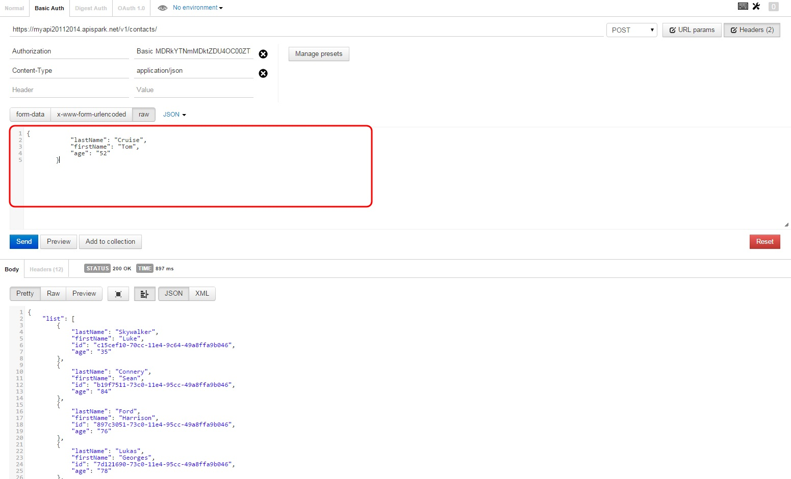
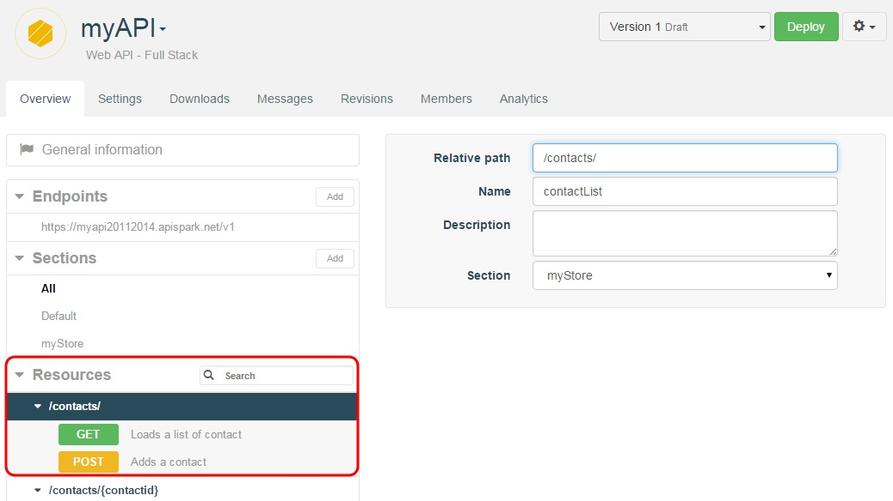
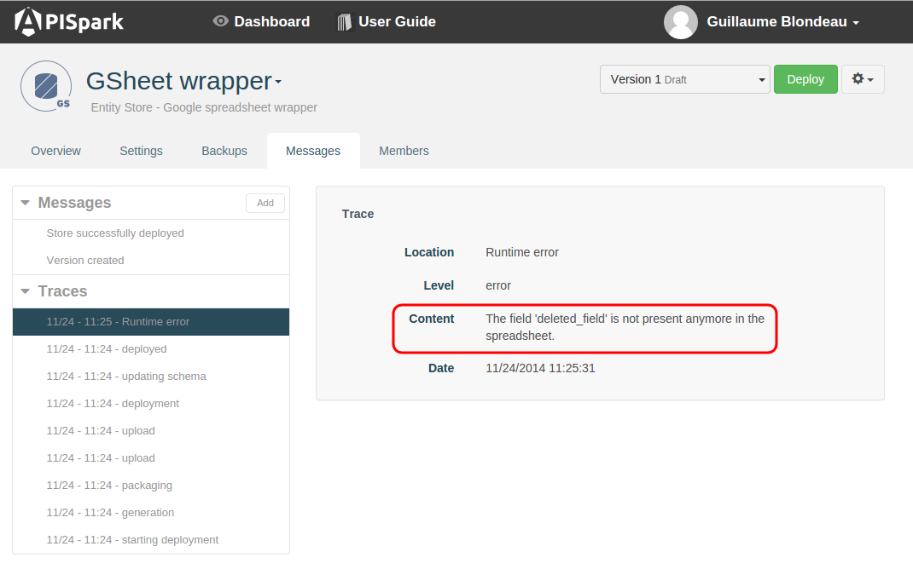
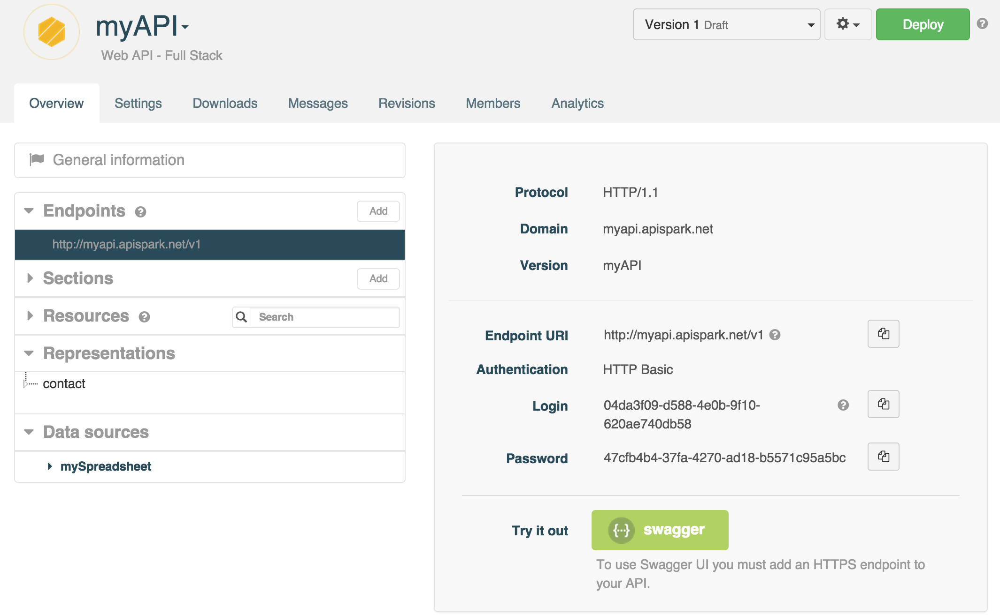
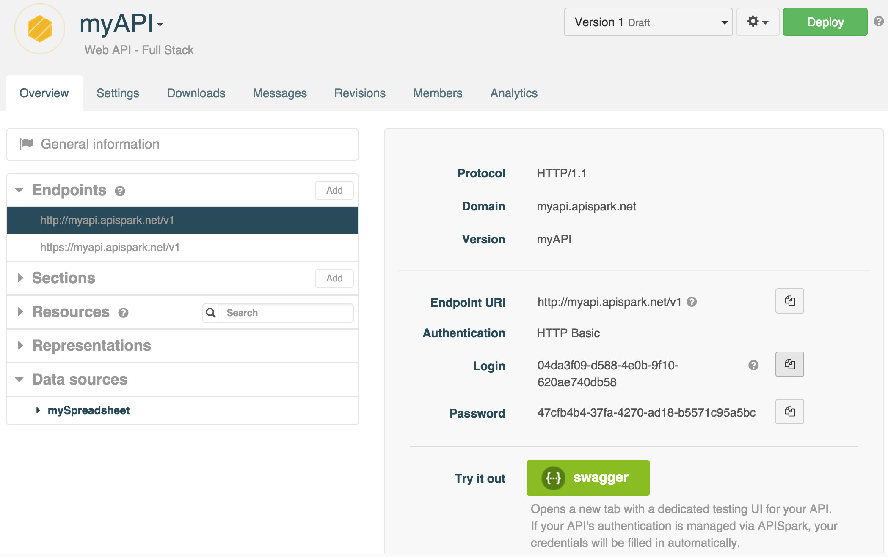
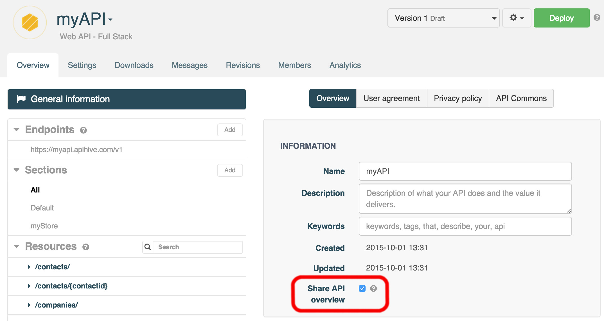

1. [I wonder if my cell is deployed](#01 "I wonder if my cell is deployed")
2. [What is the difference between deploying & publishing my API?](#02 "What is the difference between deploying & publishing my API?")
3. [I want a resource to be accessible without authentication](#03 "I want a resource to be accessible without authentication")
4. [I cannot find where to download Client SDKs](#04 "I cannot find where to download Client SDKs")
5. [I get a 400 error (Bad request) when I try to invoke my API](#05 "I get a 400 error (Bad request) when I try to invoke my API")
6. [I get a 405 error (Method Not allowed) when I try to invoke my API](#06 "I get a 405 error (Method Not allowed) when I try to invoke my API")
7. [I get a 415 error (Unsupported Media Type) when I try to invoke my API](#07 "I get a 415 error (Unsupported Media Type) when I try to invoke my API")
8. [I get a 500 error when I try to invoke my API](#08 "I get a 500 error when I try to invoke my API")
9. [I need examples of POST and PUT requests](#09 "I need examples of POST and PUT requests")
10. [I get an HTTP Error when I try to invoke my API](#10 "List of HTTP Errors Codes")
11. [The swagger button is disabled](#11 "The **swagger** button is disabled")
12. [What is the difference between "Public" and "Anyone" settings for my API?](#12 "What is the difference between "Public" and "Anyone" settings?")

# 1. I wonder if my cell is deployed

Once your cell has been deployed, a confirmation message displays on top of your screen to inform you that the deployment is successful.

If you have any doubt, go to the **Messages** tab which reports the last actions performed on your cell.

Jump to the [Check your messages](/technical-resources/apispark/guide/create/test#check-messages "Check your messages") section of our online documentation for further information.

[Back to list](#list "Back to list of frequently asked questions")

# 2. What is the difference between deploying & publishing my API?

## Deploying your API
When you deploy a cell, APISpark generates source code, compiles and deploys it in the cloud so that it will be executed in the APISpark runtime environment. As long as you have not deployed your data stores and web APIs, they are not available to store data or receive HTTP requests.

Jump to the [Cell deployment](/technical-resources/apispark/guide/explore/cell-deployment "Cell deployment") section of our online documentation for further information.

## Publishing your API
When you publish your API, you specify that it is in a stable state and is available to be used by end users or imported by other cells: you bring it into production.
A Published cell (APIs, data stores, etc.) cannot undergo structural modifications or be deleted as this could break clients or other cells using it.

Jump to the [Cell lifecycle](/technical-resources/apispark/guide/explore/cell-lifecycle "Cell lifecycle") section of our online documentation for further information.

[Back to list](#list "Back to list of frequently asked questions")

# 3. I want a resource to be accessible without authentication

The API credentials (login/password) are used to identify the users of your API.
If you want a Resource to be accessible without authentication, you can modify the security access directly on a method and set it to **Anyone**, meaning a user authenticated or not.

Open your API's Overview, in the **Resources** section, select a resource method e.g. GET method.  
In the central panel, click on the **Security** tab.
Select the **Anyone** checkbox.  
Click on the **Save** button.

[Back to list](#list "Back to list of frequently asked questions")

# 4. I cannot find where to download Client SDKs

Deploy your web API.  
Go to the **Downloads** tab.  
From the **Client SDKs** section, select the SDK you want to download.  
Click on the **Download...** button (working version or latest deployed version).

Jump to the [Generate custom client SDKs](/technical-resources/apispark/guide/publish/publish/client-sdk "Generate custom client SDKs") section of our user guide for further information.

[Back to list](#list "Back to list of frequently asked questions")

# 5. I get a 400 error (Bad request) when I try to invoke my API

Make sure the syntax you are using is valid.

When using <a href="http://www.getpostman.com/" target="_blank">POSTMAN Chrome Extension</a> to invoke your API, you may have entered your content in the address instead of entering it in the input area underneath the Headers.

Jump to our [POST and PUT requests examples](#09) for further information.

[Back to list](#list "Back to list of frequently asked questions")

# 6. I get a 405 error (Method Not Allowed) when I try to invoke my API

Make sure the method you are using is allowed.

Open your API's Overview, in the **Resources** section, click on the resource you call e.g. contacts. The methods available are listed below the resource name.  

[Back to list](#list "Back to list of frequently asked questions")

# 7. I get a 415 error (Unsupported Media Type) when I try to invoke my API

Make sure the format used is valid.

When using <a href="http://www.getpostman.com/" target="_blank">POSTMAN Chrome Extension</a> to invoke your API, you may have forgotten to set the **Content Type** Header to **application/json**.

Jump to our [POST and PUT requests examples](#09) for further information.

[Back to list](#list "Back to list of frequently asked questions")

# 8. I get a 500 error when I try to invoke my API
Before invoking your API, make sure you call the last version of your API and Data Store. You need to (re)deploy your API and the Data Stores (or/and File Stores) associated.

## (Re)deploy your API
Open your API's Overview and click on the **Deploy** button in the top right corner of your screen.

## (Re)deploy your Data Stores
To retrieve the different cells your API uses, open your API's Overview and click on the **Settings** tab.  
Click on the **Imports** section to see the different stores linked to your API.  

To open a Store, click on the store you want to open from the **Imports** section.  
Click on the name of the store in the central panel.

Click on the **Deploy** button in the top right corner of your screen.

## Check the Entity Store Traces

If you still get a 500 error message, open your Entity Store's Overview page.
Click the **Messages** tab.
The **Traces** section may display a *runtime error*. Click on it and check its **Content**. If the content does not help you, send it to our Help Desk to allow a quick resolution.

[Back to list](#list "Back to list of frequently asked questions")

# 9. I need examples of POST and PUT requests

To perform your POST and PUT requests, of course you can directly use your web browser, but we recommend that you use <a href="http://www.getpostman.com/" target="_blank">POSTMAN Chrome Extension</a> that gives you a graphical view of your requests.

Open your API's Overview page.  
Click on the relevant endpoint.  
Copy your API credentials (**Endpoint URI**, **Login** and **Password**).  
Paste them in POSTMAN to access your API.

## POST request

Paste your API Endpoint URI followed by your resource name in POSTMAN e.g. https://myapi.apispark.net/v1/contacts.  
Select the **POST** request from the drop-down menu.
Make sure **raw** format and **JSON** language are selected.  
Set **Content Type** Header to **application/json**.  
Enter your new entry in the input area underneath and click **Send**. The new entry displays in the bottom section of the screen.  

## PUT request

Paste your API Endpoint URI followed by your resource name and the entry you want to modify in POSTMAN e.g. https://myapi.apispark.net/v1/contacts/{contactid}.  
Select the **PUT** request from the drop-down menu.  
Make sure **raw** format and **JSON** language are selected.  
Set **Content Type** Header to **application/json**.  
Enter your modifications in the input area underneath and click **Send**. The updated entry displays in the bottom section of the screen.  

[Back to list](#list "Back to list of frequently asked questions")

# 10.  List of HTTP Errors Codes
<!---MARKDOWN TABLE
| http error code | http error name | actions / remedies |
| :---: | :---: |---|
| **400** | Bad Request | Make sure the syntax you are using is valid. When using POSTMAN Chrome Extension to invoke your API, you may have entered your content in the address instead of entering it in the input area underneath the Headers. |
| **401** | Unauthorized | Make sure you entered the right credentials. |
| **403** | Forbidden | Make sure the method you are using is allowed or make sure you entered credentials (access is not public). |
| **405** | Method Not Allowed | Make sure the method you are using is allowed: open your API's Overview, in the Resources section, click on the resource you call e.g. contacts. The methods available are listed below the resource name.
| **415** | Unsupported Media Type | When using POSTMAN Chrome Extension to invoke your API, you may have forgotten to set the Content Type Header to application/json.
| **422** | Unprocessable Entity | Make sure that the data you POST refer to the representation's properties and not to the column names they are mapping. Also make sure you use the right value type (string, integer) in your POST.
| **500** | Internal Server Error | Before invoking your API, make sure you call the last version of your API and Data Store. You need to (re)deploy your API and the Data Stores (or/and File Stores) associated.
-->

<table class="tg">
  <tr>
    <th class="tg-s6z2">http error code</th>
    <th class="tg-s6z2">http error name</th>
    <th class="tg-031e">actions / remedies</th>
  </tr>
  <tr>
    <td class="tg-s6z2">400</td>
    <td class="tg-s6z2">Bad Request</td>
    <td class="tg-031e">Make sure the syntax you are using is valid. When using POSTMAN Chrome Extension to invoke your API, you may have entered your content in the address instead of entering it in the input area underneath the Headers.</td>
  </tr>
  <tr>
    <td class="tg-s6z2">401</td>
    <td class="tg-s6z2">Unauthorized</td>
    <td class="tg-031e">Make sure you entered the right credentials.</td>
  </tr>
  <tr>
    <td class="tg-s6z2">403</td>
    <td class="tg-s6z2">Forbidden</td>
    <td class="tg-031e">Make sure the method you are using is allowed or make sure you entered credentials (access is not public).</td>
  </tr>
  <tr>
    <td class="tg-s6z2">405</td>
    <td class="tg-s6z2">Method Not Allowed</td>
    <td class="tg-031e">Make sure the method you are using is allowed: open your API's Overview, in the Resources section, click on the resource you call e.g. contacts. The methods available are listed below the resource name.</td>
  </tr>
  <tr>
    <td class="tg-s6z2">415</td>
    <td class="tg-s6z2">Unsupported Media Type</td>
    <td class="tg-031e">When using POSTMAN Chrome Extension to invoke your API, you may have forgotten to set the Content Type Header to application/json.</td>
  </tr>
  <tr>
    <td class="tg-s6z2">422</td>
    <td class="tg-s6z2">Unprocessable Entity</td>
    <td class="tg-031e">Make sure that the data you POST refer to the representation's properties and not to the column names they are mapping. Also make sure you use the right value type (string, integer) in yoclass="anchor" ur POST.</td>
  </tr>
  <tr>
    <td class="tg-s6z2">500</td>
    <td class="tg-s6z2">Internal Server Error</td>
    <td class="tg-031e">Before invoking your API, make sure you call the last version of your API and Data Store. You need to (re)deploy your API and the Data Stores (or/and File Stores) associated.</td>
  </tr>
</table>

[Back to list](#list "Back to list of frequently asked questions")

# 11. The **swagger** button is disabled

You may have removed your API https endpoint. To test your API via Swagger UI, you need an https endpoint.

From your API, go to the **Overview** tab.  
From the **Endpoints** section, click on the **Add** button and add an https endpoint.  
The **swagger** button is now enabled for your http endpoint.

Jump to the [Test your API](/technical-resources/apispark/guide/create/test "Test your API") section of our online documentation for further information.

[Back to list](#list "Back to list of frequently asked questions")

# 12. What is the difference between "Public" and "Anyone" settings for my API?

It is important you do not confuse the **Public** checkbox which makes your API's Overview public with the **Anyone** checkbox that lets you deactivate authentication on a specific method.

## Make your API Description public

You can make the Description of an API publicly available and not the API itself. In this instance, accessing your API would still require your credentials (which can be found in the **Overview** tab by clicking your Endpoint on the left).

From your API's **Overview**, click **General information**.  
Select the **Share API Overview** checkbox.

## Deactivate authentication

### on a particular method

If you wish to make your API available to anyone (without authentication), you can set each method independently.

From your API's **Overview**, select a method from the **Resources** section.  
Click on the **Security** tab and select the **Anyone** checkbox.

### for your whole API

If you wish for anyone to be able to access an API you can set this up right from the beginning when exporting your web API from the data store, so that you do not have to deactivate authentication for each resource and method manually.

From your data store, click on the cog button (on the left of the **Deploy** button) and select **Export web API**.  
From the creation wizard, click on **Customize settings** and select **No authentication required** from the **Default permissions** drop-down menu.

[Back to list](#list "Back to list of frequently asked questions")
