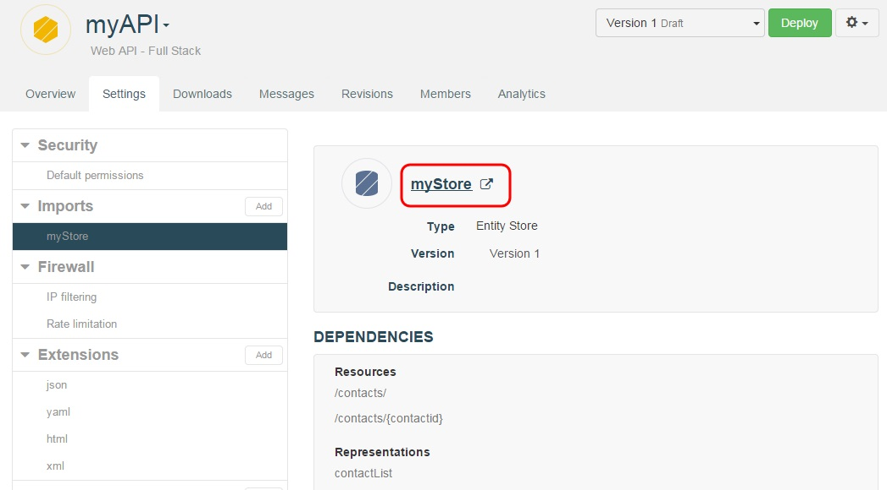
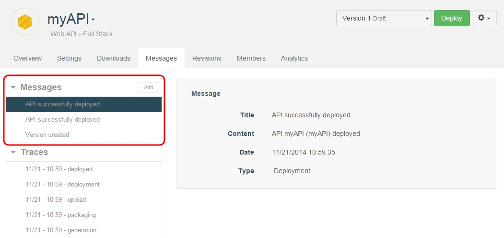
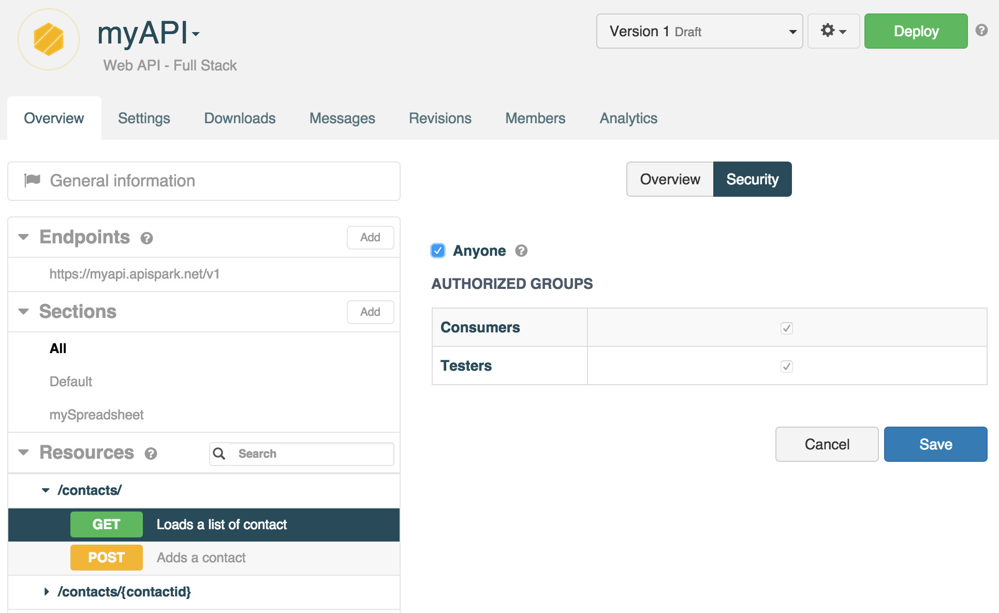
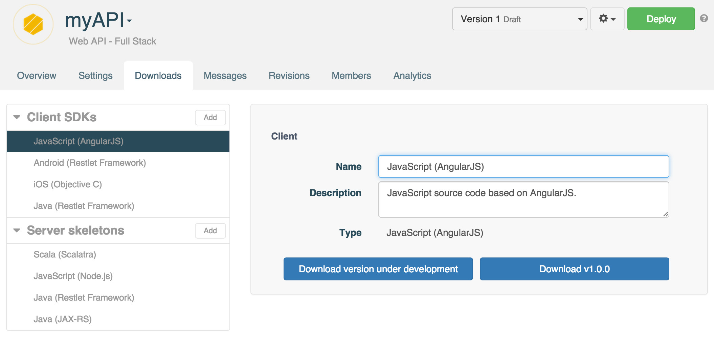
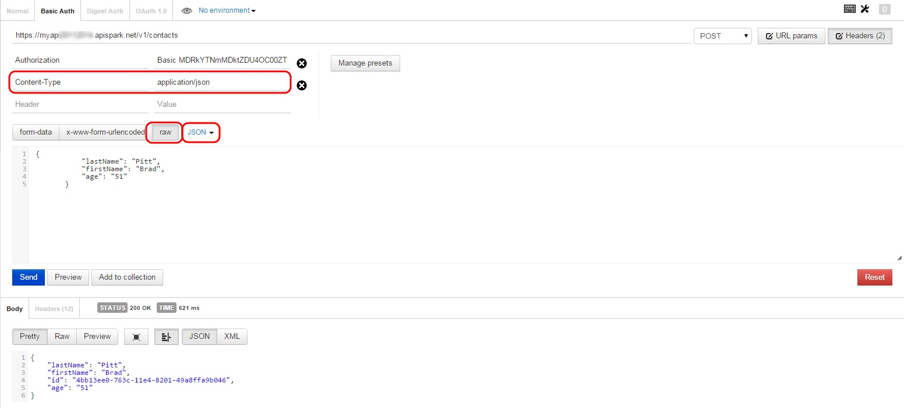
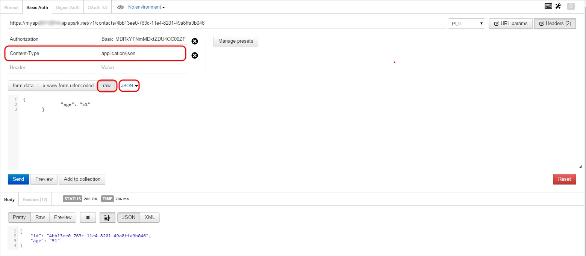

1. [I get a 500 error when I try to invoke my API](#1)
2. [I wonder if my cell is deployed](#2)
3. [What is the difference between deploying & publishing my API?](#3)
4. [I want a resource to be accessible without authentication](#4)
5. [I cannot find where to download Client SDKs](#5)
6. [I get a 415 error (Unsupported Media Type) when I try to invoke my API](#6)
7. [I need examples of POST and PUT requests](#7)

# 1. I get a 500 error when I try to invoke my API
Before invoking your API, make sure you call the last version of your API and Data Store. You need to (re)deploy your API and the Data Stores (or/and File Stores) associated.

## (Re)deploy your API
Open your API's Overview and click on the **Deploy** button in the top right corner of your screen.

## (Re)deploy your Data Stores
To retrieve the different cells your API uses, open your API's Overview and click on the **Settings** tab.  
Click on the **Imports** section to see the different stores linked to your API.  

To open a Store, click on the store you want to open from the **Imports** section.  
Click on the name of the store in the central panel.

Click on the **Deploy** button in the top right corner of your screen.

## Check the Entity Store Traces

If you still get a 500 error message, open your Entity Store's Overview page.
Click the **Messages** tab.
The **Traces** section may display a *runtime error*. Click on it and check its **Content**. If the content does not help you, send it to our Help Desk to allow a quick resolution.

# 2. I wonder if my cell is deployed

Once your cell has been deployed, a confirmation message displays on top of your screen to inform you that the deployment is successful.

If you have any doubt, go to the **Messages** tab which reports the last actions performed on your cell.

Jump to the [Test your web API](technical-resources/apispark/guide/create/test "Test your web API") section of our online documentation for further information.

# 3. What is the difference between deploying & publishing my API?

## Deploying your API
When you deploy a cell, APISpark generates source code, compiles and deploys it in the cloud so that it will be executed in the APISpark runtime environment. As long as you have not deployed your data stores and web APIs, they are not available to store data or receive HTTP requests.

Jump to the [Cell deployment](technical-resources/apispark/guide/explore/cell-deployment "Cell deployment") section of our online documentation for further information.

## Publishing your API
When you publish your API, you specify that it is in a stable state and is available to be used by end users or imported by other cells: you bring it into production.
A Published cell (APIs, data stores, etc.) cannot undergo structural modifications or be deleted as this could break clients or other cells using it.

Jump to the [Cell lifecycle](technical-resources/apispark/guide/explore/lifecycle "Cell lifecycle") section of our online documentation for further information.

# 4. I want a resource to be accessible without authentication

The API credentials (login/password) are used to identify the users of your API.
If you want a Resource to be accessible without authentication, you can modify the security access directly on a method and set it to **Anyone**, meaning a user authenticated or not.

Open your API's Overview, in the **Resources** section, select a resource method e.g. GET method.  
In the central panel, click on the **Security** tab.
Select the **Anyone** checkbox.  
Click on the **Save** button.

# 5. I cannot find where to download Client SDKs

Deploy your web API.  
Go to the **Downloads** tab.  
Click on the action button on top right of your screen and select **Generate downloads**.  
In the **Clients** section, click the one you want to download.  
Click the **Download** button.

>**Note:** The **Download** button is only visible once you have generated the downloads.

Jump to the [Generate custom client SDKs](technical-resources/apispark/guide/publish/publish/client-sdk "Generate custom client SDKs") section of our user guide for further information.

# 6. I get a 415 error (Unsupported Media Type) when I try to invoke my API

Make sure the method you are using is allowed.

Open your API's Overview, in the **Resources** section, click on the resource you call e.g. contacts. The methods available are listed below the resource name.  

Jump to our [POST and PUT requests examples](#7) for further information.

# 7. I need examples of POST and PUT requests

To perform your POST and PUT requests, of course you can directly use your web browser, but we recommend that you use <a href="https://chrome.google.com/webstore/detail/postman-rest-client/fdmmgilgnpjigdojojpjoooidkmcomcm" target="_blank">POSTMAN Chrome Extension</a> that gives you a graphical view of your requests.

Open your API's Overview page.  
Click on the relevant endpoint.  
Copy your API credentials (**Endpoint URI**, **Login** and **Password**).  
Paste them in POSTMAN to access your API.

## POST request

Paste your API Endpoint URI followed by your resource name in POSTMAN e.g. https://myapi.apispark.net/v1/contacts.  
Select the POST request from the drop-down menu.  
Enter your new entry in the input area underneath and click **Send**. The new entry displays in the bottom section of the screen.  

>**Note:** Make sure your headers are set as shown below.

## PUT request

Paste your API Endpoint URI followed by your resource name and the entry you want to modify in POSTMAN e.g. https://myapi.apispark.net/v1/contacts/{contactid}.  
Select the PUT request from the drop-down menu.  
Enter your modifications in the input area underneath and click **Send**. The updated entry displays in the bottom section of the screen.  

>**Note:** Make sure your headers are set as shown below.

