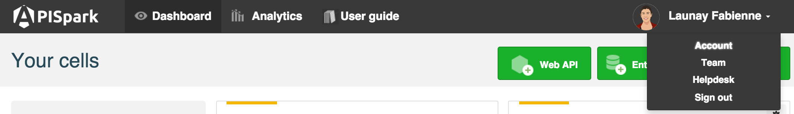
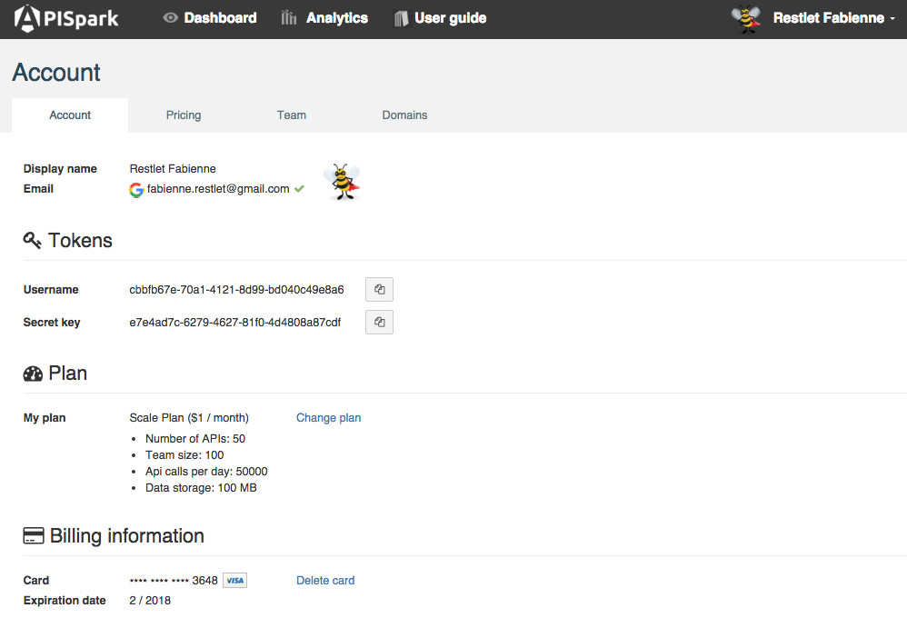
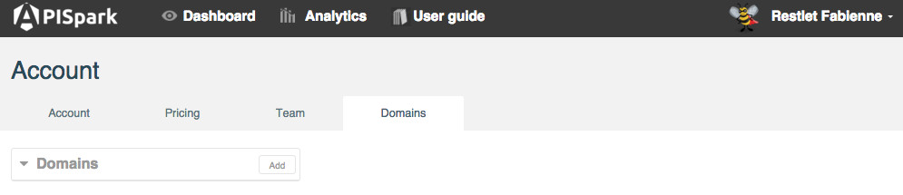

# Sign up

APISpark's sign up process is straightforward. It relies on social login to make signing up as simple as possible for you.

To sign up, click on the **Sign in** button from the <a href="https://apispark.restlet.com/signin" target="_blank">Welcome page</a> of our website and pick a social provider to identify yourself with. Your account will automatically be created for you.

## Sign in with your social provider account  

Several social login providers are supported, including **GitHub**, **Google**, **Windows Live**, **Yahoo**, **LinkedIn**, **Wordpress** and **Facebook**. You can create an account for free with any of these providers if you do not already own one.

If you are not already logged-in to your chosen provider, you will be asked to enter your username and password.

## Sign up with an email account

If you do not own an account at these social providers, you can simply sign up using any existing email address.

Click on the **Sign up** button.  
Enter your email address and password.  
Click on the **Sign up** button.

# The Account page

All your APISpark account details are available on the **Account** page.

To navigate to the **Account** page, make sure you are signed in, then click on your username on top right of your screen and select **My account**.

The **Account** page is composed of three tabs: **My account**, **My plan** and **My domains**.

## My account

 * The **Information** section provides information about your profile and the social network account you use to connect to APISpark.  
 * The **Tokens** section lists the tokens linked to your account.
You will not need to use these tokens for now. You can simply sign in to APISpark with your social provider account.  
 * The **Access Log** section logs your account activity.

## My plan

From this tab, you can select the plan that best suits you. You may upgrade or downgrade your plan according to your needs.

The **My plan** tab also provides management of your **Payment Method**.

## My domains

You can create several domains on your account.

Click on the **Add** button to add a new domain.

<!--

UPDATE SCREENSHOT

### DNS Aliasing

### DNS Delegation

-->
