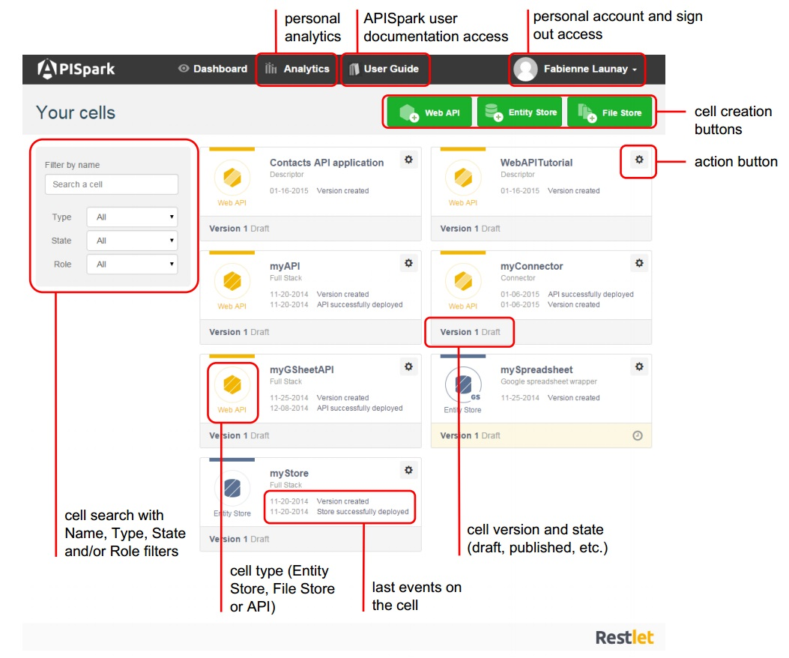

# APISpark Console

<iframe width="600" height="410" src="https://vimeo.com/138951451" frameborder="0" allowfullscreen></iframe>

# APISpark Dashboard

The Dashboard is APISpark's primary control center. From the Dashboard, you can create new Cells, manage your existing Cells, and more.

The diagram below illustrates the main features accessible from the Dashboard.

