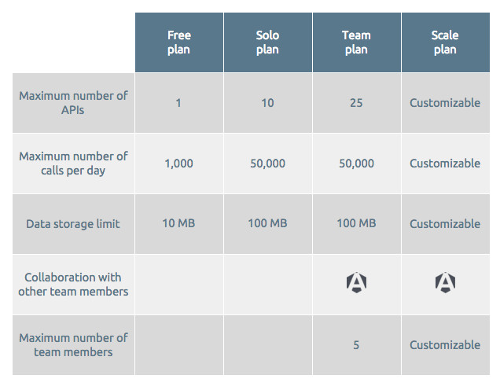
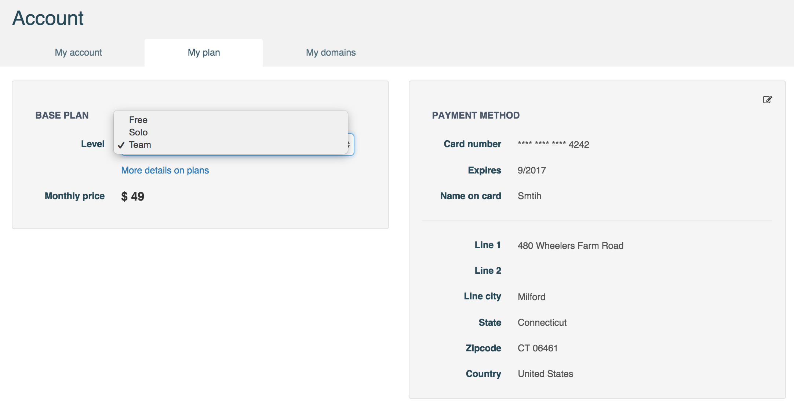
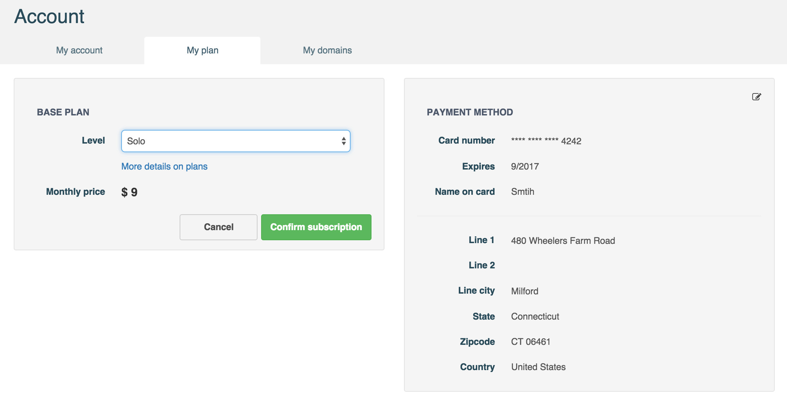
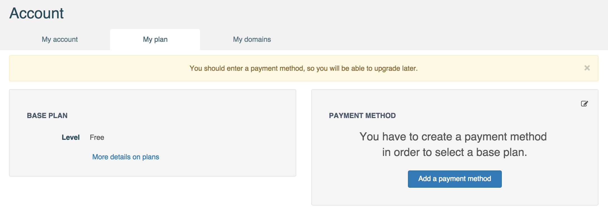
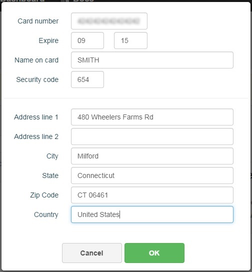

# APISpark Base plans

## Plans overview

As you subscribe to APISpark, you can choose between different base plan levels as defined in our <a href="https://restlet.com/pricing" target="_blank">Pricing page</a>.

Restlet offers simple, all-inclusive plans that scale with your projects and your team size.  
Getting started is free, and switching between plans is easy.  
All plans include access to the whole Restlet platform: Restlet Studio, DHC by Restlet and APISpark.

## Select a plan

When you Sign In, you are automatically assigned a **Free** plan. To upgrade your base plan level, you first need to enter your credit card details (see *Payment method* section below).

To switch base plan level, click on your name in the top right of your screen and select **My account**.

Open the **My plan** tab. In the **Level** drop-down menu, select your base plan level (Free, Solo or Team).

Click on the **Confirm subscription** button to activate the new plan.

# Payment methods

In order to upgrade your plan from the **Free** plan, you need to enter your credit card details.

To add a payment method to your account, click on your name on top right of your screen and select **My account**.

Click on **My plan** tab.  
In the **Payment method** section, click on the **Add a payment method** button.

Enter your credit card details and click on the **OK** button.

Your credit card details are displayed in the **Payment method** section. You can now upgrade your base plan as described above.
