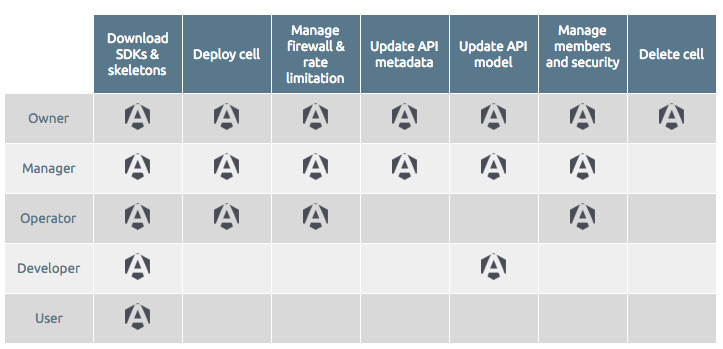

# Introduction

APISpark is built to support team-based collaboration on API projects.

Collaboration in APISpark is based on the capacity to share a cell with other members, and to attribute specific roles to team members based on the functions they carry out.

<!---

# Cell Roles

A member can have one of five roles on a cell.

For team-based collaboration, members should be given either of the roles *Owner*, *Manager*, *Operator*, or *Developer*.

*User* is a special role designed for web API members who are consumers of your API. For more information about managing your API consumption, please visit the [User Groups](/technical-resources/apispark/guide/publish/secure/user-groups "User Groups") page.

## Members rights

Depending on the role given to a member, s/he will have different permissions in the APISpark console.

## Team roles

### Owner

A cell's Owner has full rights on it. Each cell has a unique Owner, who is also the Owner of every version of the cell. The Owner's role cannot be modified.

### Manager

A Manager has all but a few rights on a cell. For instance, a manager cannot delete a cell, as this operation is reserved to the Owner and to manage the community of cell members.

### Operator

An Operator has the rights to manage runtime aspects of a cell and to manage a cell's lifecycle.

### Developer

A Developer has rights to the design-time and development aspects of a cell.

## Consumer roles

### User

A User can consult basic information about a web API and be given runtime access rights by being added to a member group.

--->

# Managing members

## Add members to your team

All your APISpark account details, including team related information, are available on the **Account** page.

To navigate to your **Account** page, make sure you are signed in, then click on your username on top right of your screen and select **Account**.  
Select the **Team** tab.  

In the **Add users to your team** field, enter the exact email address of the member you wish to add to your team and select one of the providers available for this address.
Click **Add**.

>**Note:** At the bottom of the window, you can see the number of members you added to your team and the number of members you are allowed according to the plan you subscribed to e.g. 2/5. If you need to add more members, click **Upgrade** or **Delete** unnecessary members by clicking the corresponding trash icon.

## Add a member to a cell

To manage the members of a cell, navigate to the cell's **Members** tab.

From here, you can add, delete members, and attribute roles to members.

>**Note:** When you create a new cell [revision](/technical-resources/apispark/guide/explore/revisions "revision"), it is created with the same members as the former revision. But if you restore an old revision, then you restore it with the members that were associated to this old revision (you loose the members changes you made).

From the cell **Overview** page, click on the **Members** tab.  
In the **Members** section, click on the **Add** button.  
In the window that displays, select your member email address from the **Search** field and click on the **Add** button.

Select a role for your member in the drop-down menu (Manager, Operator, Developer or User).

>**Note:** To add a member to a cell, you need to add this member to your team members from the [Account](/technical-resources/apispark/guide/get-started/account-info "Account") page as explained earlier in that page.
