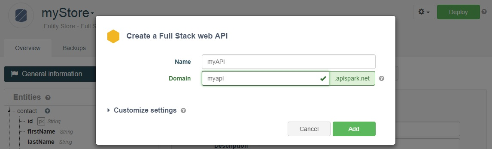
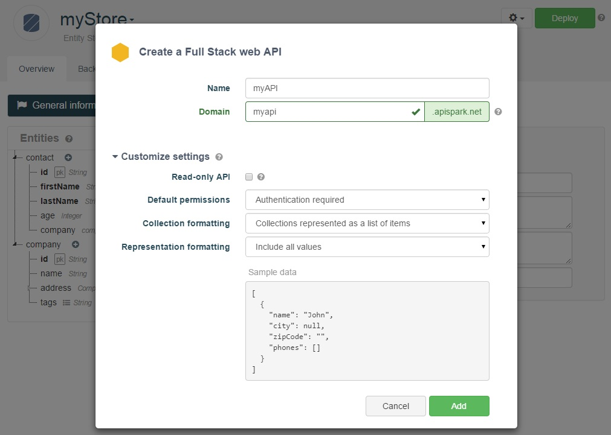
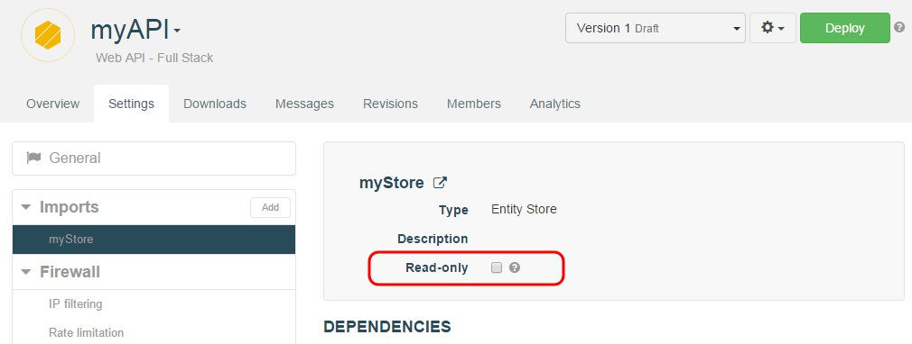

APISpark supports two major types of cells: Data Stores and web APIs. Data stores serve to store structured data and static files, while web APIs are RESTful interfaces that expose resources over the Web.

These two types of cells are built to work together, and APISpark provides tools that facilitate exposing Data Stores to the Web through web APIs.

In this section we look at different ways to automatically create a web API from existing Data Stores.

# 1. Export a web API from a Data Store

You can automatically export a web API from a Data Store. If you do not already have a Data Store, checkout the [Entity Store](/technical-resources/apispark/guide/store/entity-stores/model-data "Entity Store") or the [File Store](/technical-resources/apispark/guide/store/file-stores "File Store") page to see how to build the appropriate Data Store.

The API export process can be launched from the Data Store **Overview**. Click on the action arrow and select **Export web API**.

In the **Create a Web API** dialog, give your API a **Name**, **Domain**, and **Description** (optional).

The window will notify you of the availability of the the domain name.

## Customize settings

You can create your web api as is or start customizing it with the different settings available from the creation wizard.

### Read-only API
In read-only mode, only GET calls are allowed.
You can change this setting afterwards from the API **Settings** tab by clicking the store imported in the left section.

### Default permissions
Selecting **No authentication required** means that your API default permissions for all methods are set to **Anyone**.

For more information on default permissions, jump to the [Runtime permissions](/technical-resources/apispark/guide/publish/secure/runtime-permissions "Runtime permissions") section of our user guide.

### Collection formatting

By default, collections are represented as lists of items but you can change this setting to obtain a wrapper representation (an {entity}List entity is automatically created for each new entity).

For more information on collection formatting, jump to the [Representations](/technical-resources/apispark/guide/create/edit/representations "Representations") section of our user guide.

### Representation formatting
By default your API returns all values. You can change this setting to include all values except null values or all values except null and empty values.

For more information on representations, jump to the [Representations](/technical-resources/apispark/guide/create/edit/representations "Representations") section of our user guide.

### Sample data
The sample data text area gives you an idea of the syntax of the results returned according to the collection and representation formatting selected above.

# 2. Import a data store into an existing web API

As a complement to the Export API feature, APISpark lets you import one or more Data Stores into an existing web API.

This has the added benefit of allowing you to import multiple Data Stores of potentially different types into a single web API.  

## Create a web API

If you have not already done so, create a web API from the **Dashboard** by clicking on the **+ Web API** button.

Select **Full Stack** from the **Type** drop-down menu. Give your API a **Name**, **Domain**, and **Description** (optional).
The window will notify you of the availability of the domain name.

## Import a Data Store

To import a Data Store into an API, navigate to the API's **Overview**. Click on the **Settings** tab. Click on the **Add** button next to **Imports** in the left panel.

Select the **Type** of cell you want to import, select the **Cell** itself and the **Version** you want to import.

<!--
### Generate resources and representations

Once you have imported a Data Store into a web API, you can automatically generate resources and representations that map to the entities in the imported Data Store.

Select an import from the left panel of the API's **Settings** tab, and click on the **Add** button to generate new resources and representations.

If you update your Data Store, you can update the API's corresponding resources and representations by clicking on the **Update** button in the same window.
-->

### Synchronize your Entity Store with your API

If you deploy an Entity Store that is imported by a web API, you can update the web API's **Imports** to switch to the new deployed version of the Entity Store.

To switch to the new deployed version of an imported Entity Store, open the importing web API. Open the **Settings** tab, and select the imported Entity Store from the **Imports** section in the left panel.

Click the **Synchronize** button.

Go back to the API's **Overview** to view your updated resources and representations.
