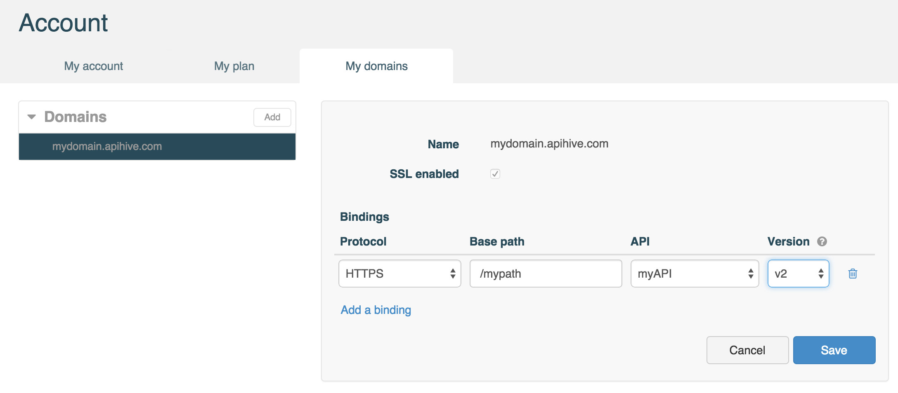
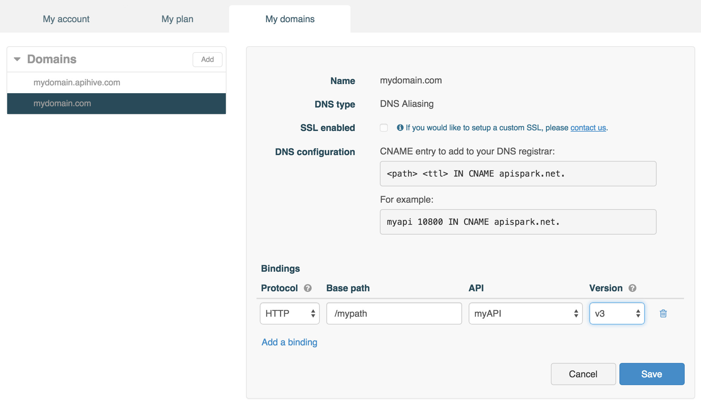

# Endpoint basics

An **Endpoint** is the entry point for accessing a web API, to which all the API's resources are attached.

An **Endpoint** has a **URI** (Uniform Resource Identifier), a **Protocol**, a **Domain**, a **Version**, and **Authentication** credentials.

A single API can have multiple endpoints, for example to respect different naming conventions or to support different protocols such as HTTP or HTTPS.

To edit a web API's endpoints in APISpark, navigate to the web API's **Overview**. The API's endpoints are listed in the **Endpoints** section in the left panel.


To add new endpoints, click on the **Add** button of the **Endpoints** section.

You will be prompted to select a **Domain** and a **Protocol** for you new **Endpoint**.

# <a class="anchor" name="custom-domains"></a>Custom domains

By default, your web API responds to traffic sent to its default "apispark.net" endpoint.

Custom domains can also be used as a basis for you API endpoints.

## Add a custom domain

To add a custom domain endpoint, you first have to register your custom domain, in the **Domains** tab of the **Account** page.


From there, you can create new endpoints for your web API, with a base URI taken either from the default apispark.net domain or from your custom domain.

**Add** a domain, choose a [DNS configuration type](dns-configuration)  and enter a name for your domain.


Then, you need to bind your domain to one or several APIs. Click **Add a binding**.



>**Note:** If you want to apply the binding to all API versions, select "\*" in the **Version** drop-down menu.


**Save** your changes and **Deploy** the API you bound to make them go live.

## <a class="anchor" name="dns-configuration"></a>DNS configuration types

APISpark proposes 2 types of DNS configuration for your custom domains.

### DNS aliasing

Use the **DNS aliasing** configuration if you opt for adding a CNAME entry with your DNS registrar, that points to apispark.net.


Here is an example configuration to setup with your domain registrar, for myapi.customdomain.com:

```
myapi 10800 IN CNAME apispark.net.
```



### DNS delegation

Use the **DNS delegation** configuration if you opt to let APISpark serve as your DNS.


The Amazon Route53 service will be leveraged in this case. In this case, the DNS servers are displayed.


