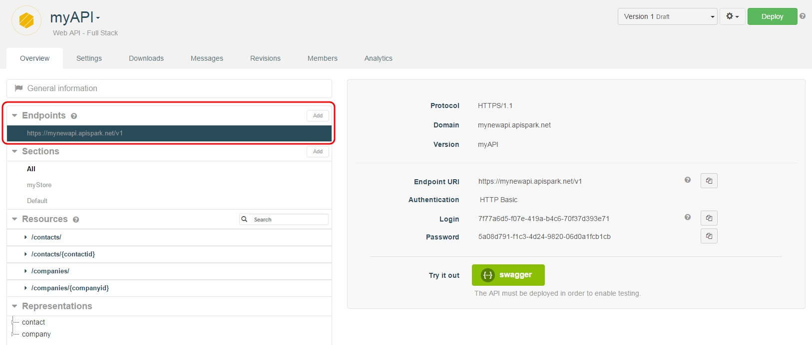

# Endpoint basics

An **Endpoint** is the entry point for accessing a web API, to which all the API's resources are attached.

An **Endpoint** has a **URI** (Uniform Resource Identifier), a **Protocol**, a **Domain**, a **Version**, and **Authentication** credentials.

A single API can have multiple endpoints, for example to respect different naming conventions or to support different protocols such as HTTP or HTTPS.

To edit a web API's endpoints in APISpark, navigate to the web API's **Overview**. The API's endpoints are listed in the **Endpoints** section in the left panel.



To add new endpoints, click on the **Add** button of the **Endpoints** section.

You will be prompted to select a **Domain** and a **Protocol** for you new **Endpoint**.

# <a name="custom-domains"></a>Custom domains

By default, your web API responds to traffic sent to its default "apispark.net" endpoint.

Custom domains can also be used as a basis for you API endpoints.

## Add a custom domain

To add a custom domain endpoint, you first have to register your custom domain, in the **My domains** tab of the **Account** page.


Add a domain and choose a DNS configuration type.


Then, edit the new DNS entry, and bind one of your web APIs.

From there, you can create new endpoints for your web API, with a base URI taken either from the default apispark.net domain or from your custom domain.

>**Note:** HTTPS is not supported for custom domains.

## DNS configuration types

APISpark proposes 2 types of DNS configuration for your custom domains.

### DNS aliasing

Use the **DNS aliasing** configuration if you opt for adding a CNAME entry with your DNS registrar, that points to your API's default endpoint on APISpark.

Here is an example configuration to setup with your domain registrar, for mypai.customdomain.com:

```
myapi 10800 IN CNAME myapi.apispark.net.
```

### DNS delegation

Use the **DNS delegation** configuration if you opt to let APISpark serve as your DNS.

The Amazon Route53 service will be leveraged in this case. In this case, the IP addresses of the DNS servers are displayed.
