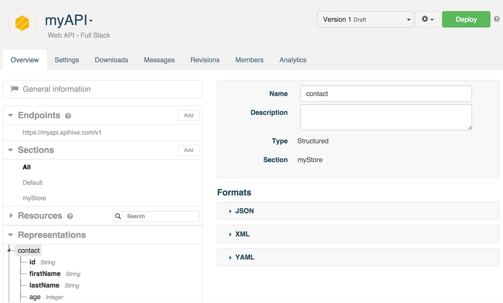
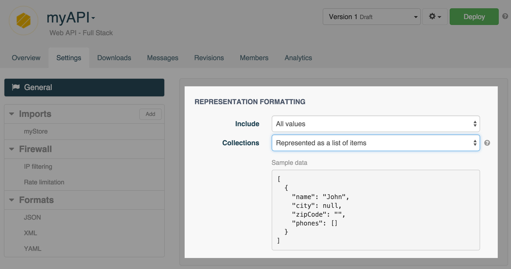
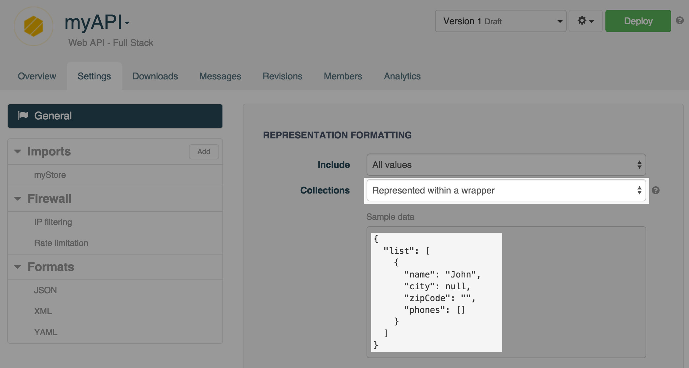

A web API has a set of **Representations** that describe the API input and output data.

A **Representation** has a **Name** and a **Description** (optional), and is composed of **Properties** which hold values. There are *Raw* (without properties) and *Structured* representations.

E.g. An API `/contacts/{id}` returns a `Contact` representation

```json
{
  "id" : "XXXid",
  "lastName" : "Smith",
  "age" : 27,
  "firstName" : "John"
}
```

It has different properties.

- id *String*  
- lastName *String*  
- firstName *String*  
- age *Integer*

Properties can be *composite*, i.e. a property can contain other properties, e.g. a “contact” entity contains an “address” property which contains a “zip code” and “city” property.

To edit a web API's **Representations**, navigate to the web API's **Overview**. The API's representations are listed in the **Representations** section in the left panel.

Once you have selected a **Representation**, you can view its properties.

Representation properties have a **Name**, **Description**, **Datatype** and  belong to a section.



## Representation properties

Representations are composed of properties. A Representation property has a number of different attributes that can be set.


You can modify the following attributes for an existing Representation property. The remaining attributes are in read-only mode as they are linked to the data store. You will thus be able to modify them from the data store instead of the API.

### Name

The property's name.

>**Note:** You cannot edit the property's name of an API published version. To be able do edit it, you will need to revert to a draft version.

### Hidden

Select this checkbox when the API is invoked or so that the Representation properties are not included into client kits. You may want to include only part of your properties.

### Sample value

A sample value can be provided in this field. This value will be used to give you an idea of what your representation will look like in different formats (JSON, XML or YAML). From the API **Overview** tab, click on the Representation chosen and select the Variant you need.


## Representation formatting

You may want to customize your API in order to choose whether output representations will contain properties with null values or not.

From the **Settings** tab, you can determine whether you want your API to return all values, all values except null values or all values except null and empty values.

Navigate to the **Settings** tab and select the appropriate formatting from the drop-down menu.



## Collection formatting

By default, collections are represented as *lists of items*.
You can determine whether you want your API to return results represented as lists of items as shown below;


or whether you want your API to return results represented *within a wrapper* (an {entity}List entity is automatically created for each new entity added).



This setting can be changed from the **General** section of the API **Settings** tab.


>**Note:** You will need to [reset](/technical-resources/apispark/guide/create/overview#reset "reset") each store import and then redeploy your API in order for your changes to be taken into account.

# Variants

A **Representation** has one or more **Variants** which determine how the representation is formatted, serialized, and deserialized.

By default, APISpark supports 3 different types of representation variants: XML, JSON or YAML.  

To view a representation's **Variants**, select the representation from the **Representations** section in the left panel.


>**Note:** When you want to POST a new entry via [Postman](/technical-resources/apispark/guide/create/test "Postman") tool for example, you can use the **Sample** text area content to make sure you are using the appropriate syntax.
