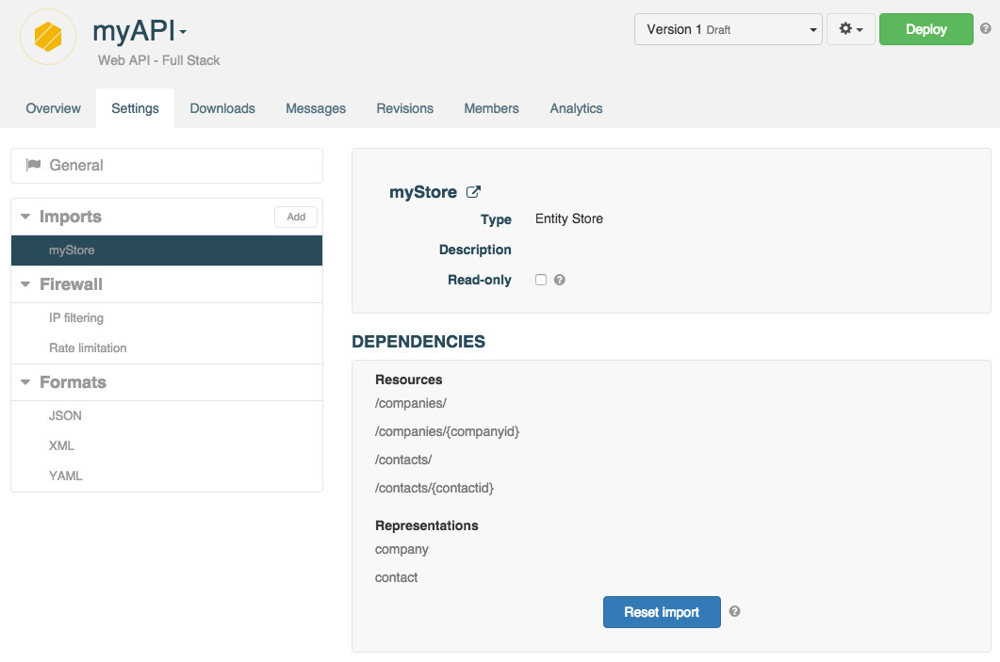

If you modify your Store structure, you will also need to update your API.

To update your API structure, open its **Settings** tab, and select the imported Entity Store from the **Imports** section in the left panel.

Click the **Reset import** button.

Go back to the API's **Overview** to view your updated resources and representations.
