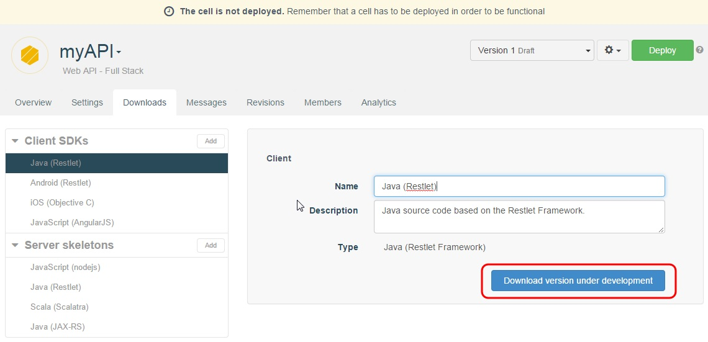
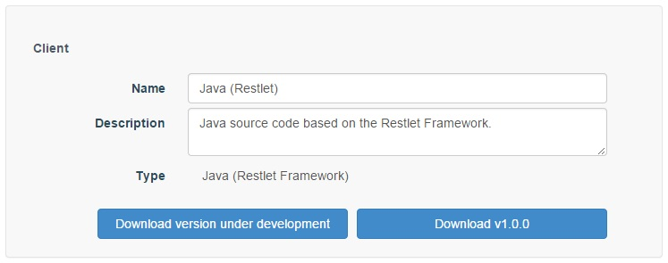
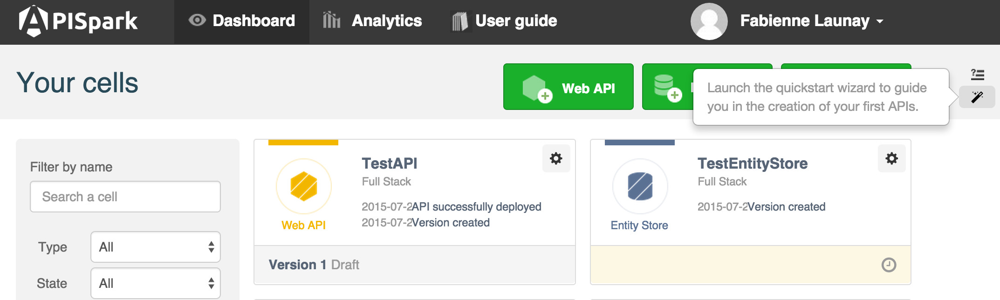
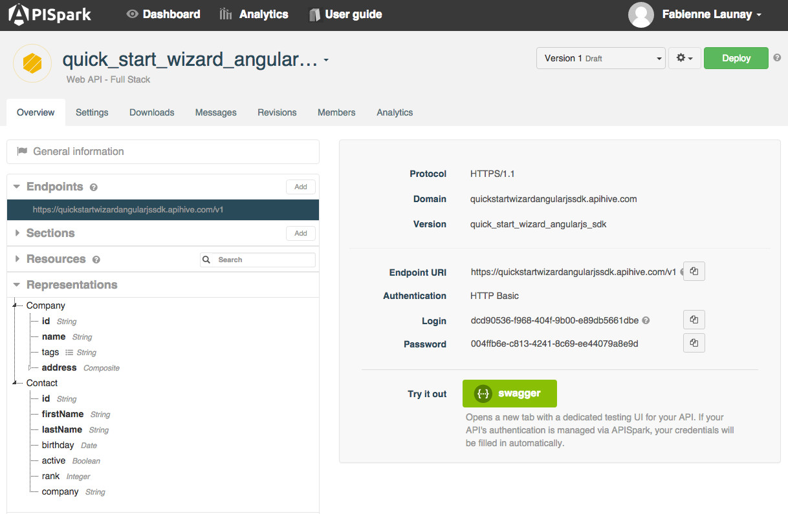
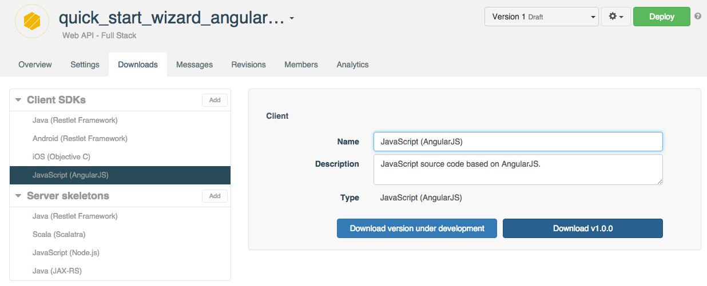

# Introduction

The beauty of a RESTful API is that it can easily be invoked by a host of different devices and applications.

To facilitate this, APISpark can generate custom client SDKs (Software Development Kits) for your web APIs for a number of different environments:


| Client SDKs |
| ------------- |
| Java (Restlet Framework) |
| Android (Restlet Framework) |
| [JavaScript (AngularJS)](#javascript-sdk) |
| iOS (Objective C) |


You can **Add** or **Delete** client SDKs from the **Client SDKs** section of the **Downloads** tab.

# Download client SDKs

APISpark lets API team members automatically create the client kits that will be made available to consumers of the API.

To download a client SDK for a web API:

Open the appropriate API.  
Click on the **Downloads** tab.  
Select the language you need (JavaScript, iOS, Java or Android) in the **Client SDKs** section.  
Click on the **Download ...** button from the central panel.  



You can either download the client SDK of the version you are working on or the last version you have created or deployed.

Once you have deployed your API for the first time, you can choose between the following two buttons:
**Download version under development** and **Download vX.X.X**.

At each *deployment* the revision number is incremented as follows: v1.1.0, v1.2.0, v1.3.0, etc.  
When you create a *new version* of your API, the client SDK version is incremented following this pattern: v1.0.0, v2.0.0, v3.0.0, etc.



>**Note:** Client kits of versions under development are available to give you an idea of the structure and content of the client SDKs provided by APISpark. Only client SDKs of versions deployed (revisions e.g. v1.1.0) or created (versions e.g. v2.0.0) are accessible and functional.


<!--
# How to use Java client SDK
1) Download Java (Restlet Framework) DSK form **Downloads** tab.  

2) From Eclipse, **File** / **Import**  
**Existing Maven project** / **Next**  
select folder  
**Finish**  

3) In **AbstractClientResource.java**, paste code provided  
Insert your API credentials  
Execute class **Run as**/**Java application**  

4) Create new Java class (**New**/**class**)  
Call it *TestAPI.java*  
Select **Public static void...** checkbox  
Execute class **Run as**/**Java application**  

5) With your *TestAPI.java* file, you can perform GET, POST requests...
-->

# <a name="javascript-sdk"></a>Using JavaScript (AngularJS) SDK

As an example, we want to create a sample app using AngularJS and APISpark.

For this purpose, create an API using APISpark Quickstart wizard.



For this example, we call our API *quick_start_wizard_angularjs_sdk*. As it is based on the quickstart wizard, the resources associated are:
* Company
* Contact



Download the AngularJS SDK from the **Downloads** tab.



## Archive structure

The downloaded archive has the following folder structure:

* `Quick_start_wizard_angularjs_sdkModule.js` contains the SDK generated by APISpark and does not require any modification.
* `app.js` is a skeleton generated by APISpark. This is the file where the custom code can be written.
* `index.html` is the entry point of the application. It automatically imports the two previous files.

## Usage

An HTTP server is required to be able to use the provided code. It can be served from any server.

If the OS has python installed, a `SimpleHTTPServer` inside the folder will do the trick:
```
cd /path/to/your/unzipped/sdk
python -mSimpleHTTPServer 1234
```
Then go to `http://localhost:1234/`.

Or use node [http-server](https://www.npmjs.com/package/http-server) with the following command line:
```
npm install -g http-server
http-server /path/to/your/unzipped/sdk
```
Open `http://localhost:8080/`.

The developed application is now available.

## Developing an app

### SDK methods

By default the SDK module is named after the name of the API. In our example for an API named *quick_start_wizard_angularjs_sdk* the SDK is named *Quick_start_wizard_angularjs_sdkClientResource*. The name of the API is capitalized and appended with *ClientResource*.

The SDK exposes all the methods required to interact with the hosted API. For each resource there is one method per HTTP verb available.

As the Quickstart wizard generates a `/companies` resource accessible through `GET` (fetch all the companies) and `POST` (create a new company), the SDK will generate the following methods:
* getCompanyList
* postCompanyList

>**Note:** When the resource is a plural then the SDK replaces the plural form by a singular one appended with List.

With the same convention the quickstart wizard generates a `/companies/{companyId}` resource accessible through `GET` (get the company information), `PUT` (update a company record) and `DELETE` (remove the specified company), so the methods generated are:
* getCompany
* putCompany
* deleteCompany

For any method generated the parameters are provided as a JS object provided as first parameter of the method. For instance to access the company of id *1*:
```JavaScript
quick_start_wizard_angularjs_sdkClientResource.getCompany({
  companyid: 1
});
```

### Security

By default all the resources hosted on APISpark are secured and hence require authentication. The standard configuration is based on [basic authentication](http://tools.ietf.org/html/rfc2617#section-2).

The `app.js` file can be filled to use authentication with the API's credentials.

>**Warning:** Make sure you do not leave your credentials when the application goes live since anyone using the application could access them.

The resources' security should be adapted to fit the need. For instance, getting the list of companies might be authorized to Anyone.

### Query for companies

Knowing this, getting the companies is pretty straight-forward and is made by calling the `getCompanyList` method and hooking onto the returned promise.

A special attention has to be dedicated to the `.then` part in the following snippets for any JS developer not familiar with promises. Since Angular is based on the [Promise theory](https://developer.mozilla.org/en-US/docs/Web/JavaScript/Reference/Global_Objects/Promise) and the [Q specification](https://github.com/kriskowal/uncommonjs/blob/master/promises/specification.md), it is recommended to have a good understanding of that and how it works. The AngularJS related documentation can be found [there](https://docs.angularjs.org/api/ng/service/$q).

```JavaScript
quick_start_wizard_angularjs_sdkClientResource.getCompanyList()
  .then(function(companies) {
    $scope.companies = companies;
  });
```

>**Note:** The promises returned by the SDK are resolved directly with the body of the HTTP response.

### Query for one specific company

To get a given company, the `companyid` must be provided as shown below:
```JavaScript
quick_start_wizard_angularjs_sdkClientResource.getCompany({
  companyid: 1
})
  .then(function(company) {
      $scope.company = company;
  });
```

### Update an existing company

An update is a call to `putCompany` with:
* the `companyid` which is the id of the company to update
* the `body` which is the new company as JSON

The promise is then resolved with the updated company.

```JS
quick_start_wizard_angularjs_sdkClientResource.putCompany({
  companyid: company.id,
  body: company
})
  .then(function(company) {
    console.log(company);
    alert('Company updated successfully');
  });
```

### Add a new company

Adding a new company is made through the use of the post on the resource list. In our example: `postCompanyList`.

The only parameter to provide is the `body` (the JSON representation of the company).

```JS
quick_start_wizard_angularjs_sdkClientResource.postCompanyList({
  body: {
    "tags": [],
    "name": "Testing company",
    "address": {
      "street":"321312 somewhere in the street",
      "zipcode": 44000,
      "city":"Babylone"
    }
  }
}).then(function(newCompany) {
  $scope.company = newCompany;
});
```

### Delete an existing company

Deleting a company is very similar to getting an existing company and only requires  the `companyid` to detect which record should be deleted.

```JavaScript
quick_start_wizard_angularjs_sdkClientResource.deleteCompany({
  companyid: 1
})
  .then(function(company) {
      $scope.company = company;
  });
```
