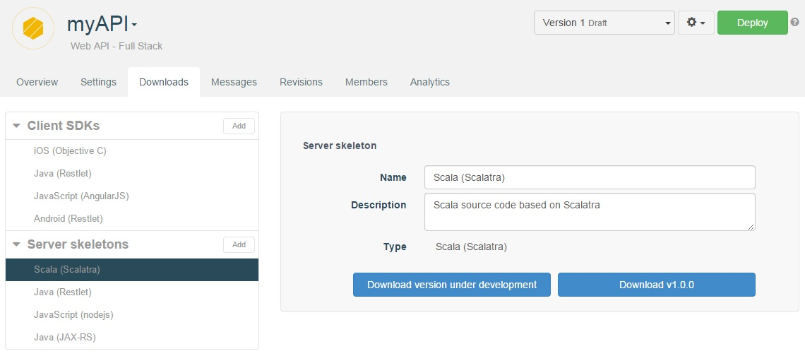

# Introduction

The beauty of a RESTful API is that it can easily be invoked by a host of different devices and applications.

To facilitate this, APISpark can generate custom client SDKs (Software Development Kits) and server skeletons for your web APIs for a number of different environments:

| Client SDKs | Server skeletons |
| ------------- | ------------- |
| Java (Restlet Framework) | Java (Restlet Framework or JAX-RS)
| Android (Restlet Framework) | Scala (Scalatra)
| JavaScript (AngularJS) | JavaScript (Node.js)
| iOS (Objective C) | <c>

You can **Add** or **Delete** client SDKs and server skeletons from respectively the **Client SDKs** and the **Server skeletons** section of the **Downloads** tab.

# Download client SDKs

APISpark lets API team members automatically create the client kits that will be made available to consumers of the API.

To download a client SDK for a web API:

Open the appropriate API.  
Click on the **Downloads** tab.  
Select the language you need (JavaScript, iOS, Java or Android) in the **Client SDKs** section.  
Click on the **Download ...** button from the central panel.  

You can either download the client SDK of the version you are working on or the last version you have created or deployed.

Once you have deployed your API for the first time, you can choose between the following two buttons:
**Download version under development** and **Download vX.X.X**.

At each *deployment* the revision number is incremented as follows: v1.1.0, v1.2.0, v1.3.0, etc.  
When you create a *new version* of your API, the client SDK version is incremented following this pattern: v1.0.0, v2.0.0, v3.0.0, etc.

>**Note:** Client kits of versions under development are available to give you an idea of the structure and content of the client SDKs provided by APISpark. Only client SDKs of versions deployed (revisions e.g. v1.1.0) or created (versions e.g. v2.0.0) are accessible and functional.

# Download server skeletons

You can download just as you do with client SDKs:

Open the appropriate API.  
Click on the **Downloads** tab.  
Select the language you need (Scala, Java - Restlet Framework or JAX-RS - or JavaScript) in the **Server skeletons** section.  
Click on the **Download ...** button from the central panel.  

Server skeletons follow the same version creation process described above for client SDKs.

<!--
# How to use Java client SDK
1) Download Java (Restlet Framework) DSK form **Downloads** tab.  

2) From Eclipse, **File** / **Import**  
**Existing Maven project** / **Next**  
select folder  
**Finish**  

3) In **AbstractClientResource.java**, paste code provided  
Insert your API credentials  
Execute class **Run as**/**Java application**  

4) Create new Java class (**New**/**class**)  
Call it *TestAPI.java*  
Select **Public static void...** checkbox  
Execute class **Run as**/**Java application**  

5) With your *TestAPI.java* file, you can perform GET, POST requests...
-->
