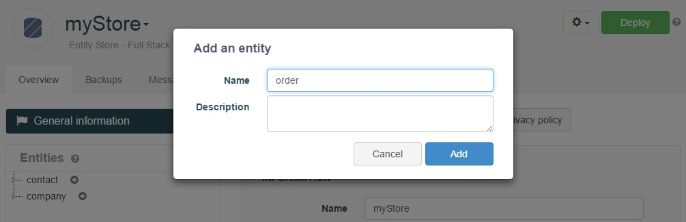
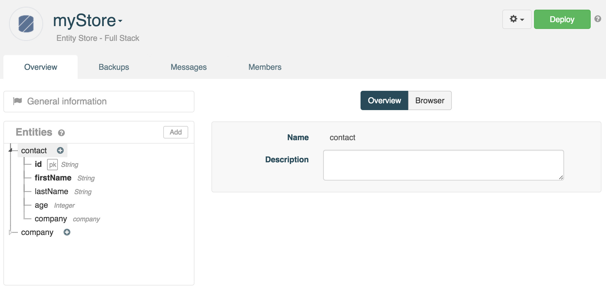
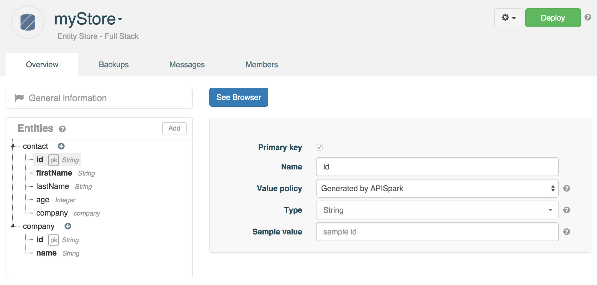
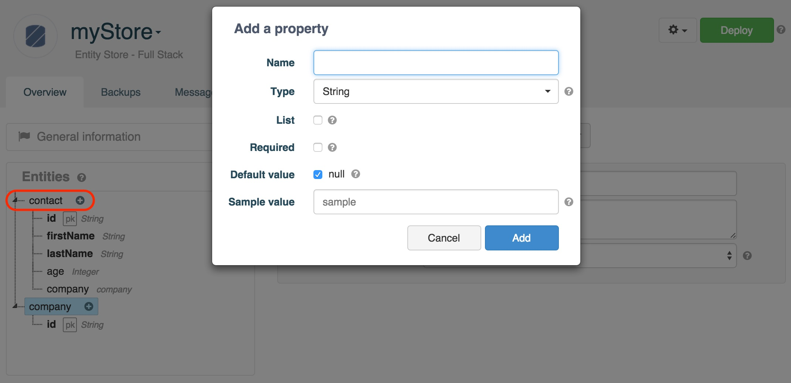
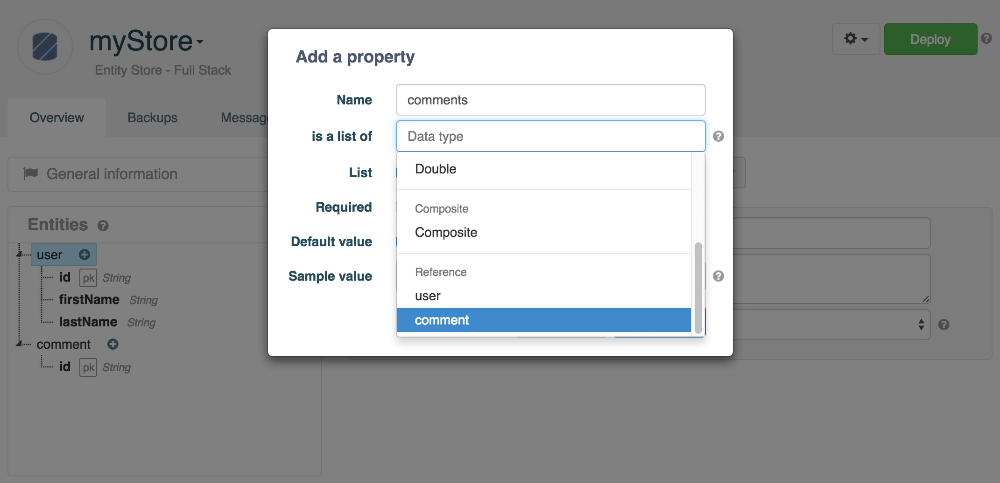
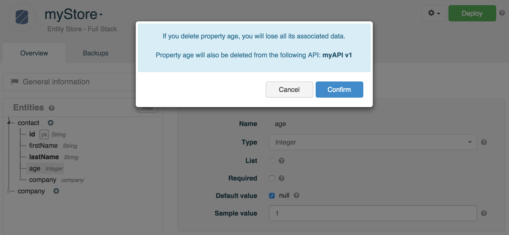

# Introduction

The Entity Store is APISpark's structured data store.  

An Entity Store provides the necessary tools to design a data model from the ground up. We will look at the Entity Store's data modeling features in the following sections.

# Create an Entity Store

Like all other cell types, Entity Stores are created and opened via the Dashboard. To create an Entity Store, go to the **Dashboard** and click on the **+ Entity Store** button.

In the **Create an Entity Store** window, select **Full Stack** in order to create an Entity Store hosted by APISpark.

Enter a **Name** (required) and a **Description** (optional) and click on the **Add** button.

# Data modeling

An Entity Store's data model is defined in the store's **Overview** tab.

An Entity Store is composed of entities, which represent types of objects and their properties. Entities can be linked together by defining special properties called relations.

## Create an entity

In the **Entities** section, click on the **Add** button.  
Give the new entity a name (required) and a description (optional) and click on the **Add** button.

## Entity configuration

Entities are listed in the **Entities** section on the left of the **Overview**.

Click on an entity from the list to display its properties underneath. Configuration information for the entity displays in the central page

The entity's **Name** and **Description** can be updated from this screen.

### Primary key policy

A property called *id* is automatically added to every new entity. This property serves as the entity's primary key.

Click on the **id** property of an Entity.

The Entity Store supports two different primary key policies.

#### Auto-generated

If the auto-generated **Value policy** is selected, then the *id* property's **Type** is immutable, and its value generated by APISpark everytime a new data element is inserted.

#### Specified at creation

You can rename the primary key property, and choose between two primitive data types: *String* and *Integer*. The value of a primary key is specified by the user in creation requests.

## Entity properties

Entities are composed of properties. An entity property has a number of different attributes that can be set.

To add a property to an Entity, click on the **+** button.

You are then invited to specify the following **attributes** for the new property.

### Name

The property's name.

### Type

The property's type. There are three main categories of types: Primitive, Composite and Reference. All possible types for a property are listed in the **Type** drop-down menu.

#### Primitive

Choose *Primitive* for basic datatypes. The primitive types available in the Entity Store are *String*, *Integer*, *Date*, *Boolean*, *Double*, *Long*, and *Float*.

#### Composite

Choose *Composite* if you need your property to contain other properties, e.g. a “contact” entity contains an “address” property which contains a “zip code” and “city” property.

In this example, "address" is a Composite property which contains 4 properties.

#### Reference

Choose Reference to link your new property to another entity created in the Entity Store. You will need this other entity id to paste it as the value of your new property, e.g. a “contact” entity has a “company” property which value will be the “company” id.

Practical data models usually require the definition of references between entities. APISpark supports one-to-many references for this purpose.

To create a one-to-many reference, add a new **Property** to the entity on the unary side. From the **Type** drop-down, select the Entity that is a reference to your property.

*Example*

Suppose your application's data model includes Users that can post Comments. A User can post multiple Comments, and a Comment is related to a single author User. Thus, this is a typical one-to-many relation.

In order to build an Entity Store like this, create a "user" entity and a "comment" entity. Add a property to entity "user" called "comments" that is of *Reference* type. Select "comment" among the *Reference* types list.

When a user posts a new *comment*, create a new *comment* element. Update the corresponding *user* element's *comments* property by adding the ID of the newly created *comment* to the list.

### List

Select this checkbox to specify the property as a collection (a list rather than a simple value).

### Required

Deselect this checkbox to specify the property as an optional field.

### Default value

To assign a default value, deselect the **Default value** checkbox and enter a value in the field that displays. The default value specified here will be suggested to the user when adding a record.

### Sample value

A sample value can be provided in this field. This value will be used to give you an idea of what your API representation will look like in different formats (by default JSON, XML or YAML).

For example, to see your API representation in JSON format, open your API **Overview**, select en representation from the **Representations** section and click on the variant chosen from the **Variants** section in the central panel.

# Edit an Entity Store schema

You can modify your Entity Store schema e.g. add a property or an entity without losing the data stored inside. Of course if you delete a property or entity, you will lose the associated data.

>**Note:** Once you have deployed your Entity Store, you will not be able to edit a property's name or its type and you will not be able to change an entity's name or its primary key policy.

## Add entities and properties

From your Entity Store, add your properties (or entities). In this example we add a composite property called *address* composed of two subproperties called *city* and *country*.

**Deploy** your Entity Store.

From the associated APIs, navigate to the **Data sources** section. This section allows you to manage the entities and properties exposed through your web API.

You can deselect the checkbox of the properties you do not want to expose and click **Apply**.

You can now **Deploy** your API and invoke it.

## Delete entities and properties

From your Entity Store, delete your properties (or entities).

Click **Confirm** and **Deploy** your Entity Store.

You can now **Deploy** the associated APIs and invoke them.

>**Note:** The web API **Data sources** section allows you to manage the entities and properties exposed through your web API.

<!--
There are three types of relations available: association, aggregation, and composition.
-->

<!--
##### Association and aggregation relations

Currently, association and aggregation relations have the same semantics: they represent a reference to another object. In practice this means that one object will contain a reference to another object through knowledge of the referred object's primary key.

##### Composition relation

The particularity of the “composition” relation is that if entity A is “composed” by entity B, then deleting a data entry of type A will result in the deletion of the data entries of type B that compose it.
-->
