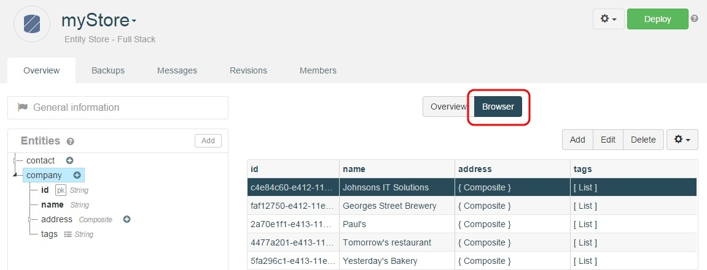
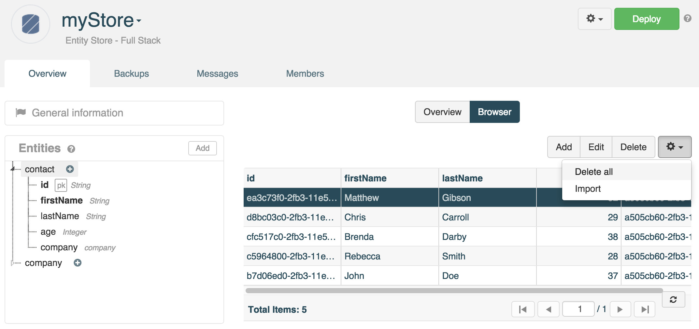
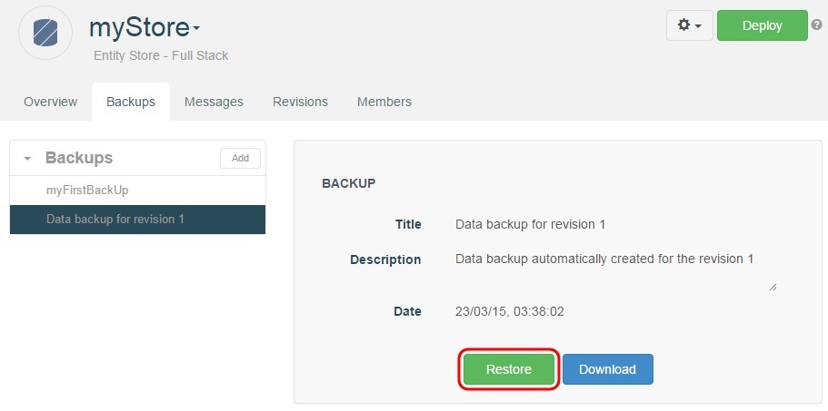

# The data browser

The data browser is a useful tool that lets you preview and edit data stored in an Entity Store.

In order to use the data browser, the Entity Store must be deployed first (see [Entity Store deployment](/technical-resources/apispark/guide/store/entity-stores/deploy "Entity Store deployment")).

If updates are made to the Entity Store's data model, the Entity Store will need to be redeployed in order for the data browser to update itself.

## Edit data

The data browser lets you view existing data, add new entries, update existing entries, and delete entries.

To open the data browser, select an Entity from the list in the left panel and click the **Browser** tab.

If your store contains more than 25 entries, they will be displayed in seperate pages. Each page contains 25 entries. You can navigate between the different pages via the button bar at the bottom of the table.

M
This button bar allows you respectively to go to the **first page**, go to the **previous page**, enter a **page number**, go to the **next page**, go to the **last page** and **refresh the page**.

## Sort data

You may want to sort data to facilitate the reading. Each column can be sorted in ascendant or descendant order.

Click on the column title once for ascendant order (▲), twice for descendant order (▼) and three time to get back to the initial order.

## Import data

If you have a big amount of data to import, you may need to perform a bulk import of your data. You can import your data in a csv file.

<iframe width="600" height="410" src="https://player.vimeo.com/video/148567520" width="500" height="313" frameborder="0" webkitallowfullscreen mozallowfullscreen allowfullscreen></iframe>

>**Notes:**  
- The first line of your csv file must include the name of each Property.  
- Make sure your csv file data format matches the data type of your Entity Properties (*Timestamp* type requires epoch format, *Boolean* type requires true/false format).  
- Composite Properties cannot be imported.  
- If the *id* is generated by APISpark, you do not need an *id* column. If an *id* is imported, it will be updated following the existing ids format.

From the data browser, click the cog button on the right of the **Delete** button and select **Import**.

Navigate to your csv file and select the appropriate column delimiter (comma, semicolon or tab).

A message informs you that the import has been successful and your data display in the data browser.

## Export data

You may need to perform a bulk export of your data. You can export your data in a csv file.

<iframe width="600" height="410" src="https://player.vimeo.com/video/148664884" width="500" height="313" frameborder="0" webkitallowfullscreen mozallowfullscreen allowfullscreen></iframe>

From the data browser, click the cog button on the right of the **Delete** button and select **Export**.

Select the appropriate column delimiter (comma, semicolon or tab).

The output file is UTF-8 encoded.

>**Note:** composites and lists properties are not exported for the moment.

## Delete data

You may delete your Entity entries one by one but if you need to delete all entries at once, use the **Delete all** button.  
Click the cog button on the right of the **Delete** button and select **Delete all**.

# Backup and restore data

APISpark lets you backup the data stored in an Entity Store for safekeeping and restoration.

To use the backup feature, navigate to the **Backup** tab from an Entity Store's **Overview**.

Backups can be created at any time, as long as the Entity Store is deployed.

## Create a backup

To create a new backup, click on the **Add** button in the backups section in the left panel. You will be prompted to enter a **Name** and a **Description** for the backup.

You can consult your existing backups in the left panel.

## Restore a backup

To restore a backup, select a backup from the **Backups** list in the left panel, and click on the **Restore** button.

> **Note**: restoring a backup will overwrite any existing data stored in your Entity Store. We recommend creating a backup of your current Entity Store before restoring a previous backup.

## Download a backup

To download a backup, select a backup from the **Backups** list in the left panel, and click on the **Download** button. You will download your backup in csv format.

