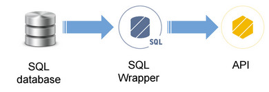

# Introduction

APISpark features a Wrapper Entity Store for SQL databases. The SQL Wrapper lets you expose data stored in a SQL database through a web API.

# Create a SQL Wrapper

To know how to create a SQL wrapper step by step, jump to our [SQL tutorial](/technical-resources/apispark/tutorials/expose-sql-via-api "SQL tutorial").

# Primary key policy

A unique identifier is automatically added to every new entity and serves as the entity's primary key. By default, it is generated by your database.

Click on the **id** property of an Entity.

The SQL wrapper supports three different primary key policies.

## Generated by database

The value of the primary key is generated by the origin SQL database. You can rename the primary key property and its data type is *Integer*.

## Generated by APISpark

If **Generated by APISpark** is selected, then the *id* property's **Type** and **Name** are immutable, and its value generated by APISpark everytime a new data element is inserted.

## Specified at creation

You can rename the primary key property, and choose between three data types: *String*, *Integer* and *Long*. The value of a primary key is specified by the user in creation requests.

# Update your SQL database structure

If you modify your database structure (e.g. add/remove columns), you will need to synchronize your database with your sql-to-wrapper Wrapper.

Navigate to the **Settings** tab of your SQL Wrapper.  
Click the **Synchronize** button and **Deploy** your wrapper.

The changes made have been propagated to the associated API(s) as you you can see in your API **Data sources** section.

