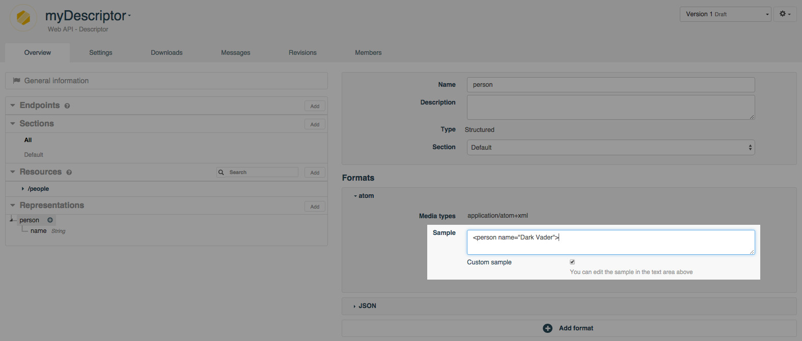
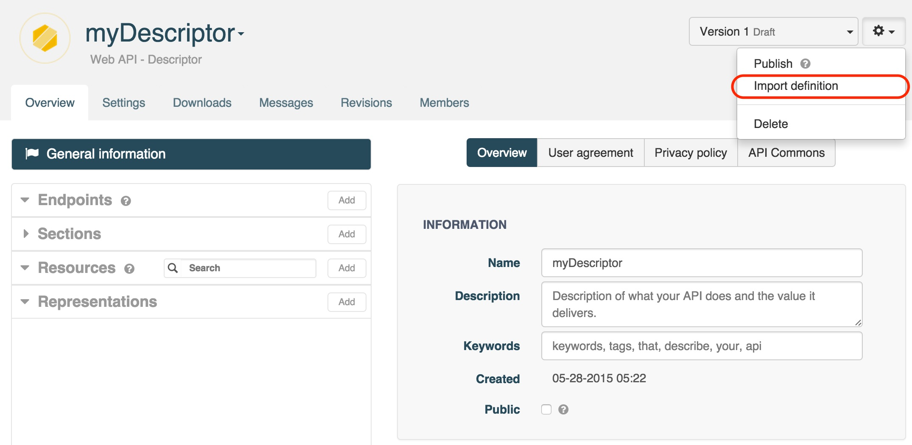
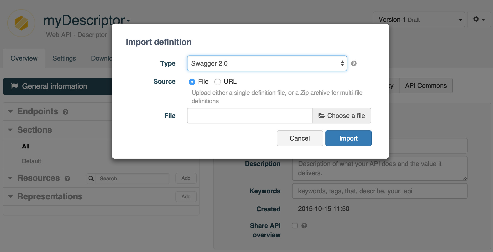

# Create a Descriptor cell

To create a Descriptor, go to the **Dashboard** and click on the **+Web API** button.

In the **Create a web API** window, select **Descriptor** from the **Type** drop-down menu. You will be prompted to give your Descriptor a **Name** and a **Description** (optional).

A **Descriptor** is composed of **Endpoints**, **Resources**, and **Representations**.

## Add a custom sample value to a representation

You can add custom samples to a representation:
From the **Overview** tab, select the chosen representation from the left panel and select the **Custom sample** checkbox. Edit the sample in the associated text field and **Save**.

To go back to the default sample value, deselect the **Custom sample** checkbox and **Save**.

>**Note:** Custom sample values are not supported for input representations or method responses of **list** Type.

# Describe your web API

Rather than manually create a *Descriptor* from scratch, APISpark provides ways for you to automatically generate one that describes your existing API.

A *Descriptor* can be generated from your current API's Swagger definition, or from your code if your API is implemented using either the Restlet Framework or JAX-RS.

## Generate a Descriptor from a Swagger or RAML definition

You can generate a web API Descriptor by importing a Swagger/RAML definition for an existing web API, by providing the Swagger definition's URL or file. Swagger 1.2, Swagger 2.0 and RAML 0.8 are supported.

From the Dashboard, open an existing Descriptor or create a new one by clicking on **+ Web API** and selecting **Descriptor** from the drop-down menu.

From the Descriptor's **Overview**, click on the cog button on the top right of your screen and select **Import definition** from the menu.

You will be prompted to select the file that contains your API's Swagger definition or to enter the URL that points to it. Swagger 1.2, Swagger 2.0 and RAML 0.8 are supported.

Click on the **Import** button to import the Swagger/RAML definition into your Descriptor. As a result, representations and resources will be added to your Descriptor according to the content of the Swagger definition.

To view the changes, navigate to the Descriptor's **Overview** tab.

### Import a multi-file definition

You can import a multi-file definition by uploading a zip archive.

Click on **Choose a file** and browse to the zip archive you have chosen.  
From the **Main definition file** drop-down menu, select the  main file at the root of your API definition.

## Generate a Descriptor with Restlet's code Introspector

The Restlet code introspector is designed to generate a web API Descriptor by introspecting the code of your existing web API implementation.

The introspector supports two types of Java implementations: those based on the Restlet Framework, and those based on JAX-RS. In both, Swagger annotations are supported.

For more information on how to introspect a Restlet Framework application, jump to our [Document an existing Restlet web API](/technical-resources/apispark/tutorials/document-restlet-api "Document an existing Restlet web API") tutorial.

For more information on how to instrospect a JAX-RS application, jump to our [Document an existing JAX-RS web API](/technical-resources/apispark/tutorials/document-jax-rs-api "Document an existing JAX-RS web API") tutorial.

After introspecting your JAX-RS code, you can work on your [Descriptor](/technical-resources/apispark/guide/document/download-documentation "Descriptor").
