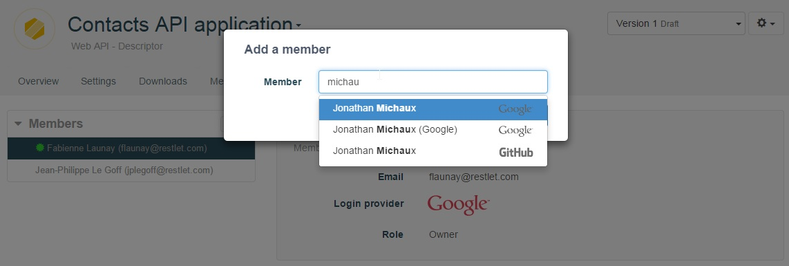
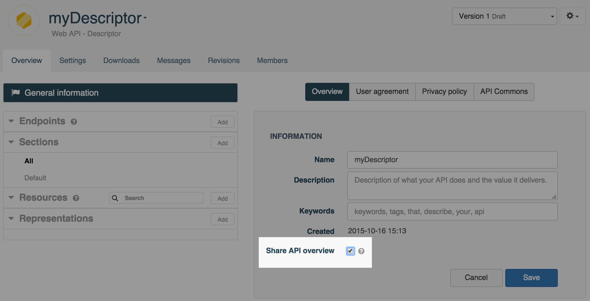
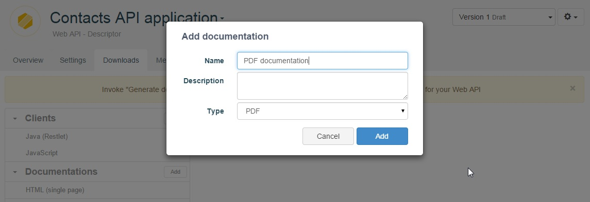
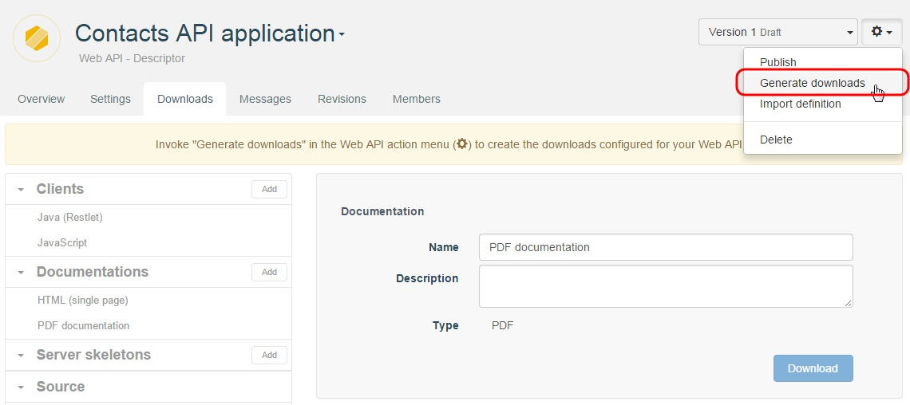

Once you have completed your **Descriptor** cell, you can get your web API documentation and share it with your team or make it public.

<!--
# Document your web API

For details on how to get the documentation of your cell, go to the [Documentation page](/technical-resources/apispark/guide/publish/publish/documentation "Documentation page") of the **Publish** section.
-->

# Share your web API Descriptor

## Share it with team members

Once you have created your Descriptor cell, you can share it with your team members.

Navigate to the **Members** tab, and click on the **Add** button.

For more information on Team work, jump to our [Team work](/technical-resources/apispark/guide/explore/team-work "Team work") section of the User Guide.

## Make it public

To share you Descriptor cell to anyone, you can also make it public.

Navigate to the **Overview** tab and select the **Public** checkbox.

# Download your web API Descriptor

## Add new documentation for download

In order to be able to download documentation for your Descriptor, you need to first define the documentation you want to make available.

To do this, navigate to the **Downloads** tab of your Descriptor and click on the **Add** button of the **Documentations** section in the left panel.

You will be prompted to select a **Name** and **Type** (format) for your new downloadable documentation.

Once the desired types of documentation have been added to the **Documentations** section, you will need to generate the downloads for your Descriptor.

## Generate documentation and client kits

To generate the downloads for your Descriptor, open the API's **Overview**, click on the drop-down action button and select **Generate downloads**.

Your documentation can now be downloaded from the **Downloads** tab in the **Documentations** section by selecting a type of documentation from the list and clicking on the **Download** button.

<!--add screenshot when bug fixed
-->

# Use Standard formats for third party integration

With **APISpark**, you could download the [API definition in standard formats](/technical-resources/apispark/guide/publish/publish/api-definition "Standard API definition") like **RAML** or **Swagger** and integrate it with third party applications.
