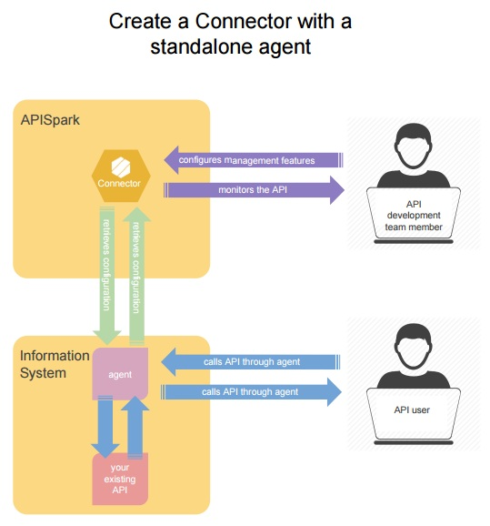
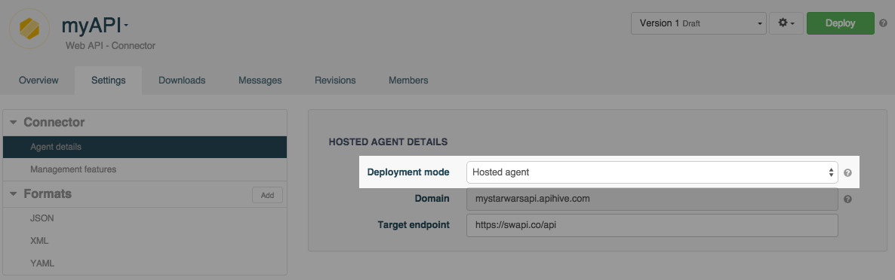

APISpark can bring additional features to your existing web API hosted outside of APISpark with the *Connector* cell.

# Enhance your web API

With a *Connector*, you can add and configure the following features to your API:

* Authenticated access  
* Fine-grained access control  
* Rate-limitation (quotas) to your API users  
* IP filtering

# How does a connector work?

A connector is splitted into two parts: a *Connector Cell* and a *APISpark Agent*.

The Connector Cell is defined in the APISpark console and holds the configuration of the desired features.

The APISpark Agent is set in front of your API, accesses this configuration, acts as a Reverse Proxy and provides the features you have enabled in the APISpark console on the incoming requests of your API.

You can either decide to host the agent on your own Information System or to host it directly on APISpark:

## Hosted agent
By default, APISpark hosts the agent. A hosted agent will be running directly within APISpark and will allow you to add management features to your API by proxying its traffic. if you choose hosted agent **Deployment mode**, you will be asked to choose a domain on apispark.net. A default HTTPS endpoint will be created using that domain.

## Standalone agent
A standalone agent can be downloaded and run on your own infrastructure in order to reduce lag as much as possible as the agent is very close to your hosted API. This agent allows you to add management features to your API by proxying its traffic.

# Create a Connector cell

To create a Connector, go to the **Dashboard** and click on the **+Web API** button.

In the **Create a web API** window, select **Connector** from the **Type** drop-down menu.

Select the appropriate **Deployment mode**:

**Hosted agent**  
The default configuration is *Hosted agent*.
You are prompted to give your Connector a **Name** and a **Description** (optional). The **Domain** field is filled in automatically on the basis of the **Name** entered. If the domain is not available, a message informs you that you need to choose a unique domain.

From the **Settings** tab, select the **Remote agent** menu from the **Connector** section. Enter a **Target endpoint** for your agent.

>**Note:** Your target endpoint must not end up with a trailing slash "/".

**Standalone agent**  
You will be prompted to give your Connector a **Name** and a **Description** (optional).

A Connector has the same properties as a [web API](/technical-resources/apispark/guide/create/overview "Web API") except that a Connector is not hosted by the APISpark platform.

With a Connector you can also document your web API as with a [Descriptor](/technical-resources/apispark/guide/document/overview "Descriptor").

Once you have created a Connector, you can [configure it and install the Remote Agent](/technical-resources/apispark/guide/manage/remote-agent "Remote Agent") in your Information System (if you choose the standalone agent configuration), and that's all.  
 Your web API has new features inside without writing a line of code!

# Import a Swagger or RAML definition

You can import a Swagger or RAML definition by providing the definition's URL or file. Swagger 1.2, Swagger 2.0 and RAML 0.8 are supported.

From the Dashboard, open an existing Connector or create a new one by clicking on **+ Web API** and selecting **Connector** from the drop-down menu.

From the Connector's **Overview**, click on the cog button on the top right of your screen and select **Import definition** from the menu.

You will be prompted to select the file that contains your API's definition or to enter the URL that points to it. Swagger 1.2, Swagger 2.0 and RAML 0.8 are supported.

Click on the **Import** button to import the Swagger or RAML definition into your Connector. As a result, representations and resources will be added to your Connector according to the content of the definition.

To view the changes, navigate to the Connector's **Overview** tab.

## Import a multi-file definition

You can import a multi-file definition by uploading a zip archive.

Click on **Choose a file** and browse to the zip archive you have chosen.  
From the **Main definition file** drop-down menu, select the  main file at the root of your API definition.

# Switch a connector cell deployment mode

It is possible to switch between hosted or standalone configurations.  
Switch from standalone agent to hosted agent deployment mode requires that you specify a domain name if one was not already chosen.
>**Note:**  If you switch back to standalone agent configuration, the domain name is still reserved to this connector in case you would want to switch back.

Domain creation is subject to the same rules as for full stack APIs. This also results in the creation of a new HTTPS endpoint that uses this domain.

Navigate to the **Settings** tab and select **Agent details** from the **Connector** section. Choose the *Hosted agent* or *Standalone agent* configuration from the **Deployment mode** drop-down menu.

**Save** your changes and **Deploy** your Connector so that your latest changes are taken into account.
