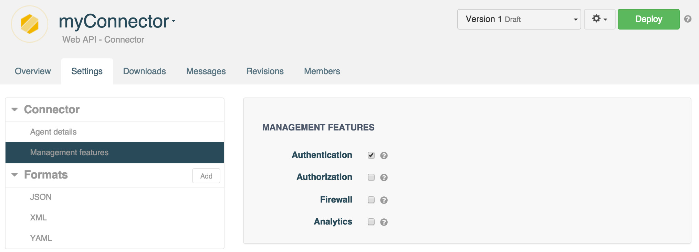
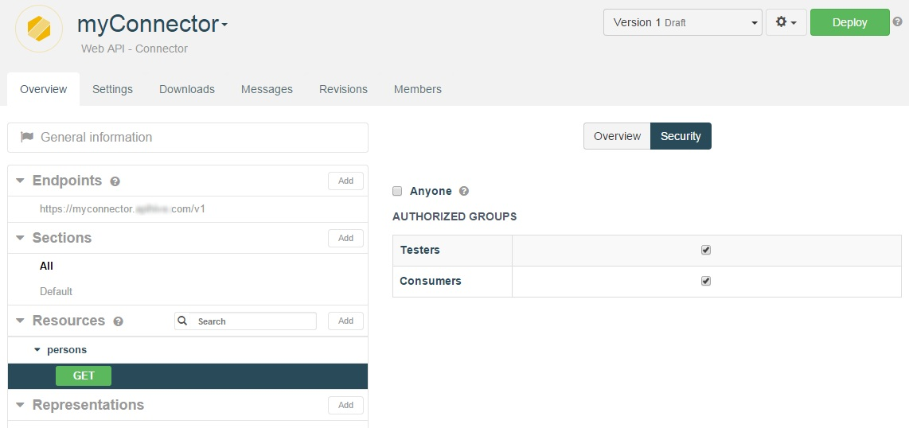
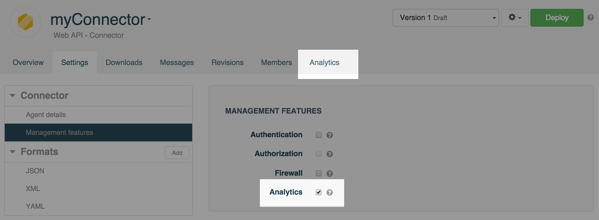

The features used by the *Remote Agent* are defined on your APISpark Dashboard, on the *Connector* cell.

# Configure your agent

To enable or disable each feature:

Open the appropriate cell.  
Navigate to the **Settings** tab.  
In the **Connector** section, select **Management features**.  
Select the features you want to enable.

## Authentication module

The **Authentication** module uses the access settings defined in the **Members** tab.

For more information, jump to our [User Groups](/technical-resources/apispark/guide/publish/secure/user-groups "User Groups") section.

## Authorization module

By enabling the **Authorization** module, you activate the **General** section with the **Default permissions** page.

You will find the **Default Permissions** page by clicking the **General** button in the **Settings** tab.

To go to the **Security** tab, navigate to the **Overview** tab and select a method from the **Resources** section.

Go to the [Runtime Permissions](/technical-resources/apispark/guide/publish/secure/runtime-permissions "Runtime Permissions") section to discover how to configure the access.

>**Note:** The **Authorization** module requires the **Authentication** module to be activated.

## Firewall module

With the **Firewall** module, you can add *Rate Limitation* or *IP Filtering* to your web API.

Please go through the [Firewall settings](/technical-resources/apispark/guide/publish/secure/firewall-settings "Firewall Settings") page to add such rules.

## Analytics module

If you enable the **Analytics** module, you activate the **Analytics** tab. This tab allows you to measure your API consumption.

# Activate your settings

Once you have completed your settings, you need to deploy your *Connector* configuration to activate them.

Click on the **Deploy** button to deploy your cell. Please go to the [Cell deployment](/technical-resources/apispark/guide/explore/cell-deployment "Cell deployment") page for further information.

# Install your Standalone agent

In order to plug the Connector services, you need to install the agent in your Information System in front of your web API application.

Please follow the steps below to install the agent:

## Download the agent

The agent is a standalone application and exists also as a Restlet Framework Service to use it embedded in a Restlet Framework application.

<!-- TODO add download link and restlet framework guide link -->

## Configure the Agent

As explained before, APISpark agent uses the modules that you have enabled in your APISpark Console.

The agent retrieves its settings from APISpark and you need to configure the agent first to communicate with your Connector cell.

The Standalone agent is configured from a properties file which is included in the downloaded file. This file looks like this:

<pre lang="ini"><code>
agent.login=67b60a5d-c2b8-43a3-97b8-084d6ce60e10
agent.password=5dcf7dc2-a2c4-44f5-b753-c26abea2c8b5
agent.cellId=154
agent.cellVersion=1
reverseProxy.enabled=true
reverseProxy.targetUrl=https://192.168.10.130:8080
</code></pre>

To fill-in this configuration file, go to the **Settings** tab and select **Remote Agent** in the **Connector** section.

On this page you will find the value of the property keys `agent.login`, `agent.password`, `agent.cellId` and `agent.cellVersion`.

The `reverseProxy.targetUrl` key should be set to the URL of your web API.

Let's have a look at a full configuration example:

* Before you install the agent:

  The URL `https://myapi.com` serves your local web API running on `https://192.168.10.130:8080`.

* With the agent:

  The agent is started on `https://192.168.10.131:8000`.

  Now, the URL `https://myapi.com` serves the agent on `https://192.168.10.131:8000`.

  The agent should redirect the incoming request to your local web API on `https://192.168.10.130:8080`.

  Therefore the agent configuration is:

  <pre lang="ini"><code>
  reverseProxy.targetUrl=https://192.168.10.130:8080
</code></pre>

With the standalone agent, the value of the `reverseProxy.enabled` key should be set to `true`.

## Start the Agent

Once your configuration file is filled, you can start the agent with the command below:

<pre lang="java"><code>
java -jar -DapiSparkServiceConfig=/path/to/agent.properties apispark-agent.jar
</code></pre>

  > Note:
  > The agent requires a Java runtime environment 1.7 (or above).

## Change the port

By default the *Agent* runs on port 8000. You could change the port with the `-p` option as shown below:

<pre lang="java"><code>
java -jar\
  -DapiSparkServiceConfig=/path/to/agent.properties\
  apispark-agent.jar\
  -p 3000
</code></pre>

## Use HTTPS

You could also run the Agent with the `HTTPS` protocol instead of `HTTP` with the `--https` option .

Use `--help` to have the full list of options.

### Sample case using a self signed certificate

1.Generation of a self signed certificate into a keystore called `server-keystore.jks`

Achieve this step using `keytool`.

<pre lang="shell"><code>
keytool -genkey\
 -v\
 -alias serverX\
 -dname "CN=**serverX**,OU=IT,O=JPC,C=GB"\
 -keypass password\
 -keystore server-keystore.jks\
 -storepass password\
 -keyalg "RSA"\
 -sigalg "MD5withRSA"\
 -keysize 2048\
 -validity 3650
</code></pre>

>**Note:** The keystore is protected by a password.

2.Configure the agent to leveraging HTTPS and use this keystore

Just add the following command line parameters:

<pre lang="shell"><code>
--https --sslKeyPassword password --sslKeyStorePassword password --sslKeyStorePath /path/to/server-keystore.jks --sslKeyStoreType JKS
</code></pre>

Here is the full command line of the agent:

<pre lang="shell"><code>
java -jar\
  -DapiSparkServiceConfig=/path/to/agent.properties\
  apispark-agent.jar\
  --https\
  --sslKeyPassword password\
  --sslKeyStorePassword password\
  --sslKeyStorePath /path/to/server-keystore.jks\
  --sslKeyStoreType JKS
</code></pre>
