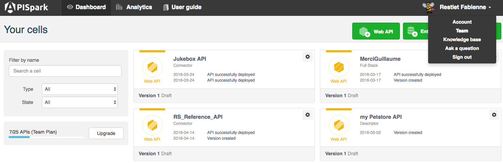
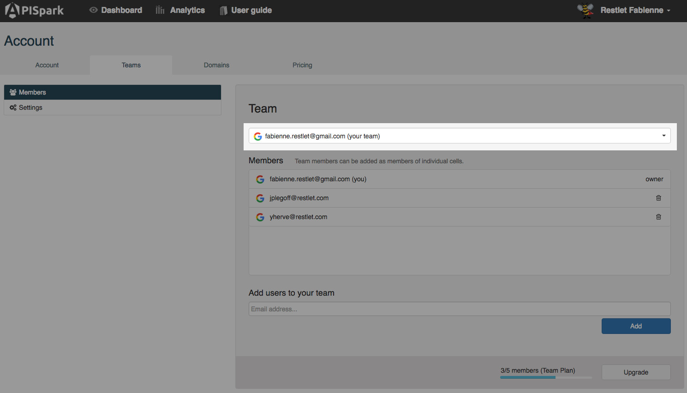
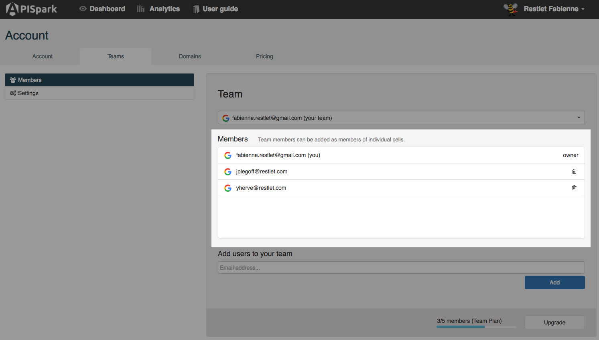
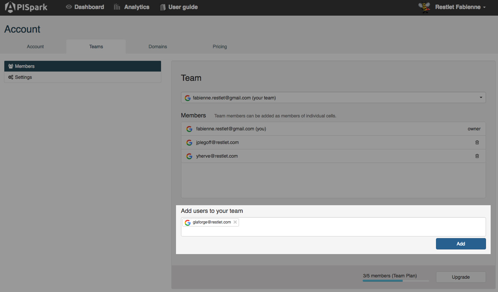

APISpark allows you to share your cells with members of your team (if you subscribed to a Team or Scale [plan](/technical-resources/apispark/guide/get-started/subscribe "plans")).  
You can define your [Sharing settings](/technical-resources/apispark/guide/share/sharing-settings "Sharing settings") from the Settings page.

# View your teams

To navigate to your **Teams** page, make sure you are signed in, then click on your username on top right of your screen and select **Teams**.  

From the top drop-down menu, select one of the teams you belong to (including yours).

The **Members** displayed underneath are those of the team selected above.  

>**Note:** You can delete members of your own team by clicking the recycle bin button displayed on the right of each member except you.

# Add users to your team

Click on your username on top right of your screen and select **Teams**.    
In the **Add users to your team** field, enter the email address of a user you want to add to your team and click **Add**.

>**Note:** At the bottom of the window, you can see the number of members you added to your team and the number of members you are allowed according to the plan you subscribed to (Here 3/5). If you need to add more members, click **Upgrade**.
