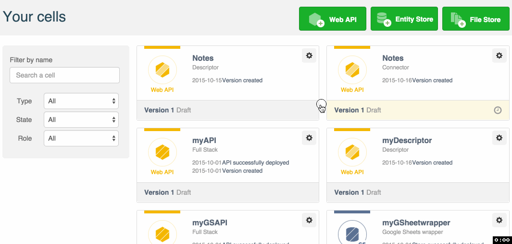
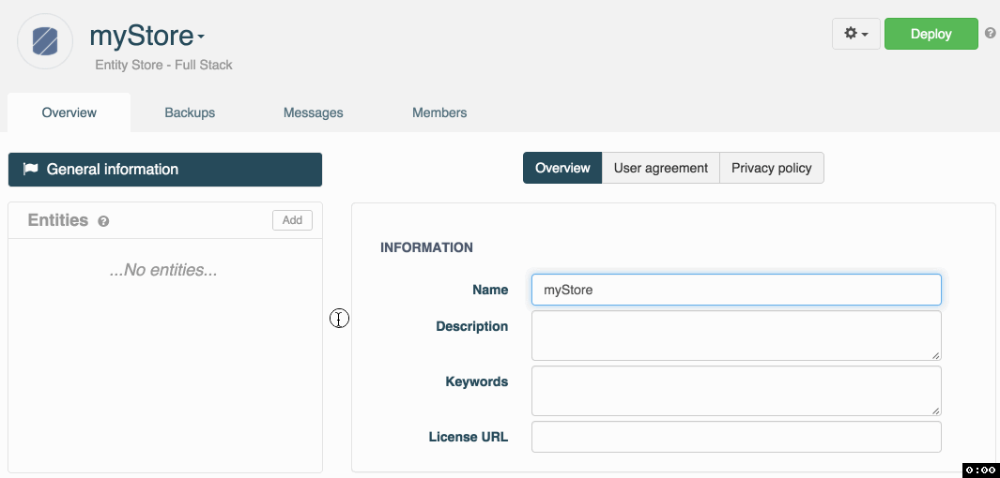
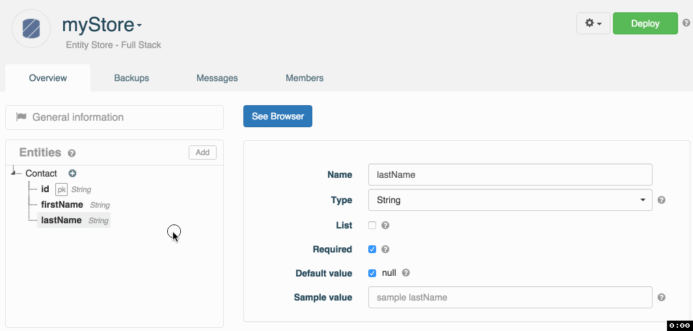
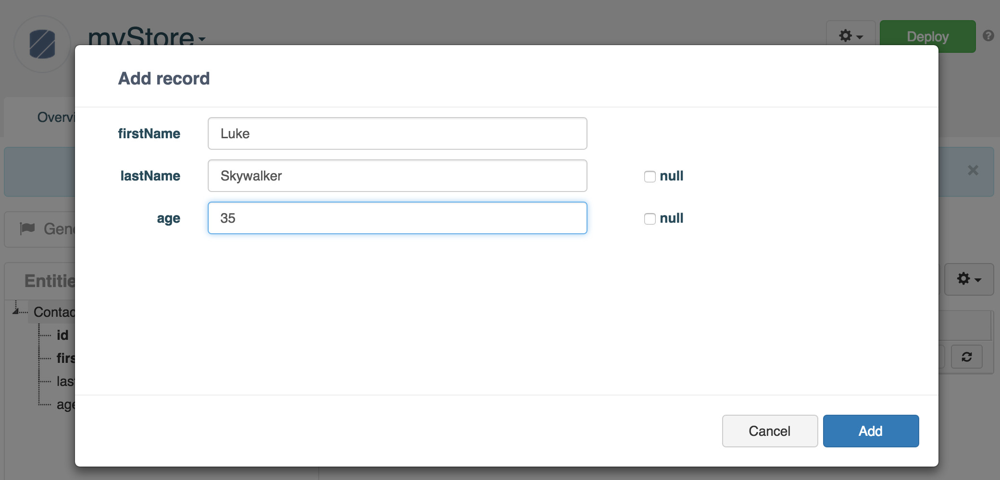
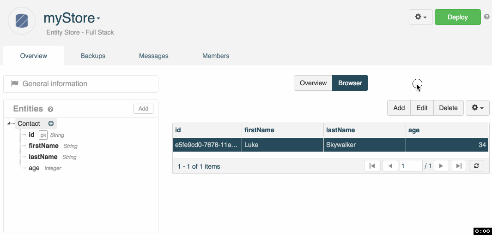
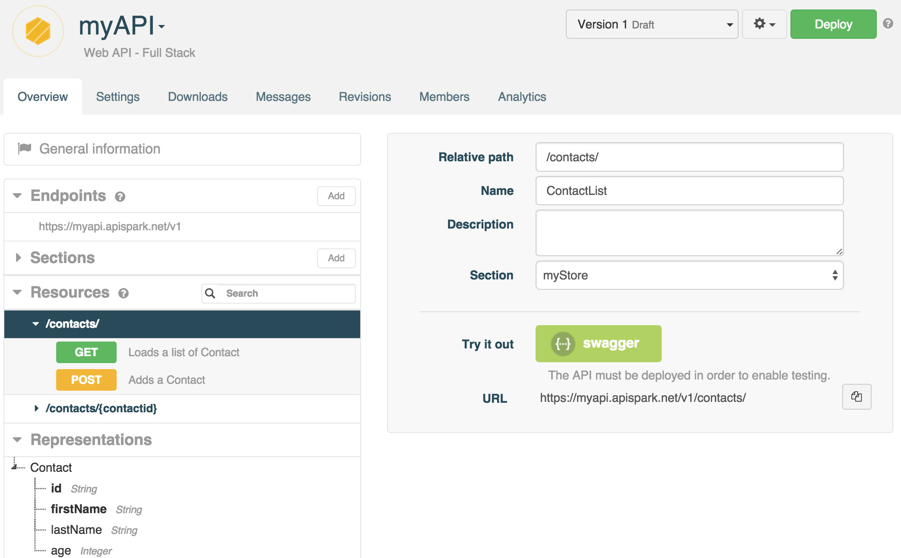

# Introduction

This tutorial will show you how to deploy your first API in 15 minutes or less. Head to our [User guide](/technical-resources/apispark/guide "User guide") page first if you would like to learn about the main concepts behind APISpark. Now, let’s get right to it.

# Requirements

To follow this tutorial, you will need the following:

*   a web browser,
*   15 minutes of your time.

# 1. Create an Entity Store

## 1.1 Add a new Entity Store

If you have not already done so, sign in to your APISpark account and open your **Dashboard**.

Create a new Entity Store. Click on **+ Entity Store**, select the "Full stack" **Type** and enter the **Name** "myStore".

Click on the **Add** button to create the new Entity Store.

You will be taken to the new Entity Store's **Overview page**.

## 1.2 Create your data model by adding entities and properties

Click on the **Add** button next to **Entities** in the left panel to create a new Entity. Name the new Entity **Contact**.

To add **Properties** to an entity, select the + button to the right of this entity.

We are going to create three properties named *firstName*, *lastName* and *age*. Note that the *id* property was created automatically.

For each property you create, you can choose a **Type**, a **Default value**, make it **Optional** or a **List**.

## 1.3 Deploy the Entity Store

Click on the **Deploy** button to deploy your Entity Store.

## 1.4 Add data via the Data Browser

Once your Entity Store has been deployed, you can use it to store contacts. For the purpose of this tutorial, let’s add one via the APISpark Data Browser.

Select the Contact entity from the **Entities** menu in the left panel of the **Overview**.

Click on the **Browser** tab in the central panel.

Click on the **Add** button to add a new Contact. You will be prompted to enter values for the entity's properties.

Click on the **Add** button. Your first contact should be displayed like so:

# 2. Create a Web API

## 2.1 Export an API from the Entity Store

From the Entity Store **Overview**, click on the cog button to the left of the **Deploy** button and select **Export web API**.

Enter a name for your API (e.g. myAPI).

The domain will be created automatically but may not be available anymore so make sure to adjust it.

Click **Add**. You will be taken to the API’s **Overview** page.

Note that your API's **Endpoints**, **Resources**, and **Representations** have been created automatically.

The screenshot below shows some of the drop down menus opened to give you an idea of how the web API **Overview** is organized.

## 2.2 Deploy the web API

Deploy the API by clicking the **Deploy** button.

The API should now be accessible online. To reach it, use the subdomain of apispark.net that you chose when you created the API.

The credentials required to invoke the API are located in the **Overview** tab, by selecting the relevant **Endpoint**.

# 3. Invoke the web API

Using a web API does not impose any particular programming language. It can even be done from a web browser. However, to test your API, APISpark offers an integration of the Swagger UI that provides a graphical user interface to perform HTTP calls.

From the **Overview** tab of your API, select the appropriate Endpoint.  
From the left panel, click on the Resource and the Method chosen and click on the **swagger** button.

The Swagger UI opens in a new tab.  
Your credentials are pre-filled in the two fields on top of the screen.

Scroll down to the bottom of the page and click on the **Try it out!** button to invoke your API.

>**Note:** APISpark lets you generate custom Client SDKs for your API. Different environments are supported including Java, Android, iOS and JavaScript (AJAX or Node.js).

Congratulations on completing this tutorial! If you have questions or suggestions, feel free to contact the <a href="http://support.restlet.com/" target="_blank">Help Desk</a>.
