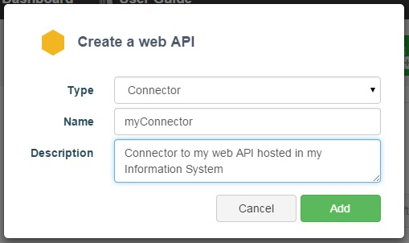
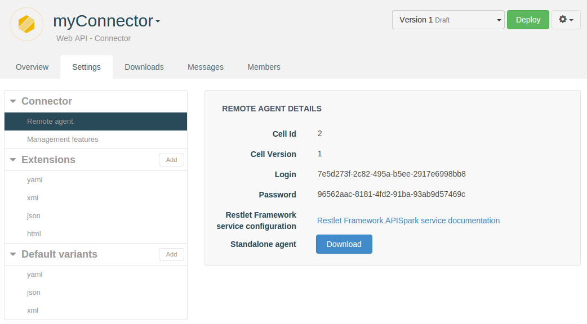

# Introduction

APISpark provides a tool to manage an existing Web API hosted outside of APISpark. To get a full overview of the management features available, take a look at the [related documentation](https://restlet.com/technical-resources/apispark/guide/manage/connectors).

In this scenario, we will add authenticated access to an existing Web API via the APISpark tool. If you don't have a running Web API, you will find a link to download a dummy one.

# 1. Create a Web API Connector

If you have not already done so, <a href="
https://apispark.restlet.com/signin" target="_blank">sign in</a> to your APISpark account and open your **Dashboard**.

Create a new Connector. Click on **+ Web API**, select the "Connector" **Type** and enter the **Name** "myConnector".



Click on the **Add** button to create the new Web API Connector.

You will be taken to the new Web API Connector's **Overview page**.

# 2. Configure the authentication feature

## 2.1. Enable authentication feature

First of all, you will want to enable the authentication feature of the Connector you just created. To do so, check the checkbox **Authentication** from the **Management features** menu entry from the left panel of the **Settings**.


## 2.2. Add members to your Web API

To add new consumers to your API, create new members in **Members**.


Members of your Web API Connector will be able to consume it once it has been deployed. A set of credentials will be auto-generated for each of them.

Each member will receive credentials, to get them log in to APISpark and click on the **Endpoint** you want to attack in the left panel of the **Overview**.

**INSERT SCREENSHOT HERE WHEN READY**

You can now deploy your Web API Connector.

# 3. Plug the agent to your Web API

## 3.1. Launch your Web API

If you have a Web API running you can use it, otherwise, download [this dummy Web API]() and launch it with the following command line:

```
java -jar myDummyAPI.jar
```

The dummy API runs on `https://localhost:9001`.


## 3.2. Launch the agent

The agent is available for download in the **Remote agent** entry in the left panel of **Settings**.



You will download a zip file containing the jar and a configuration file. To learn how to fill the configuration, please take a look at this [specific documentation](https://restlet.com/technical-resources/apispark/guide/manage/remote-agent) in the section **Configure the Agent**.

Once your agent is configured, just launch it with the following command line:

```
java -jar -DagentConfiguration=./agent.properties apispark-agent.jar
```

# 4. Invoke the Web API

Now that your environment is all set, try to call `http://localhost:8000` with and without providing valid credentials.


