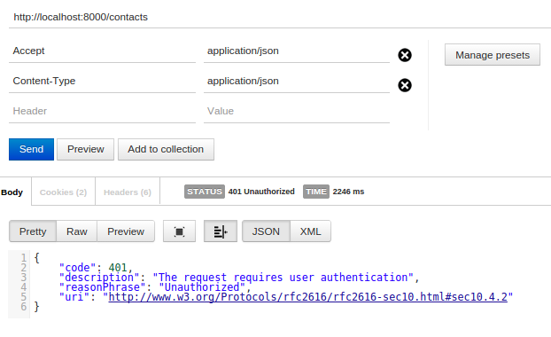
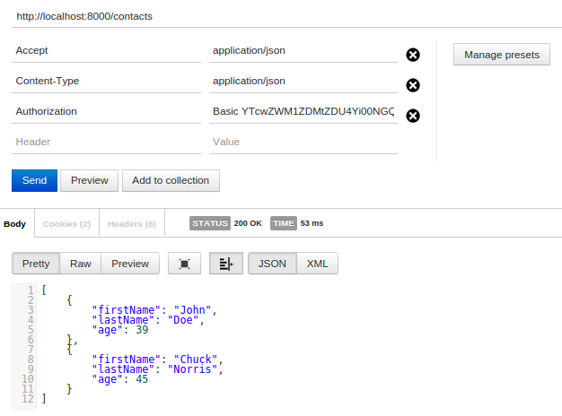

# Introduction

APISpark provides a tool to manage an existing web API hosted outside of APISpark. To get a full overview of the management features available, take a look at the [related documentation](https://restlet.com/technical-resources/apispark/guide/manage/connectors).

In this scenario, we will add authenticated access to an existing web API via the APISpark tool. If you do not have a running web API, you will find a link to download a sample one.

# 1. Create a web API Connector

If you have not already done so, <a href="
https://apispark.restlet.com/signin" target="_blank">sign in</a> to your APISpark account and open your **Dashboard**.

Create a new Connector. Click on **+ Web API**, select the "Connector" **Type** and enter the **Name** "myConnector".


Click on the **Add** button to create the new web API Connector. You will be taken to the new web API Connector's **Overview** page.

# 2. Configure the authentication feature

## 2.1. Enable the authentication feature

First of all, you will want to enable the authentication feature of the Connector you just created.  
To do so, click on the **Settings** tab.  
In the **Connector** section, select **Management features**.  
Select the **Authentication** checkbox in the central panel.


## 2.2. Add members to your web API

To add new consumers to your API, create new members from the **Members** tab.


Members of your web API Connector will be able to consume it once it has been deployed. A set of credentials will be auto-generated for each of them.

Each member will receive credentials. To get them, log in to APISpark and click on the **Endpoint** you want to call in the left panel of the **Overview** page.

**INSERT SCREENSHOT HERE WHEN READY**

You can now deploy your web API Connector.

# 3. Plug the agent to your web API

## 3.1. Launch your web API

If you have a web API running you can use it, otherwise download [this sample web API]() and launch it with the following command line:

```
java -jar mySampleAPI.jar
```

The sample API runs on `https://localhost:9001`.


## 3.2. Launch the agent

The agent is available for download from the **Remote agent** page: click on the **Settings** tab, and select **Remote agent** from the **Connector** section. 


You will download a zip file containing the jar and a configuration file. To learn how to configure the agent, please take a look at this [specific documentation](https://restlet.com/technical-resources/apispark/guide/manage/remote-agent) in the section **Configure the Agent**.

Once your agent is configured, launch it with the following command line:

```
java -jar -DapiSparkServiceConfig=./agent.properties apispark-agent.jar
```

# 4. Invoke the web API

Now that your environment is all set, try to call `http://localhost:8000` with and without providing valid credentials.

## 4.1. Calling the API with invalid credentials



## 4.2. Calling the API with valid credentials



Congratulations, you just protected your API with authentication!
