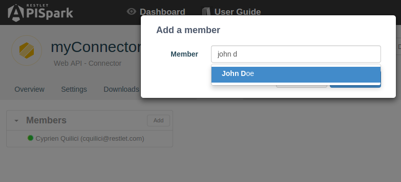

# Introduction

APISpark provides a tool to manage an existing web API hosted outside of APISpark. To get a full overview of the management features available, take a look at the [related documentation](/technical-resources/apispark/guide/manage/connectors).

In this scenario, we will add authenticated access to an existing web API via the APISpark tool. If you do not have a running web API, you can use our sample API hosted on APISpark.

# 1. Create a web API Connector

If you have not already done so, <a href="
https://apispark.restlet.com/signin" target="_blank">sign in</a> to your APISpark account and open your **Dashboard**.

Create a new Connector. Click on **+ Web API**, select the "Connector" **Type** and enter the **Name** "myConnector".


Click on the **Add** button to create the new web API Connector. You will be taken to the new web API Connector's **Overview** page.

In the **Endpoints** section, click on the **Add** button to add an Endpoint to your Connector.

# 2. Configure the authentication feature

## 2.1. Enable the authentication feature

First of all, you will want to enable the authentication feature of the Connector you just created.  
To do so, click on the **Settings** tab.  
In the **Connector** section, select **Management features**.  
Select the **Authentication** checkbox in the central panel.


## 2.2. Add members to your web API

To add new consumers to your API, create new members from the **Members** tab.



Members of your web API Connector will be able to consume it once it has been deployed. A set of credentials will be auto-generated for each of them.

Each member of the Connector can use his/her credentials to consume the API. To get yours, go to the **Overview** page of the Connector and open the Endpoint you want to invoke.


You can now **Deploy** your web API Connector.

# 3. Plug the agent to your web API

## 3.1. Launch your web API

If you have a web API running, make sure it is running. Otherwise just make GET calls on this URL:

[https://rsreferenceapi.apispark.net/v1/contacts/](https://rsreferenceapi.apispark.net/v1/contacts/)

## 3.2. Launch the agent

The agent is available for download from the **Remote agent** page: click on the **Settings** tab and select **Remote agent** from the **Connector** section.


You will download a zip file containing the jar and a configuration file. To learn how to configure the agent, please take a look at this [specific documentation](https://restlet.com/technical-resources/apispark/guide/manage/remote-agent) in the section **Configure the Agent**.

Once your agent is configured, launch it with the following command line:

```
java -jar -DapiSparkServiceConfig=/path/to/your/agent.properties apispark-agent.jar
```

# 4. Invoke the web API

Now that your environment is all set, try to call `http://localhost:8000` with and without providing valid credentials.

## 4.1. Calling the API with invalid credentials


## 4.2. Calling the API with valid credentials


Your API is now protected with authentication.

Congratulations on completing this tutorial! If you have questions or suggestions, feel free to contact the <a href="http://support.restlet.com/" target="_blank">Help Desk</a>.
