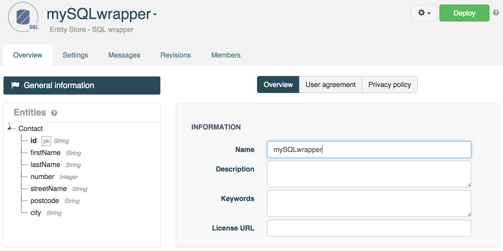

# Introduction

This tutorial will show you how to create a custom web API that exposes data stored in an Address Book SQL database.

# Requirements

To follow this tutorial, you will need:

*   a web browser,
*   20 minutes of your time,
*   your SQL database login details.

# 1. Prepare the SQL Data Source

In this tutorial example, we create an SQL table named **T_CONTACT** with the following fields:

<li>**ID** (varchar): primary key</li>
<li>**FIRST_NAME** (varchar): first name</li>
<li>**LAST_NAME** (varchar): last name</li>
<li>**NUMBER** (int): street number</li>
<li>**STREET_NAME** (varchar): street name</li>
<li>**POSTCODE** (varchar): postcode</li>
<li>**CITY** (varchar): city</li>

>**Note:** The currently supported column types are the following: INT, INTEGER, MEDIUMINT, DATE, DATETIME, TIMESTAMP, TIME, BIGINT, BOOLEAN, DECIMAL, DOUBLE, FLOAT, NUMERIC, SMALLINT, TINYINT and VARCHAR.

Connect the database engine using the MySQL console:

<pre>$ mysql -u root -p</pre>

Create a database and switch to it:

<pre>mysql> create database apispark;
Query OK, 1 row affected (0.01 sec)
mysql> use apispark;
Database changed</pre>

Create an InnoDB table named T_ADDRESS with fields previously listed:

<pre>CREATE TABLE T_CONTACT (
	  ID VARCHAR(255),
	  FIRST_NAME VARCHAR (255),
	  LAST_NAME VARCHAR (255),
	  NUMBER INT,
	  STREET_NAME VARCHAR (255),
	  POSTCODE VARCHAR (255),
	  CITY VARCHAR (255),
	  PRIMARY KEY(ID)
	) ENGINE = InnoDB;
</pre>

Create a new user and grant him full rights on the database. Replace username and password by the values you like:

<pre>CREATE USER 'username'@'%' IDENTIFIED BY "password";
GRANT ALL PRIVILEGES on apispark.T_CONTACT TO 'username'@'%';
FLUSH PRIVILEGES;
</pre>

>**Note:** you can grant privileges on all tables by replacing T_CONTACT by \* and on all databases by replacing apispark by \*.

# 2. Create an SQL Wrapper

## 2.1 Create a new SQL Wrapper

If you have not already done so, <a href="https://apispark.restlet.com/signin" target="_blank">sign in</a> to your APISpark account and open your **Dashboard**.

Create a new Entity Store. Click on **+ Entity Store**, select the "SQL Wrapper" **Type** and enter the **Name** "mySQLWrapper".

Input a description if you wish.

Click on **Add** to create the Wrapper. You will be taken to the Wrapper's **Settings** tab.

## 2.2 Configure Wrapper security settings

In the **Security** section, click on **SQL Source**.

Select the **Driver** (database type) and input the **Host name**, **Port number**, **User** name and **Password**.

Click **Save** and click on the **Test connection** button to test the connection.

>**Note:** depending on your configuration, you may need to configure your firewall in order to authorize APISpark IP addresses to access your database from the internet. Feel free to contact the <a href="http://support.restlet.com/" target="_blank">Help Desk</a> if you need help.

## 2.3 Import a Catalog

From the **Settings** tab, click on the **Add** button of the **SQL database** section.

The catalog list contains all the databases visible by the specified user. Select the **Catalog** you wish to import and click on the **Import** button.

From the **SQL database** section, click on the catalog you selected. It will open its **Overview** tab.

Next, click on the **Entities** tab.

Click on the **Add entities** button.

This automatically creates entities based on the imported tables. APISpark automatically renames the entities and their properties during this operation.

Our Entity Store now contains an Entity called *Contact*.

The *Contact* entity’s properties correspond to the columns present in the matching database table.

# 2.4 Deploy the SQL Wrapper

Click on the **Deploy** button to deploy the Wrapper.

# 3. Export a Web API

From the Wrapper's **Overview** page, click on the action button on the left of the **Deploy** button and select **Export web API**.

Give your new API a name. We named ours **My Address Book API**.

The domain will be created automatically but may not be available anymore so make sure to adjust it.

Click on **Add** to create the API. You will be taken to the API's **Overview** page.

Deploy the API by clicking the **Deploy** button.

# 4. Invoke the Web API

Using a web API does not impose any particular programming language. It can even be done from a web browser. However, to test your API, APISpark offers an integration of the Swagger UI that provides a graphical user interface to perform HTTP calls.

From the **Overview** tab of your API, select the appropriate Endpoint.  
From the left panel, click on the Resource and the Method chosen and click on the **swagger** button.

The Swagger UI opens in a new tab.  
Your credentials are pre-filled in the two fields on top of the screen.

Scroll down to the bottom of the page and click on the **Try it out!** button to invoke your API.

Any POST requests made to the API will result in new data being created in your SQL database. Likewise, any data manually inserted via your SQL DBMS is visible via the custom web API.

>**Note:** APISpark lets you generate custom Client SDKs for you API. Supported environments include Java, Android, iOS and JavaScript (AJAX or Node.js).

Congratulations on completing this tutorial! If you have questions or suggestions, feel free to contact the <a href="http://support.restlet.com/" target="_blank">Help Desk</a>.
