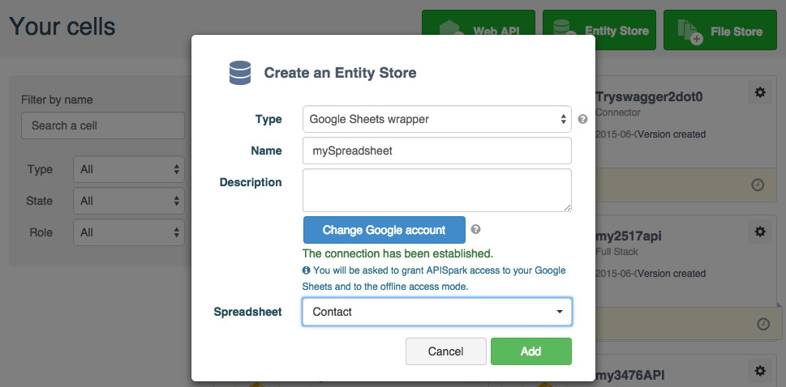
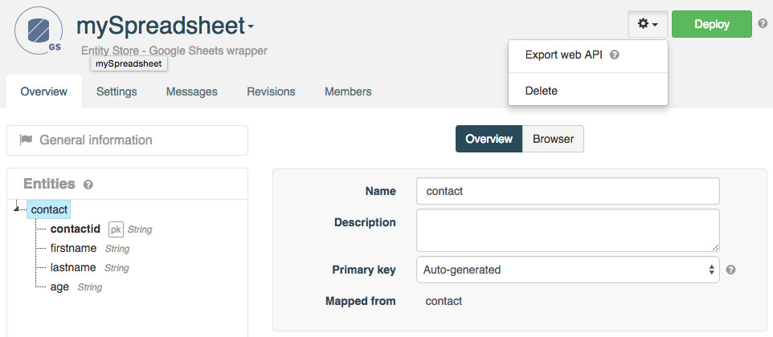
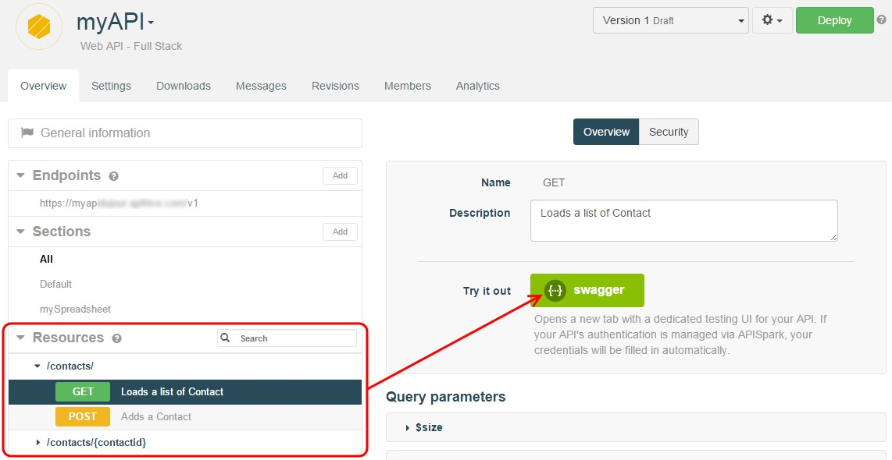
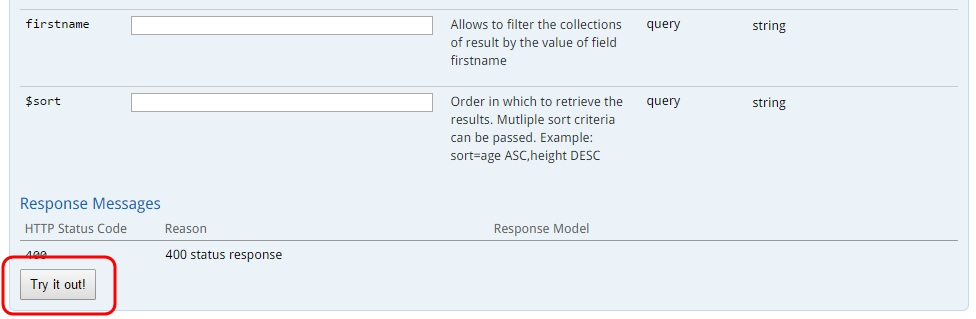

# Introduction

This tutorial will show you how to create a custom web API that exposes data stored in a Google Sheet. <a href="
http://docs.google.com/" target="_blank">Google Sheet</a> is a popular collaborative data editing tool within the Google Docs suite.  
You can import one Google Sheet per wrapper. If you need data from several Google Sheets, create one wrapper per Google Sheet and import them in one single API.

# Requirements

To follow this tutorial, you will need:

*   a web browser,
*   20 minutes of your time,
*   a Google Account application-specific password.

# 1. Prepare a spreadsheet

Sign in to your **Google Drive** account.

In this tutorial example, we have a spreadsheet with a worksheet named **Contact** with the following columns, containing a list of contacts:

*   **contactid**: primary key
*   **firstname**: first name
*   **lastname**: last name
*   **age**: age

> **Note:** we recommend using lowercase characters from the roman alphabet only for column names.

Add a **Contact** so that you can retrieve it later when performing an HTTP call to your API.
We have chosen to name ours Darth Vader, 46 years old.

# 2. Configure the Google Sheets Wrapper

Sign in to your **APISpark** account.

Click on **+ Entity Store**.

Select "Google Spreadsheet wrapper" as a **Type** and enter a **Name** for your store. We named ours "mySpreadsheet". Input a **Description** if you like.

Click the **Connect to Google Sheets** button. A message informs you that the connection has been established.

Select the appropriate **Spreadsheet** from the drop-down menu.

Click on the **Add** button.

>**Note:** You can connect to another Google account from the creation wizard by clicking the **Change Google account** button. After you have created your wrapper, you can still choose another Google account or another spreadsheet from your wrapper's **Settings** tab.

Entities will be created based on the structure of your spreadsheet. One entity will be created for each worksheet.

In this case, a **Contact** entity was automatically created. Entity properties are created based on the name of the columns in the first row of a worksheet.

Go back to the Wrapper's **Overview** tab to view the new entities.

Deploy the Google Sheets Wrapper by clicking on the **Deploy** button.

# 3. Export a Web API from the Wrapper

From the Wrapper's **Overview** page, click on the actions button on the right of the **Deploy** button and select **Export web API**.

Give your new API a name. We named ours **myAPI**.

The domain will be created automatically but may not be available anymore so make sure to adjust it.

Click on **Add** to create the API. You will be taken to the API's **Overview** page.

Deploy the API by clicking the **Deploy** button.

# 4. Invoke the web API

Using a web API does not impose any particular programming language. It can even be done from a web browser. However, to test your API, APISpark offers an integration of the Swagger UI that provides a graphical user interface to perform HTTP calls.

From the **Overview** tab of your API, select the appropriate Endpoint.  
From the left panel, click on the Resource and the Method chosen and click on the **swagger** button.

The Swagger UI opens in a new tab.  
Your credentials are pre-filled in the two fields on top of the screen.

Scroll down to the bottom of the page and click on the **Try it out!** button to invoke your API.

Note that any POST requests made to the API will result in new data being created in your Google Spreadsheet. Likewise, any data manually inserted via the Google Spreadsheet is visible via the custom web API.

You can also perform simple [filters](/technical-resources/apispark/guide/publish/publish/invocation#filter "filters") on entity properties and [sort](/technical-resources/apispark/guide/publish/publish/invocation#sort "sort") queries on Google Sheets wrapper APIs.

>**Note:** Non alphanumeric characters must be in quotes in your queries. If your spreadsheet cells are in plain text format, they must also be in quotes in your queries.

APISpark lets you generate custom Client SDKs for your API. Supported environments include Java, Android, iOS and JavaScript (AJAX or Node.js).

Congratulations on completing this tutorial! If you have questions or suggestions, feel free to contact the <a href="http://support.restlet.com/" target="_blank">Help Desk</a>.
