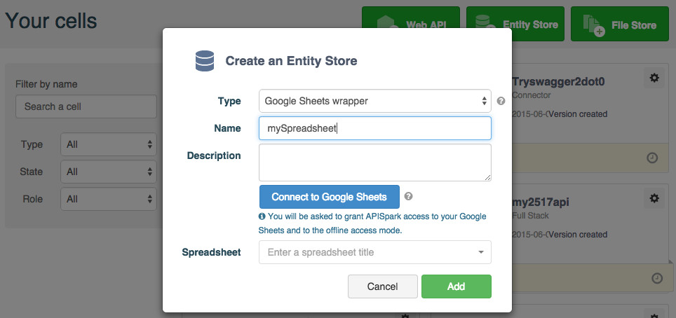
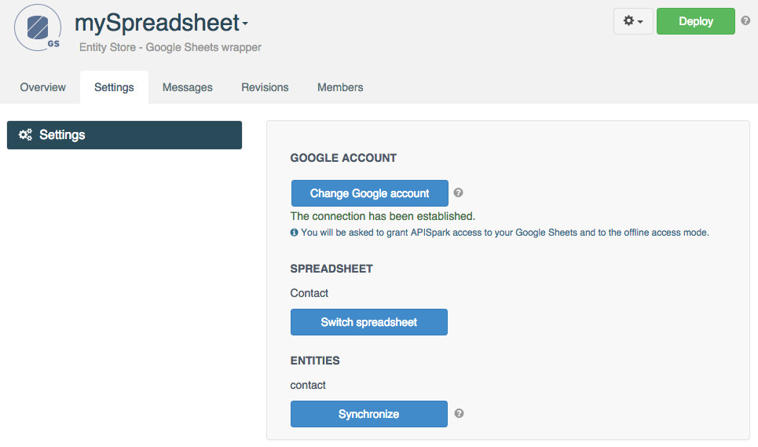
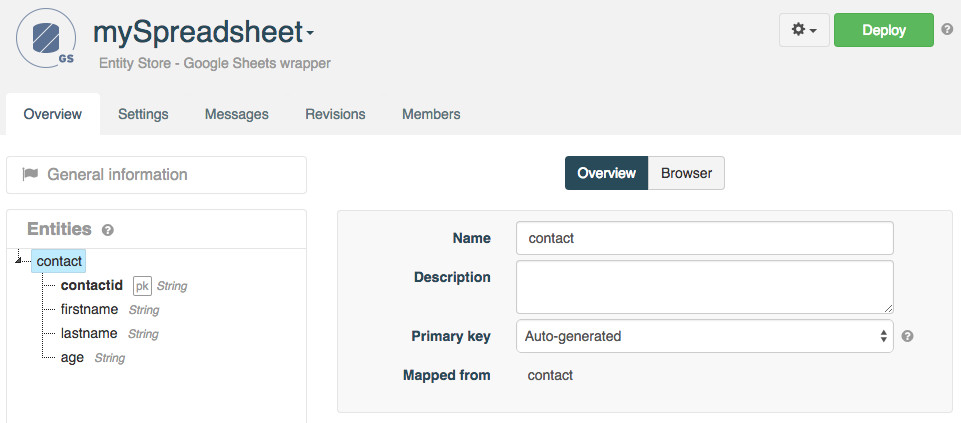
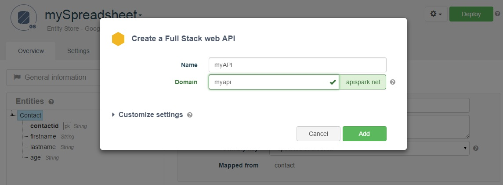

# Introduction

This tutorial will show you how to create a custom web API that exposes data stored in a Google Spreasheet. <a href="
http://docs.google.com/" target="_blank">Google Spreadsheet</a> is a popular collaborative data editing tool within the Google Docs suite.  
You can import one Google Spreadsheet per wrapper. If you need data from several Google Spreadsheets, create one wrapper per Google Spreadsheet and import them in one single API.

# Requirements

To follow this tutorial, you will need:

*   a web browser,
*   20 minutes of your time,
*   a Google Account application-specific password.

# 1. Prepare a Google Spreadsheet

Sign in to your **Google Drive** account.

In this tutorial example, we have a spreadsheet with a worksheet named **Contact** with the following columns, containing a list of contacts:

*   **contactid**: primary key
*   **firstname**: first name
*   **lastname**: last name
*   **age**: age

> **Note:** we recommend using lowercase characters from the roman alphabet only for column names.

Add a **Contact** so that you can retrieve it later when performing an HTTP call to your API.
We have chosen to name ours Darth Vader, 46 years old.

# 2. Create the Google Spreadsheet Wrapper

Sign in to your **APISpark** account.

Click on **+ Entity Store**.

Select **Google Spreadsheet wrapper** and enter a name for your store . We named ours "mySpreadsheet". Input a description if you like.

Click **Add** to create the Wrapper. You will be taken to the Wrapper's **Settings** page.

# 3. Connect to Google Sheets

From the **Security** section, click on the **Google Account** menu.

Click on the **Connect to Google Sheets** button to connect to your Google account. A **Google Accounts** window displays and invites you to choose the Google account to which you want to connect. Select the appropriate account.

A message informs you that the connection has been established.

You can select another account later on by clicking the **Change Google account** button.

# 4. Import a Spreadsheet

From the **Imports** section in the left panel, click on the **Add** button.

Select a spreadsheet to import and click on **Import sheet**.

The selected spreadsheet's **Overview** tab opens in the central panel.

# 5. Import entities

Select a spreadsheet from the **Imports** section in the left panel.

Click on the **Entities** tab in the central panel.

Click on the **Add entities** button to create entities based on the structure of the spreadsheet.

One entity will be created for each worksheet.

In this case, a **Contact** entity was automatically created. Entity properties are created based on the names of the columns in the first row of a worksheet.

Go back to the Wrapper's **Overview** tab to view the new entities.

Deploy the Spreadsheet Wrapper by clicking on the **Deploy** button.

# 6. Export a Web API from the Wrapper

From the Wrapper's **Overview** page, click on the actions button on the right of the **Deploy** button and select **Export web API**.

Give your new API a name. We named ours **myAPI**.

The domain will be created automatically but may not be available anymore so make sure to adjust it.

Click on **Add** to create the API. You will be taken to the API's **Overview** page.

Deploy the API by clicking the **Deploy** button.

# 7. Invoke the web API

Using a web API does not impose any particular programming language. It can even be done from a web browser. However, to test your API, APISpark offers an integration of the Swagger UI that provides a graphical user interface to perform HTTP calls.

From the **Overview** tab of your API, select the appropriate Endpoint.  
From the left panel, click on the Resource and the Method chosen and click on the **swagger** button.

The Swagger UI opens in a new tab.  
Your credentials are pre-filled in the two fields on top of the screen.

Scroll down to the bottom of the page and click on the **Try it out!** button to invoke your API.

Note that any POST requests made to the API will result in new data being created in your Google Spreadsheet. Likewise, any data manually inserted via the Google Spreadsheet is visible via the custom web API.

>**Note:** APISpark lets you generate custom Client SDKs for you API. Supported environments include Java, Android, iOS and JavaScript (AJAX or Node.js).

Congratulations on completing this tutorial! If you have questions or suggestions, feel free to contact the <a href="http://support.restlet.com/" target="_blank">Help Desk</a>.
