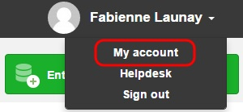
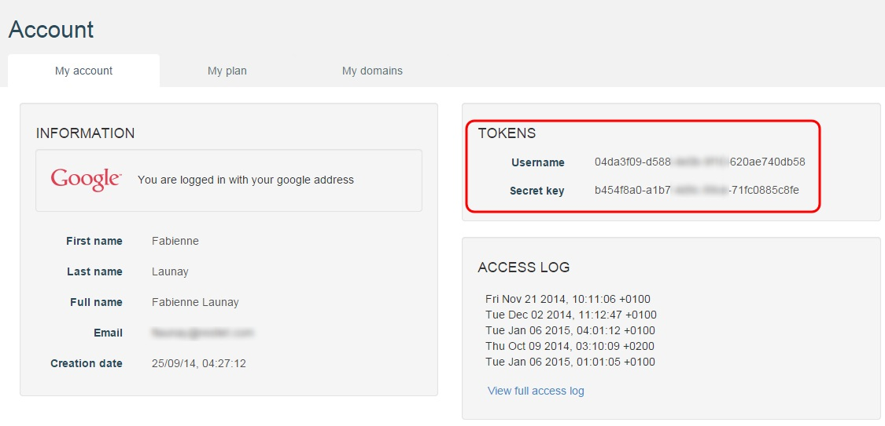
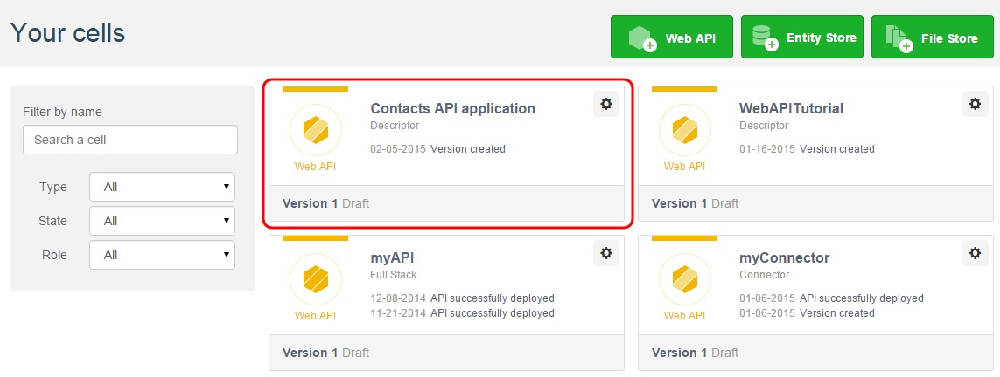
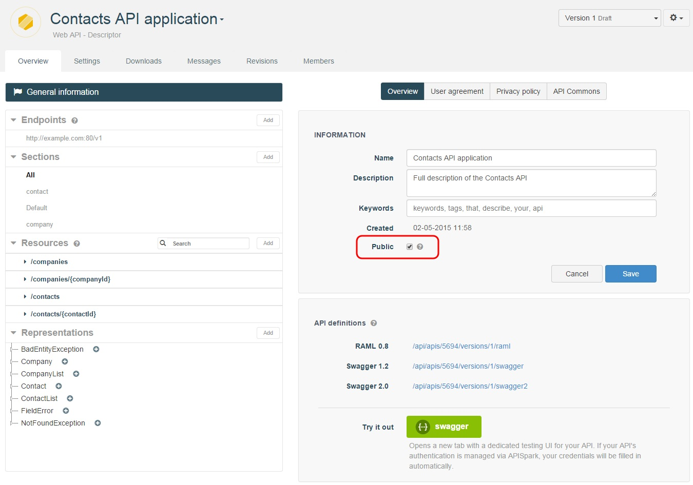

# Introduction

The Restlet Framework provides a tool that extracts the web API definition of your Restlet (or JAX-RS) application and imports it in APISpark to provide documentation and tooling such as generation of client kits.

With this tool, you will be able to create a new APISpark cell and edit it within APISpark.

<!--By running the tool again, you will be able to synchronize web API changes initiated from your API's code.
-->

For this tutorial, we provide you with a Restlet sample API in order to test the Descriptor feature. This fully operational API handles companies and contacts: it can be invoked to add, read, update and delete contacts and companies.

# Requirements

To follow this tutorial, you will need:

* a web browser,
* Maven,
* Git,  
* 20 minutes of your time.

# 1. Retrieve Restlet sample API
We provide you with a <a href="https://github.com/restlet/restlet-sample-descriptor" target="_blank">Restlet sample API description</a> that allows you to test the Descriptor feature. If you have your own Restlet API, feel free to use it.  

- Install git (if you have not done it yet) to launch a git clone in command line;  
or
- Launch the command from your development environment. If you are working on Windows, you can use e.g. git shell or git bash.

```git clone https://github.com/restlet/restlet-sample-descriptor.git```

# 2. Retrieve your credentials
Sign in to [APISpark](https://apispark.restlet.com) (if you have not done it yet) and retrieve your credentials in the **My account** page.  
Click on your username on top right of the screen and select **My account**.



You will find your **Username** and **Secret key** in the **Tokens** section.  



We will need these credentials to fill in the parameters at introspection launch.

# 3. Launch introspection
Run the introspection code to export the API documentation to APISpark with Maven.  
Install Maven (if you have not done it yet) to launch introspection in command line from the `restlet-sample-descriptor` directory.

```mvn test -Pexport-to-apispark -Dapispark.username=<your username> -Dapispark.secretkey=<your secret key>```

>**Note:** Working on Windows, avoid using git shell or git bash for this operation.

The main method is located in the ```org.restlet.example.contact.api.ExportToApispark``` class which source is indicated here in ```./src/test/java/org/restlet/example/contact/api/ExportToApispark.java```. In order to set your credentials, you can either edit the source code, or use the ```apispark.username``` and ```apispark.secretkey``` system properties.

Once introspection is completed successfully a similar message displays:

```
Your Web API descriptor's id is: 123456
Your Web API documentation is accessible at this URL: https://apispark.restlet.com/apis/123456/versions/1/overview
```

In your <a href="https://apispark.restlet.com/dashboard" target="_blank">APISpark Dashboard</a>, you can see the new **Descriptor** cell created.



<!--Change Proposal for Launch Introspection part:

a) Compile your own code (your Maven project will retrieve all the dependencies including the introspector's)

b) Launch introspection with the following parameters:

- your username (-u)
- your password (-p)
- the name of your own class

java -cp "/path/to/your/lib/*" org.restlet.ext.apispark.Introspector -u {your username} -p {your password} {your class}

e.g. java -cp "/path/to/your/lib/*" org.restlet.ext.apispark.Introspector -u 55955e02-0e99-47f8 -p 6f3ee88e-8405-44c8 org.restlet.api.MyContacts

>**Note:** The "org.restlet.ext.apispark.Introspector" class is the entry point.

-->


# 4. Customize API documentation
Once you have imported our sample API documentation in your APISpark Dashboard, feel free to customize it: the application, its resources, methods and beans.

You can customize it either:  
- from the APISpark console  
or  
- directly from the code  

<!--

INCLUDE THIS IN APISPARK USER GUIDE - INTROSPECTOR PAGE


Here are key places to customize the documentation from the code:

- general characteristics fof the API from the ```ContactsApplication``` class.
- *Resources* are described by their interface in the ```org.restlet.example.contact.api.resource``` package.
- *Exceptions* are serialized in the ```org.restlet.example.contact.api.core.exception``` package.

## Customize the Application
In the constructor: ```setName``` and ```setDescription```

## Customize Resources

### thanks to Restlet Framework
In the constructor: ```setName``` and ```setDescription```

### thanks to Swagger annotations
Use the ```@Api``` annotation either on the annotated interface, or in the implementation class:
```@Api(value = "Companies", description = "Company list resource")```

## Customize Methods

### thanks to Swagger annotations
Use the ```@ApiOperation``` annotation:
```@ApiOperation(value = "list the companies", tags = "company")```

Use the ```@ApiResponses``` annotation, only for online Swagger documentation. Status and representation are deduced from the signature of the method:  

```
    @ApiResponses({
            @ApiResponse(code = 200, message = "the added company"),
            @ApiResponse(code = 422, message = "company not valid", response = BadEntityException.class)
    })
```

## Customize Beans

### thanks to Jackson annotations

You can customize a bean with Jackson annotations in order to control serialization/documentation (only if you leverage the Jackson extension).

Use the ```@JsonInclude(JsonInclude.Include.NON_EMPTY)``` annotation to exclude empty or null attributes (cf class ```BadEntityException```).

Use the ```@JsonRootName``` annotation: it defines the name of the root element of the Json (cf class ```CompanyList```).

Use the ```@JsonProperty``` annotation: the name of the property in the serialized representation (cf class ```Company```).

Use the ```@JacksonXmlRootElement``` annotation: in the XML representation, it sets the name of the root element.

Use the ```@JacksonXmlElementWrapper``` annotation: in the XML representation, the "tags" attribute is wrapped inside a "tags" element (cf class ```CompanyList```).

Use the ```@JacksonXmlProperty``` annotation: in the XML representation, any "Tag" element is marked as "tag" instead of "tags" (cf class ```CompanyList```).
Customize a bean thanks to Swagger annotations in order to control the documentation of the bean
Use the ```@ApiModelProperty``` annotation: the description of the annotated field.


Here is a list of sample commands available:

## List of companies in distinct formats

```
curl http://localhost:8000/companies  
curl http://localhost:8000/companies -H 'accept: application/xml'  
curl http://localhost:8000/companies -H 'accept: application/x-yaml'  
curl http://localhost:8000/companies?media=yaml'
```

## Representation of a company in distinct formats

```
curl http://localhost:8000/companies/1  
curl http://localhost:8000/companies/1?media=xml'  
curl http://localhost:8000/companies/1 -H 'accept: application/x-yaml'
```

## List of contacts in distinct formats

```
curl http://localhost:8000/contacts  
curl http://localhost:8000/contacts?media=xml'  
curl http://localhost:8000/contacts -H 'accept: application/x-yaml'
```

## Representation of a contact in distinct formats

```
curl http://localhost:8000/contacts/1  
curl http://localhost:8000/contacts/1 -H 'accept: application/xml'  
curl http://localhost:8000/contacts/1?media=yaml'
```

## Swagger 1 documentation, available in Swagger UI

```
curl http://localhost:8000/api-docs  
curl http://localhost:8000/api-docs/companies  
curl http://localhost:8000/api-docs/contacts
```

## Swagger 2.0 documentation, available in Swagger UI

```
curl http://localhost:8000/swagger.json
```
-->

<!-- Test your API
You can then test your API from your web browser or from tools such as the Chrome extensions [POSTMAN](https://chrome.google.com/webstore/detail/postman-rest-client/fdmmgilgnpjigdojojpjoooidkmcomcm?utm_source=chrome-ntp-icon) and [DHC](http://sprintapi.com/dhcs.html) that provide a graphical user interface to perform HTTP calls.
-->

# 5. Share your documentation
If you want to share your documentation with other members or even with your API users, you can make your Descriptor cell public.

From your **Dashboard**, open your **Descriptor** cell. Select the **Public** checkbox and click the **Save** button.



You can then communicate the following link to your API users: https://apispark.restlet.com/apis/\{cell number\}/versions/\{version number\}/overview
