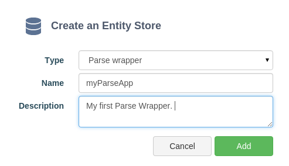

# Introduction

This tutorial will show you how to create a web API that gives access to existing data stored in a Parse backend.
<a href="http://Parse.com/" target="_blank">Parse.com</a> is a popular Backend as a Service (BaaS) provider that powers connected mobile applications.

# Requirements

To follow this tutorial, you will need:

*   a web browser,
*   20 minutes of your time,
*   your Parse login details.

# 1. Prepare the Parse backend

Sign in to your **Parse** account and go to the **Dashboard**.

Create a new app and give it a **Name**. We called our "MyParseApp".

Navigate to the **Data Browser** after creating your app, or click on the **Core** tab.

Click on the **+ Add class** button to create a new class. We named our class "Contact".

You will see four automatically generated columns: objectId, createAt, updatedAt and ACL.

Add the following extra columns:

*   **lastName** (String)
*   **firstName** (String)
*   **age** (Number)

Create a new row by clicking **+Row**. You can directly edit the row’s data by entering values in the fields. For the sake of this
	tutorial, we added a person called John Smith, age 34.

Click on the **Settings** tab then click on the **Keys** tab.

Copy both your **Application ID** and your **REST API key**.

# 2. Create a Parse Wrapper

## 2.1 Add a new Parse Wrapper Entity Store

If you have not already done so, <a href="https://apispark.restlet.com/signin" target="_blank">sign in</a> to your APISpark account and open your **Dashboard**.

Create a new Parse Wrapper Entity Store. Click on **+ Entity Store**, select the "Full stack" **Type** and enter the **Name** "myParseApp".

Click on the **Add** button to create the new Wrapper.

You will be taken to the new Wrapper's **Overview page**.

## 2.2. Configure your Parse account

Click on the **Settings** tab.

In the **Security** drop down, click on **Parse Account**.

Paste your **Application ID** and **REST API** keys.

Click on the **Test** button.

## 2.3 Add an entity

Parse does not expose metadata about its data store. Therefore the structure or your Parse store must be re-created manually in APISpark, by creating entities and properties with matching names.

To do so, click on the **Overview** tab.

Click on **Add an entity**.

Name your **Entity**. In this tutorial example, we will name it **Contact** and add three properties to it: firstName, lastName and age.

>**Note:** Your **Entity** elements and the **Schema** elements from Parse.com do not have to match up perfectly. For this purpose, you can
	use the **Mapped from** attribute on the entity and its fields. This allows you to specify the name of the target element (entity or property) in Parse.

Click on the **Deploy** button.

When your **Entity Store** has been deployed, you can export it as a new web API.

# 3. Export a Web API

From the Wrapper's **Overview** page, click on the actions button on the right of the **Deploy** button and select **Export web API**.

Give your new API a name. We named ours **myAPI**.

The domain will be created automatically but may not be available anymore so make sure to adjust it.

Click on **Add** to create the API. You will be taken to the API's **Overview** page.

Deploy the API by clicking the **Deploy** button.

# 4. Invoke the Web API

Using a web API does not impose any particular programming language. It can even be done from a web browser. However, to test your API we recommend the use of tools such as the Chrome extensions POSTMAN and DHC that provide a graphical user interface to perform HTTP calls.
The following figure shows the call to the Contacts API with POSTMAN.

The credentials required to invoke the API can be found in the **Overview** tab, by clicking on the relevant **Endpoint**. You will need to copy the **Endpoint URI**, **Login** and **Password** information for the next step.

When using POSTMAN, click on the **Basic Auth** tab, fill in the **Username** and **Password** fields with the information copied from your APISpark **Endpoint**. Fill in the **Endpoint URI** and add **/contacts/** at the end of it.

Click the **Send** button.

The following figure shows the API call in POSTMAN.

Any POST requests made to the API will result in new data being created in your Parse backend. Likewise, any data manually inserted via your Parse backend's Data Browser is visible via the custom web API.

>**Note:** APISpark lets you generate custom Client SDKs for you API. Supported environments include Java, Android, GWT and JavaScript (AJAX or Node.js).

Congratulations on completing this tutorial! If you have questions or suggestions, feel free to contact the <a href="http://support.restlet.com/" target="_blank">Help Desk</a>.
