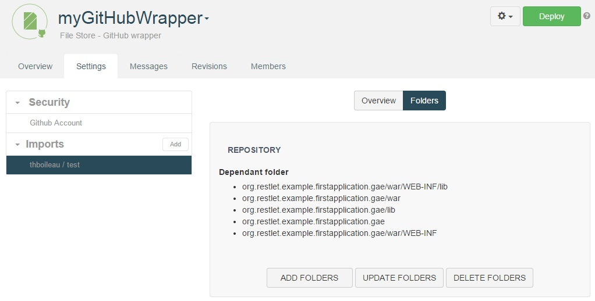
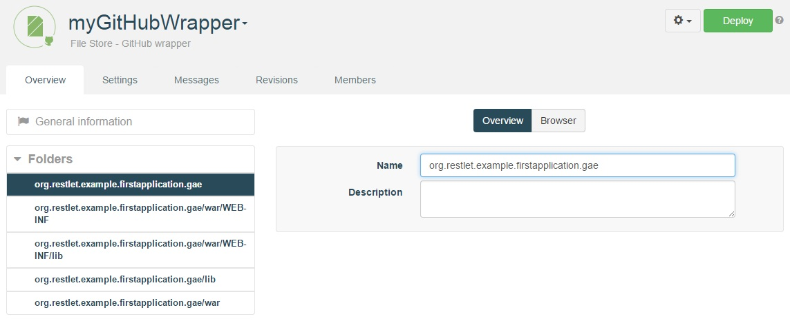

# Introduction

GitHub is a social coding platform that hosts Git repositories.

The APISpark GitHub Wrapper is a type of File Store that wraps the content of a GitHub repository. This content can then be manipulated directly via the wrapper, or imported into a web API and exposed for consumption.

# Requirements

To follow this tutorial, you will need:

*   a web browser,
*   15 minutes of your time,
*   your GitHub login details,
*   access to a GitHub repository.

## 1. Create a GitHub Wrapper

From the **Dashboard**, click on the **+ File Store** button, and select "GitHub wrapper" from the **Type** drop-down menu.

Give your wrapper a **Name** and a **Description** (optional).

You will be taken to the new Wrapper's **Settings** tab.

## 2. Configure your GitHub account

From the wrapper's **Settings** tab, select **Github Account** from the **Security** section in the left panel.

Enter your GitHub account credentials. Press the **Test** button to check the connection.

>**Note:** We advise you to [use personal access tokens](/technical-resources/apispark/guide/store/wrappers/github#personal-access-tokens "use personal access tokens") to import your GitHub repository.

## 3. Import a GitHub repository

To select a GitHub repository to import, click the **Add** button next to the **Imports** section in the left panel.

You will be prompted to enter the username of the **Owner** of the repository, as well as the **Repository** name.

## 4. Generate the Wrapper's folders

Once the repository has been imported, select it from the **Imports** section in the left panel, and open the **Folders** tab in the central panel.

Click on the **Add folders** button to import the repository's folders. Imported folders are listed in the **Dependant folder** section in the central panel.

Open the Wrapper's **Overview** tab to view the imported folders.

## 5. Deploy the Wrapper and browse the folders

In order to browser the contents of the folders, you need to start by deploying the Wrapper. Click on the **Deploy** button at the top-right of the screen.

Once the Wrapper is deployed, you can select a folder from the **Folders** section in the left panel, and then open the **Browser** tab in the central panel.

Congratulations on completing this tutorial! If you have questions or suggestions, feel free to contact the <a href="http://support.restlet.com/" target="_blank">Help Desk</a>.
