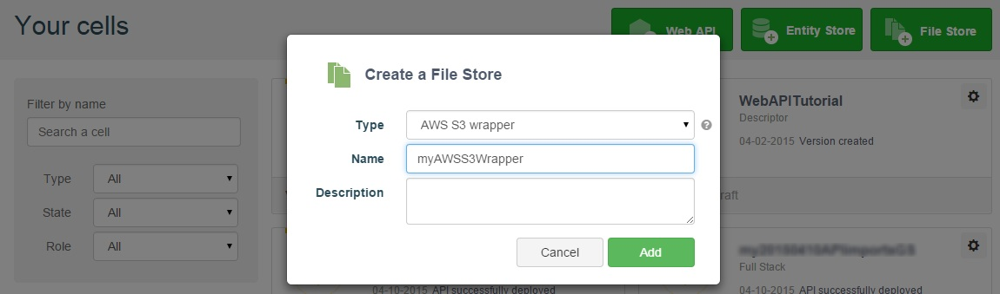
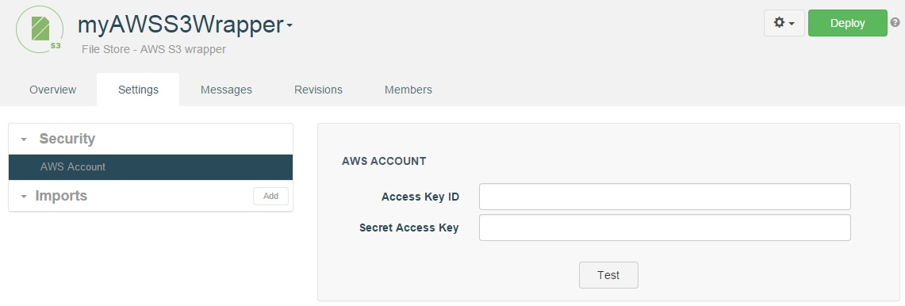
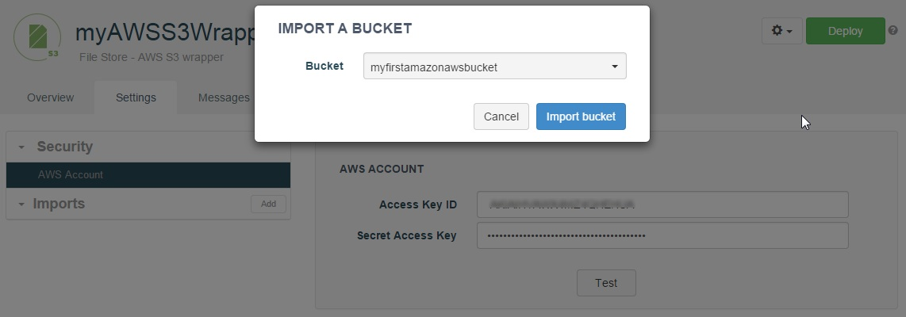
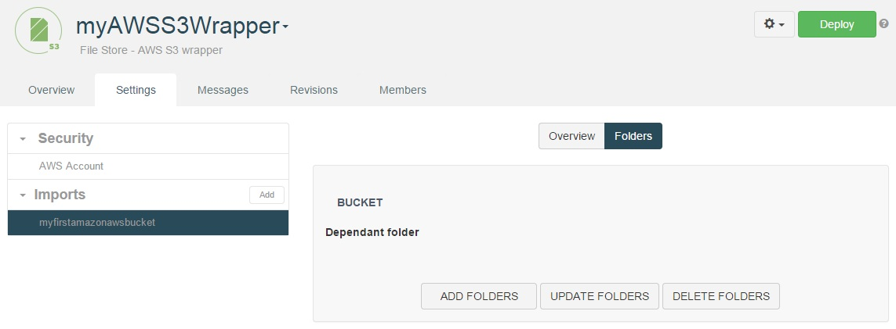

# Introduction

APISpark features a Wrapper File Store for Amazon <a href="
http://aws.amazon.com/s3/" target="_blank">AWS S3</a>
 buckets. The S3 Wrapper  lets you serve and store files from existing S3 buckets through a web API.

This guide does not explain how to configure AWS S3, but simply lists the information you will need to collect from your AWS administrator in order to configure the APISpark S3 Wrapper.

<h1 class="iconed" id="toc_0"><i class="fa fa-flag-checkered"></i>Requirements</h1>

To follow this tutorial, you will need:

*   a web browser,
*   20 minutes of your time,
*   your AWS access key ID and secret access key to be able to use your AWS S3 account.

<h1 class="numbered" id="toc_1"><i>1</i>Create your S3 File Store Wrapper</h1>

Click on the **+File Store** button, select "AWS S3" from the **Type** drop-down menu, and give your store a name. In this example we named our store "myAWSS3Wrapper".

<h1 class="numbered" id="toc_2"><i>2</i>Configure your S3 File Store Wrapper</h1>

Click on the **Settings** tab. From the **Security** section, select **AWS Account**.

Enter your **Access Key ID** and **Secret Access Key** and click on the **Test** button.

<h1 class="numbered" id="toc_3"><i>3</i>Import a bucket</h1>

In the **Imports** section, click on the **Add** button. From the **Bucket** drop-down menu, select the bucket you want to import and click on the **Import bucket** button.

Click on the **Folders** tab and on the **Add folders** button to create the associated folders.

If your bucket contains several root folders, associated folders are created for each of them. You can then explore the folders individually by clicking on them.

Click on the **Deploy** button.

<h1 class="numbered" id="toc_4"><i>4</i>Create and invoke your web API</h1>

Once your File Store has been deployed, you can simply export it as a new web API via the cog button or import it from an existing web API. For more details on how to do this, please check out our [tutorials](/technical-resources/apispark/tutorials "tutorials").

Congratulations on completing this tutorial! If you have questions or suggestions, feel free to contact the <a href="http://support.restlet.com/" target="_blank">Help Desk</a>.
