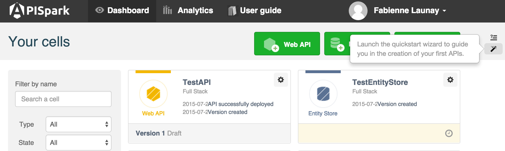
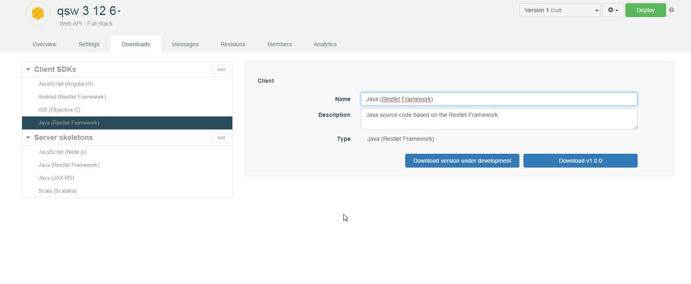
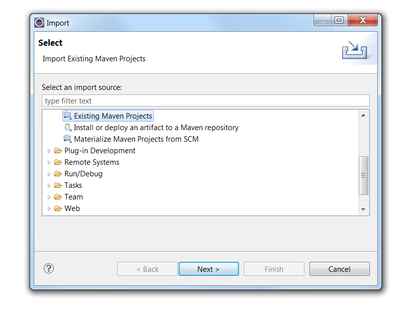
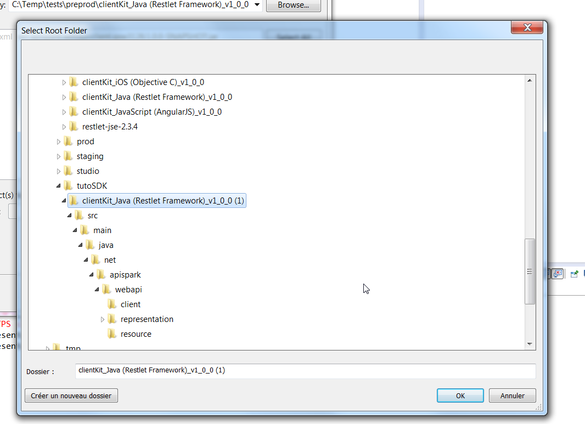
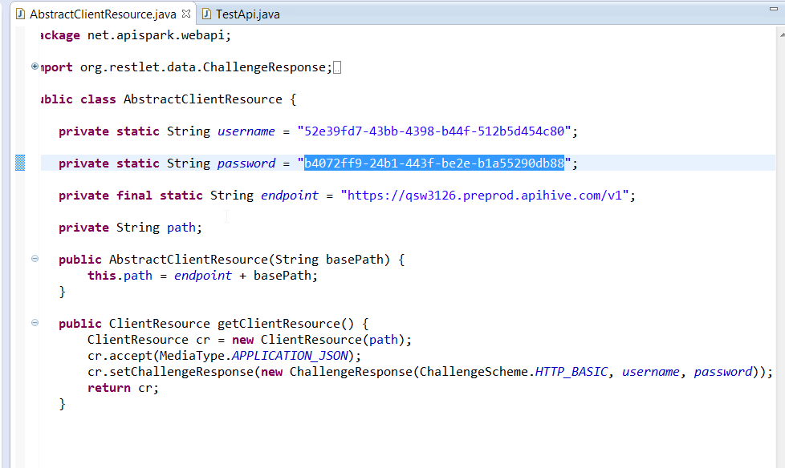
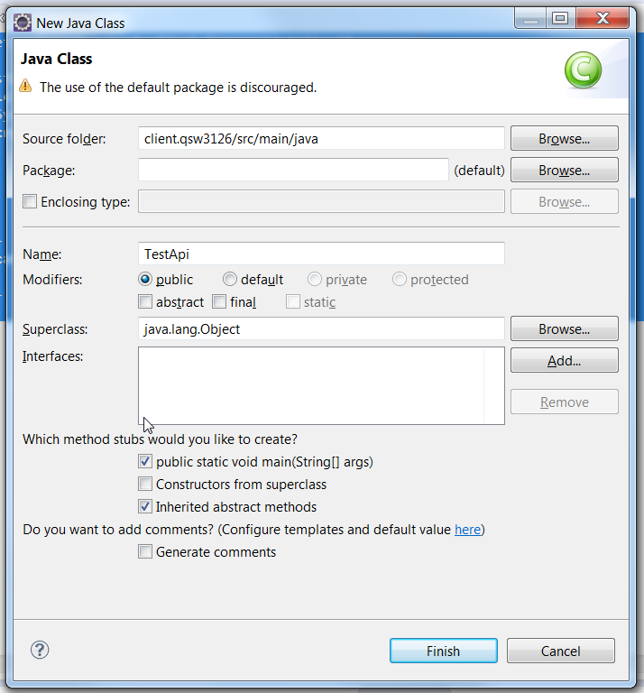
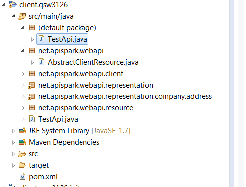
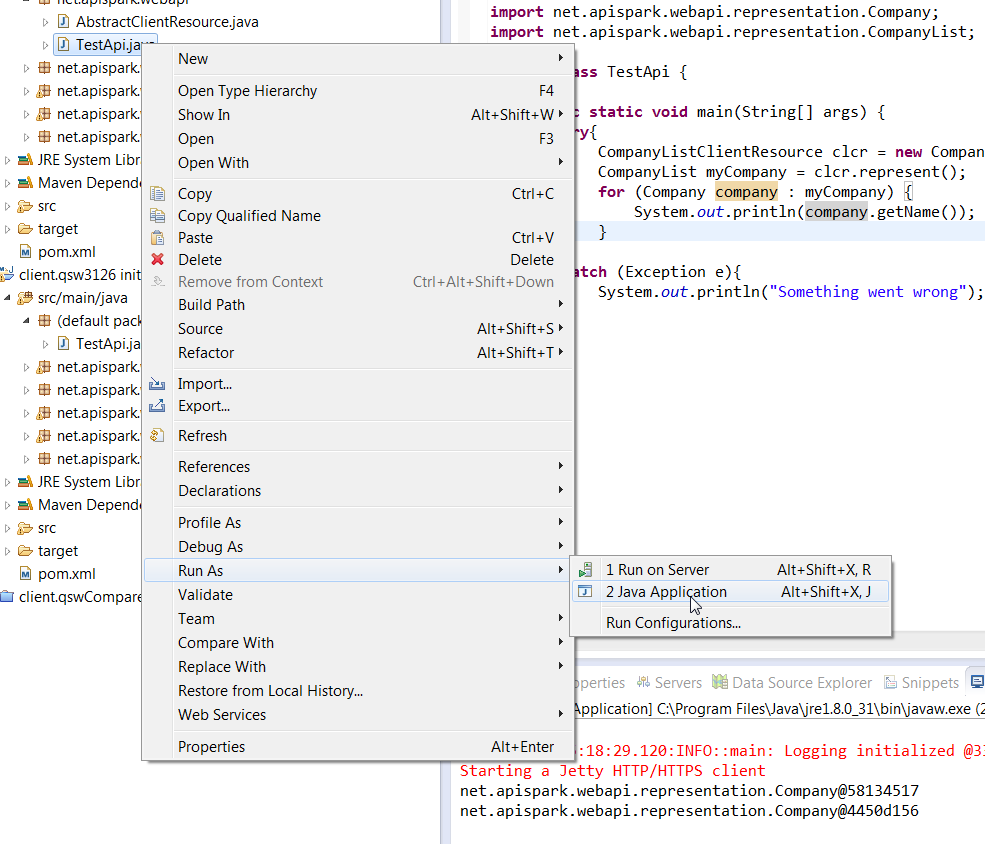

# Introduction

# Requirements

To follow this tutorial, you will need:

*   a web browser,
*   20 minutes of your time,
*   your SQL database login details.

# 1. Create an API

As an example, we want to create a sample app using Restlet Framework (Java) and APISpark.

For this purpose, create an API using APISpark Quickstart wizard.

For this example, we call our API *quick_start_wizard_java_sdk*. As it is based on the quickstart wizard, the resources associated are:  
* Company  
* Contact  

to be updated

Download the **Java SDK** from the **Downloads** tab.

to be updated

# 2. Import provided code

From Eclipse, import the provided code in the main method. This code describes the project and its dependancies.  
Click **File** and select **Import**.
Select **Existing Maven projects**.  
  

Select root folder `clientKit_Java (Restlet Framework)_v1_0_0(1)` and click **OK**.

Copy code provided (MrB) and paste it in `AbstractClientResource.java`.
Insert your API credentials.

# 3. Create new Java class
Create a new Java class called *TestApi*.  
Click **New** and select **class**.
From the **New Java Class** window, select the **Public static void main(String[] args)** checkbox and click **Finish**.

You can see your new class called *TestAPI.java* has been created in the tree.

Run it as a Java application.  
Right click it and select **Run As** / **2 Java Application**.

# 4. Test your API
In the java file created, you can now call your API, perform GET or POST requests, etc.

Congratulations on completing this tutorial! If you have questions or suggestions, feel free to contact the <a href="http://support.restlet.com/" target="_blank">Help Desk</a>.
