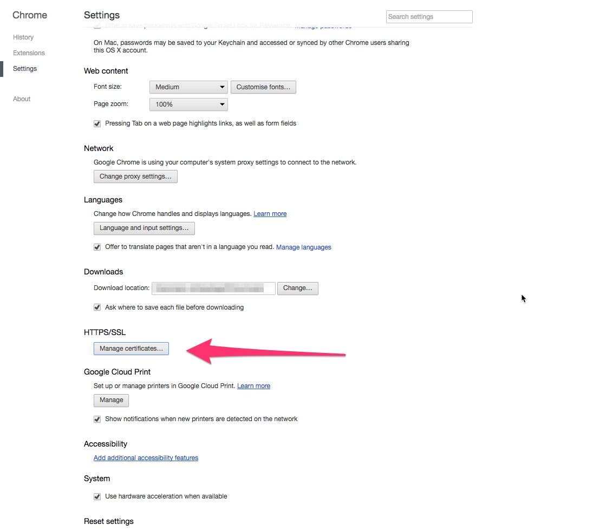

1. [How can I add a client certificate for HTTPS in Restlet Client?](#01 "How can I add a client certificate for HTTPS in Restlet Client?")

# 1. How can I add a client certificate for HTTPS in Restlet Client?

As Restlet Client relies on Chrome certificate management, you need to add your certificate to Chrome from Chrome settings:

[Back to list](#list "Back to list of frequently asked questions")
