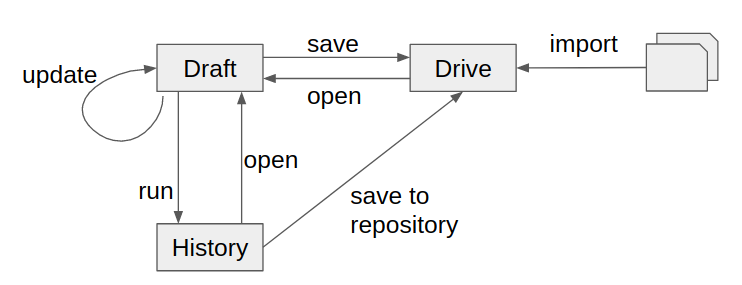

## Introduction

History main goal is to record any request sent, and to allow to edit it in the request editor in discovery mode.

Let's recall the aim of the discovery mode. This mode lets you focus on a single couple of tasks: setting up requests and sending them.
As said [here](saving), the discovery mode does not record automatically any intermediary versions of the edited request.
What if you want to go back to a previous version? That's where the History enters the game.

History automatically records the requests sent and the related responses.
In another words, history won't help you to recover any state of the edited request. It record requests that you send which, in a way, is what really matters.

History stores the requests run and the related response, from anywhere in the application (either from the discovery mode of the Requests perspective, the Scenarios Perspective, or from a scenario).
The history is a tab present in the Requests perspective available either on the top left or bottom pane of Restlet Client.

=> TODO show a screenshot.

## Browsing the history

=> TODO show a screenshot with numbered annotations.

An entry of the history contain both sent request and received response. In addition, it contains also the duration of the request.
Entries are displayed according to the date they have been sent: the last sent first, at the top of the list.

In addition, entries are grouped by URL which means that any successive requests to the same urls represent only one entry in the list. This helps to keep the history synthetic.

## Actions

### Open request in discovery mode

From within the history list, users can load the selected entry into the requested editor. Related response is loaded as well.
Take care, the request that was edited previously has now join the abysses and nobody will take it back.

### Save request(s) to drive

You can also save a set of requests into the drive, using the save to repository feature.

Just select a list of requests, and select the target. It could be a new container (project, service, or scenario), or an existing one.
