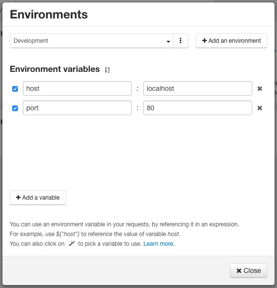

In your application development workflow, you probably rely on different environments such as development, staging and production. 
As a developer, you don't want to spend time updating requests to match your current environment.

Restlet Client provides a powerful feature to use variables in your requests through the environments.
On the top right of the screen, you will find an environment selector to set your current environment.

You can create as many variables as you need in an environment.
An environment variable is composed of a name and a value.

The environment editor lets you manage your environments. It gives you ability to rename, clone, delete or even export / import environments.

While you are editing your requests you will have a quick access to the preview of your variables by simply hovering the preview button.

Environment variables can be then used at any place in the request like URL, headers, query parameters and text / form payloads.
You just have to reference the variable within an expression. For example, use `${host}` to reference the value of a variable named `host`.
You can also open the expression builder (by clicking on the "magic wand") to visually pick a variable to use.

The set of variables used is from the selected environment. 
You can inspect the environment variables taken into account when executing the request by looking at the HTTP tab.

