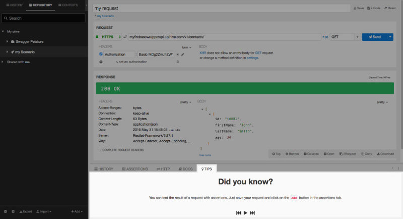
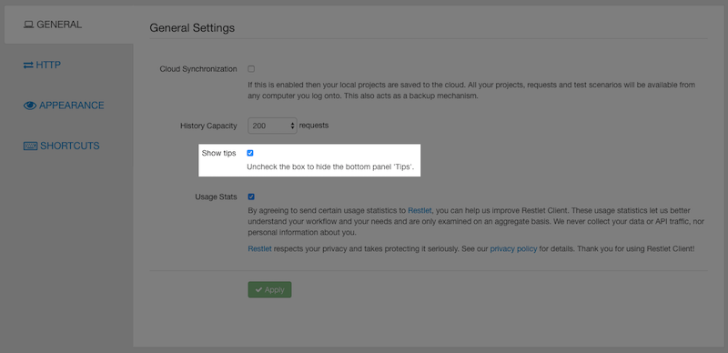

# Introduction

Restlet Client provides you with a **TIPS** tab that gives you useful information you may ignore on how to use Restlet Client.

# Browse through our TIPS

To access Restlet Client Tips, click the **TIPS** tab from the bottom panel.

The buttons at the bottom of the screen allow you to browse through the different Tips available.

<i class="fa fa-play"></i>&nbsp;&nbsp;Makes new Tip display every 10 seconds  
<i class="fa fa-pause"></i>&nbsp;&nbsp;Makes current Tip display until you click on <i class="fa fa-play"></i> button  
<i class="fa fa-fast-backward"></i>&nbsp;&nbsp;Makes you switch to the next Tip  
<i class="fa fa-fast-forward"></i>&nbsp;&nbsp;Makes you switch to the previous Tip  

# Deactivate the TIPS tab

If you do not want the **TIPS** tab to display, you can deactivate it.

Click on the **Settings** tab on top right of the screen. From the **General** tab, deselect the **Show tips** checkbox and **Apply** your changes.

