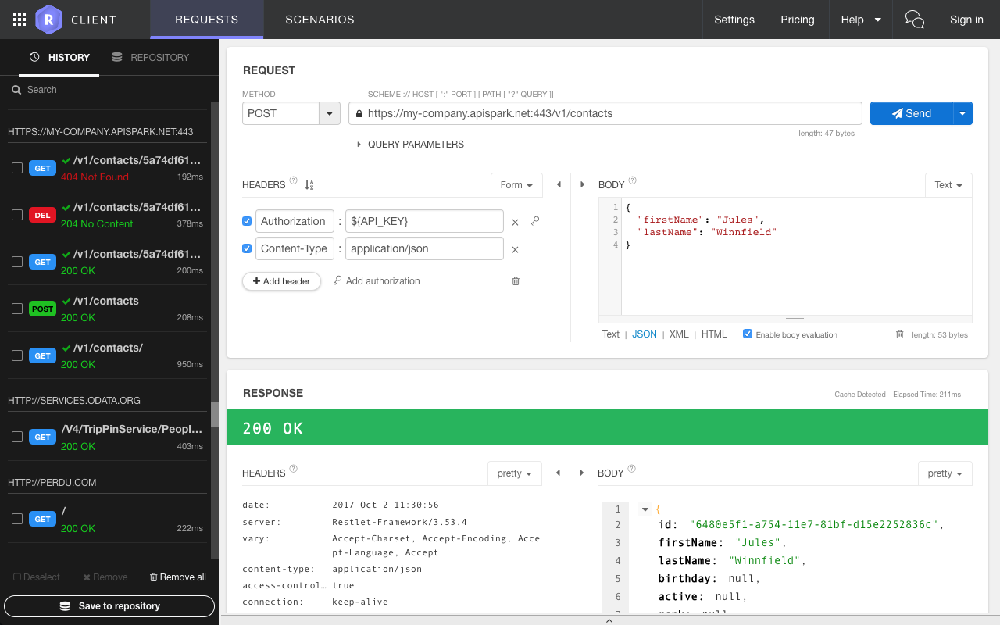
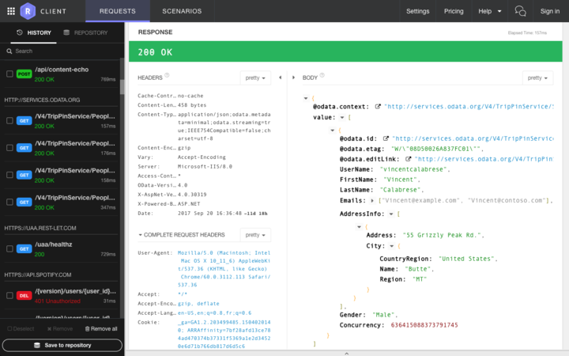
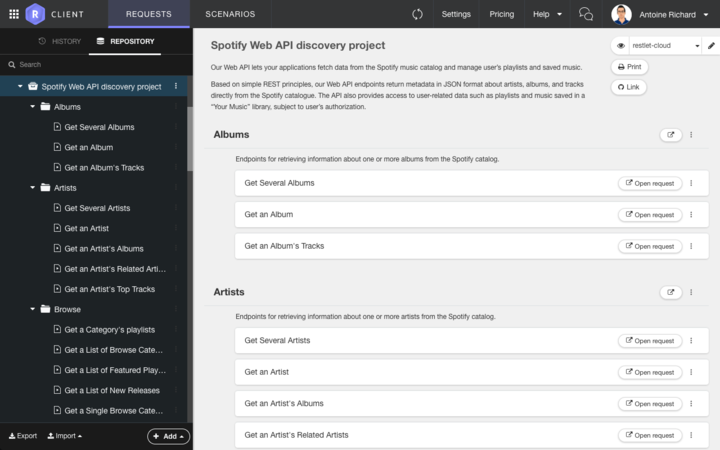
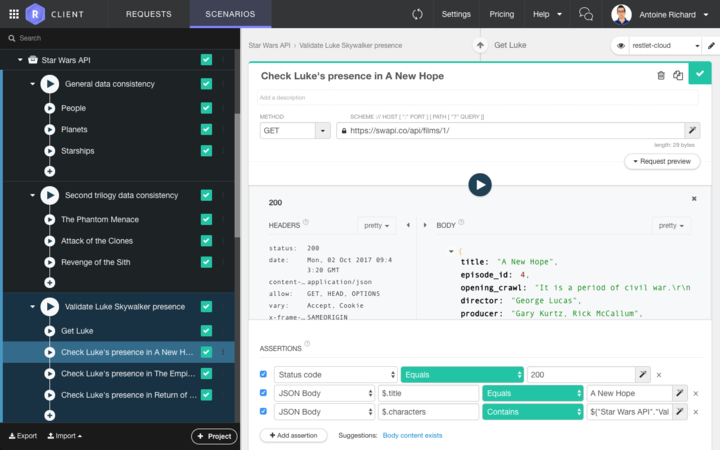
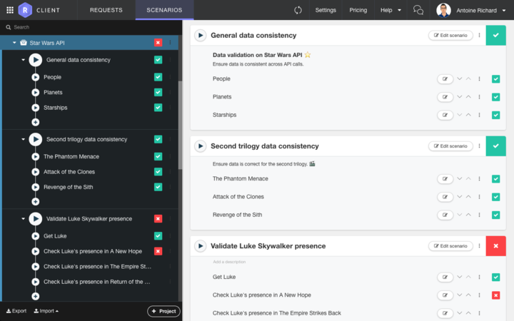

Restlet Client (formerly known as DHC) allows you to interact with REST services.
It brings many different features that make your user experience better, save you precious time when debugging HTTP calls or sharing your requests with others.

Let's introduce the two main use cases that Restlet Client addresses.

## API discovery and debugging

Restlet Client helps you to __call any type of HTTP API__ (REST, hypermedia, SOAP, OData...) with a powerful while easy to use __request editor__.

Once the request has been set, Restlet Client lets you __inspect API responses__ thanks to the ability:

* to pretty print different data formats,
* to preview web assets like images or web pages,
* to follow hyperlinks,
* etc.

Then save, document, __organize__, and __share__ your API requests with your team!

## API testing

With Restlet Client, you can create complex __scenarios__ that emulate __real-life usages__ of your API (combine multiple API requests, reuse data from previous responses, etc.)

Whether you want to __check__ that your API is behaving as specified, or you need to confirm how well third-party APIs are responding, Restlet Client lets you perform many sorts of __API response tests__ such as on the value of headers, parts of the body or response time among others.

