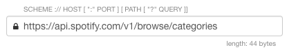

The request editor in Restlet Client allows you to define an HTTP request.
Each part of the request is handled by a dedicated area in the editor:

* [HTTP Method](#method) 
* [URL](#url) 
* [Headers](#headers) 
* [Body](#body) 

### URL

The URL is composed of:

* a scheme (or protocol) used to interact with a server e.g. HTTP or HTTPS
* a host and an optional port used to identify the target server
* a path used by the server to select the resource that will handle the request.

### Query parameters

The query parameters can be updated directly in the URL text field or the dedicated area which presents a simple tabular form.
The menu on the right allows to indicate whether the name or value of the query parameters are already encoded and does not require to be encoded another time.

### Headers

The headers can be edited either as simple tabular form or as a raw block of text. In the latter case, you have to comply with the <a href="https://tools.ietf.org/html/rfc7230#section-3.2" target="_blank">syntax of HTTP headers <i class="fa fa-external-link" aria-hidden="true"></i></a>.

### Body

The editor of the body part is a little bit more complex as it covers several cases and is at the same time still intuitive to use.

It guides you to manually edit:

* simple text plain payloads
* JSON, XML and HTML payloads with syntax coloration
* Web forms or multipart form payloads (<a href="https://www.w3.org/TR/html401/interact/forms.html#h-17.13.4" target="_blank">cf Web forms specification <i class="fa fa-external-link" aria-hidden="true"></i></a>)

The editor of the request body also helps you also upload files from your drives.
Please note that for technical reasons the file paths are not persisted with your request which means two things:

* you will have to upload again the file after reloading the request .
* you can't run such requests using the Maven Plugin.

Please <a href="mailto:support@restlet.com">contact us</a> for more information.

## Edition helpers

Here are listed some notable helpers provided by the request editor.

Auto-completion is available for the header names, and for the values of the following headers:

* Accept, Accept-Charset, Accept-Encoding, Accept-Language, Accept-Ranges
* Allow
* Expect
* Cache-Control
* Content-Encoding, Content-Language, Content-Type
* Transfer-Encoding

The header "Content-type" is automatically set according to the format selected in the body editor. You can still override the preset value.

The header "Authorization" has a dedicated helper which supports the "BASIC" authentication scheme. This helper allows you to enter your username and password. It hashes these values accordingly to the specification.

### HTTP Method

The list of proposed methods can be extended via the HTTP settings. You can add your own methods and indicate whether the method you define accepts a body or not. If you select a method without body in the request editor, the body won't be editable.

The list of the most common HTTP methods are predefined.
Please notice that the `TRACE` method has not been added since Client relies on the XmlHttpRequest API and that its implementation in Chrome does not support the `TRACE` method.

