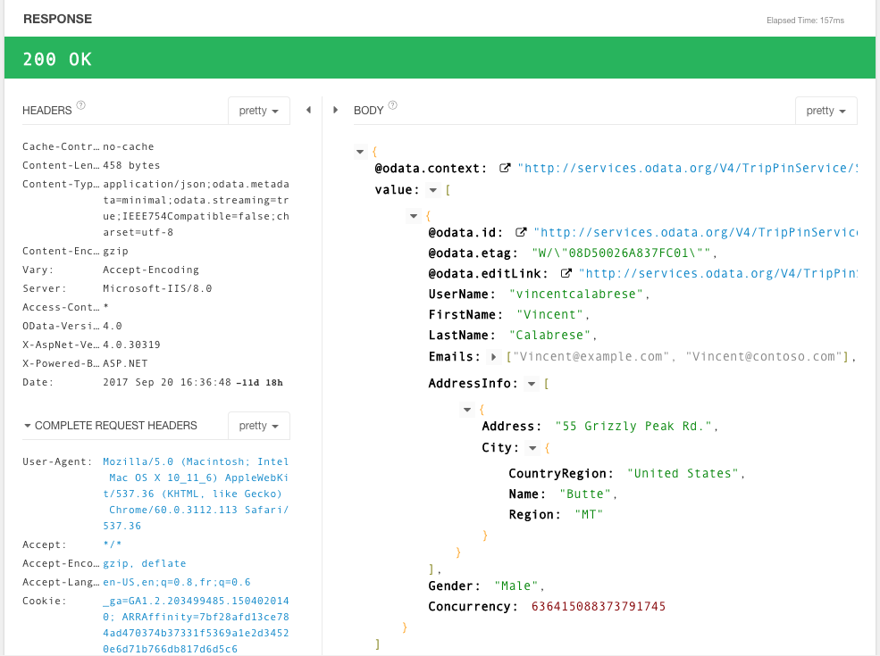

Once your request has been designed, it's time to send it to the server!
Let's start by explaining how to send a request, and the available options.
In a second part, we will describe the reponse inspection capabilities.

## Send and redirect

In the Requests tab, you will find a "Send" button, right near the URL field.
In order to keep things simple, just click on the button and sent the request will be.

However there is more to say about it, and this relates with what is called "redirection".

Redirection is a concept that covers a specific set of responses sent back by the server.
Basically, such responses tell the client that a further step is required in order to achieve the request.
The nature of the next step is described by the redirection response.
You can refer to <a href="https://tools.ietf.org/html/rfc7231#page-54" target="_blank">the HTTP specification <i class="fa fa-external-link" aria-hidden="true"></i></a> for more details about this topic.

The "Send" button allows three actions:

* click on it, as mentionned above, then the request is sent in the default redirection mode
* select an option called "Follow redirects" then the request is sent with this redirection mode
* select an option called "Don't follow redirects" then the request is sent with this redirection mode

The default redirection mode is defined in the settings. By default, redirections are not followed.

When asked to follow redirections, Restlet Client automatically achieves the next step described by the response.

## Inspect responses

Restlet Client provides a dedicated area to display the response. This area maps the different elements of a response.

### Status code and message

The status code and message correspond to the status of the response. The status code is a normalized number. HTTP defines different families at this level: 2xx for success, 3xx for redirection, 4xx for client errors and 5xx for server errors.

### Headers

The list of HTTP headers of the response are available under two formats: the default one is the "Pretty" mode where all headers are listed in a tabular form with readable alignement of both names and values.
The second mode is "raw" where all headers are displayed as they are received. This format is much more compact, and could be less readable.

#### Request edition helpers

At first sight, it looks surprising to talk about request edition in this section, but you deserve good surprises, right?

Let's say that you try out an API and send a request that creates an entity. By convention, the response contains the URL of the newly created entity (usually in a "Location" header). It's quite appealing to ìmmediately send the request that returns the content of the new entity and Restlet Client simply helps you set up this request.

Restlet Client understands a list of response headers and provides useful actions when you click on them. 
See the table below for a complete list of niceties.

Response header | When clicking on the value link
----------------|--------------------------------
Location | The URL of the current request is replaced by the header's value
x-xrds-location | The URL of the current request is set with the header's value
Set-Cookie | A new header "Cookie" is added to the request with the header's value
Etag | A new header "If-None-Match" is added to the request with the header's value (see <a href="https://tools.ietf.org/html/rfc7232" target="_blank">conditional request specification <i class="fa fa-external-link" aria-hidden="true"></i></a> for more details)
Last-Modified | A new header "If-Modified-Since" is added to the request with the header's value (see <a href="https://tools.ietf.org/html/rfc7232" target="_blank">conditional request specification <i class="fa fa-external-link" aria-hidden="true"></i></a> for more details)
Expires | A new header "If-Modified-Since" is added to the request with the header's value (see <a href="https://tools.ietf.org/html/rfc7232" target="_blank">conditional request specification <i class="fa fa-external-link" aria-hidden="true"></i></a> for more details)
Cache-Control | If value is a "max-age" or a "s-max-age" cache control directive then a new header "Cache-Control" is added to the request with value "max-age=0"
Allow | Such headers contain a list of HTTP methods, each of them is clickable. Once clicked, the method of the current request is updated
Access-Control-Allow-Methods | Such headers contain a list of HTTP methods, each of them is clickable. Once clicked, the method of the current request is updated

### Response payload

Response payload corresponds to the data received.
In order to ease readability, all kinds of payloads can be displayed as-is (aka "Raw" mode), hex-encoded (aka "Hex" mode).
Some of payloads can be also formatted using syntax coloration and other options (aka "Pretty" mode) or in a "Preview" mode.

Let's have a few words about these modes:

* "Raw" means display the bytes of the payloads. Be careful, it may produce unwanted effects when applied on "binary" payloads
* "Hex" displays each bytes of the payload in their hexadecimal representation
* "Preview" fits very well with images, HTML payloads, etc. The browser is asked to render the payload according to its media type. "Binary" files are not rendered.
* "Pretty" supports syntax colorization and few others goodies, see below.

The "Raw" and "Hex" modes are available for all kinds of payloads.
The "Preview" mode is available for the Html payloads, images and Binary. In the latter case, it simply displays a message saying that binary files can't be previewed.

Let's describe more deeply the "Pretty" mode.

Payload type | syntax colorization | line numbers | expand/collapse nodes | urls are clickable
-------------|---------------------|--------------|-----------------------|-------------------
XML | yes | yes | yes | yes
JSON | yes | yes | yes | yes
HTML | yes | no | no | yes

#### Configure types of payloads

In "Settings/Appearance", you can also configure the link between a media-type, a formatter and some options (show line numbers, collapse/expand nodes by default).

#### Additional data

* The body viewer shows the time taken by the request/response at the top right (labelled "elapsed time")
* The body viewer shows also the length of the body in the bottom right

### Complete request headers

This section shows the headers that are typically managed by the browser, and what values have been sent. With Restlet Client, you can benefit of letting the Browser manage these headers for you or you can choose to take control on it:

#### Browser behavior

Chrome browser adds additional headers to your HTTP requests, if they are not provided, such as:

* User-Agent
* Accept, Accept-Encoding, Accept-Language
* Cookie

The headers actually sent are displayed in the "Complete request headers" part of the response:

You can click on the values here to define them as part of your request. You will be able to overwrite them if needed.

If you're automating your API tests, we recommend to explicitly override headers that are relevant for your API, so that the behavior will be reproducible with our automation tool.

#### Cookies

Restlet Client benefits of the Chrome browser's Cookies management.

If Chrome browser has stored a cookie related to a particular domain, this cookie will be added to the request you'll send with Restlet Client to that domain.

If you don't want cookies to be added in a request, simply define a header Cookie with an empty value to override this behavior.

### Request edition helpers

In pretty mode, when possible, the URLs are parsed and emphasized. When clicking on such links, the request is updated:

* the URL field of the current request is updated with the value of the link (note that relative links are computed against the current request's URL)
* the method of the current request is set to `GET`.

This is quite useful if you want to browse your API just like you browse the Internet by following links on pages.
Let's say you first request your API to get a contact. If the body contains links to the contact's address, you can quickly get the representation of the related address in two clicks:

* click on the link to refresh the current request
* send the new request

### Additional actions

* Copy 2 request: copies the response payload into the payload of the request. If the request does not support payload (for example GET) then the method is automatically updated to `POST`.

* Copy to clipboard the response body: copies the response payload into the clipboard; JSON or XML payloads are indented.

* Download: downloads the response payload on local drive.

## Request previsualization / response

You can previsualize the request you set up as raw text, and by the way get the whole response (if any) as raw text in the tab `HTTP` at the bottom pane, in the Requests tab.
