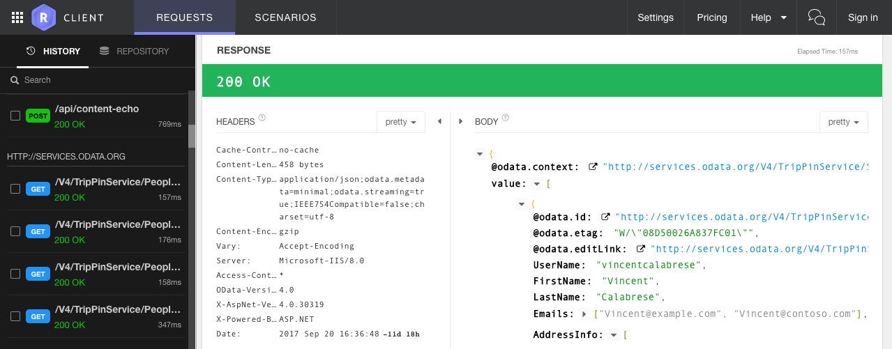
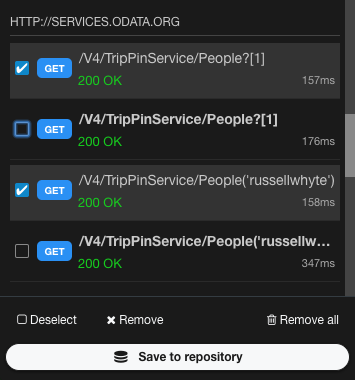

## Introduction

Now that you have sent a few requests, you might want to remember exactly how the request or its response looked like. You can do exactly that with the history. The history is accessible from the left panel of the Requests perspective and shows last requests sent by URL. 

Clicking on an item in the history loads it in the request panel, you can then edit it and send a modified version if you want.

The history saves the requests and responses of all the requests sent in Restlet Client, whether they are sent in the Requests perspective or Scenarios perspective, as part of a scenario or alone doesn't matter, it is stored. 

From within the history list, users can load the selected entry into the requested editor. Related response is loaded as well.

## Browsing the history

An entry of the history contains both sent request and received response. In addition, it contains the duration of the request.
Entries are displayed according to the date they have been sent: the last sent first.

In addition, entries are grouped by URL which means that any successive requests to the same URL are listed together.

## Save requests to drive

You can save a set of requests into the drive, using the "Save to repository" feature.

Just select requests in your history, click the button and define where they should be stored.

You can put them in your drive or a shared drive if you [belong to a team](./collaborating)), in an existing request container or create a new one. 

__Tip:__ If you want to preserve the execution order of your requests, save them as a scenario.
