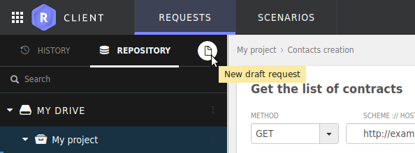

## Save or Save as

Two actions help you to save requests inside a drive: `Save` and `Save as`.

The latter opens a dialog box for you to define where to save the request. You will be able to save it into an existing project, as a step of a scenario, etc.

If you are modifying a request that has already been saved, you'll be proposed a quick `Save` option by default.

## Copy as cUrl

A `Copy as cUrl` option is available in the dropdown menu of the save button. Click it to export your request in the standard [cURL](https://curl.haxx.se/) syntax.

## Start a new draft request

To start a creating a new request from scratch, Click on the  `New draft request` button: 

<!-- IN SCREENSHOT: REQUEST_EDITOR -->

You will get a blank request editor to craft your request from scratch. Use the `Save` / `Save as` button to save your request in your drive at will.

## Organizing your drive

Let's elaborate about the notions of drive, and request containers.

### Drive

The repository contains all your requests and the requests of your teams.
The requests are split in drives, yours - `My drive` - and one for each of the teams you belong to. The last ones are known as `shared drives`.

If you are the owner of a team, all the projects -more on projects below - you share can be seen by your team members. 
They appear on their side in a `Shared drive` which name is the email address linked to your Restlet account. 

Of course a drive can be local, in this case it is generally labelled `My drive`.

If you subscribed to a "Team" plan, you can share your own drive. In this case, you are intronised Team owner, and you own also the shared drive.
Every member of your team are called Team members, and get their own copy of the shared drive.

### Request containers

Of course a drive can store requests but also other kind of containers:

* scenario: a scenario is an ordered set of requests. It is very helpful to define a sequence of requests and play it again, and again, and again. [Learn more about scenarios](../test/chain-requests)). You can change the order at will in the scenario's overview. Just click on the arrows to move a request up or down.
* service: a service contains either scenarios or requests. Children entities are ordered by type, then by name.
* project: a project contains either scenarios, services or requests. Children entities are ordered by type, then by name.

Each entity has a name and a description. The description field accepts markdown so that you get powerful documentation tools.

When you save a request from the testing perspective, you can choose an existing container, or create a new one.

> Note about the order of children:
> The children entities of a container are run in the same order as presented by the user interface.
