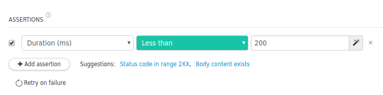

If you want to make sure your API lives up to your standards, you can create assertions. Assertions allow you to verify that the response received validates certain criteria and good news, they are super-simple to write!

You can for example assert that the response is received in less than 200ms if your SLA specifies it.

 

You'll find a in-depth documentation on assertions in the [dedicated page](../test-automate/validate-http-responses).
