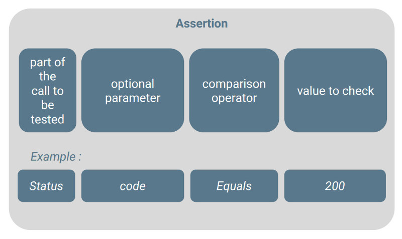
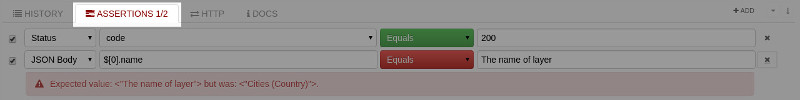
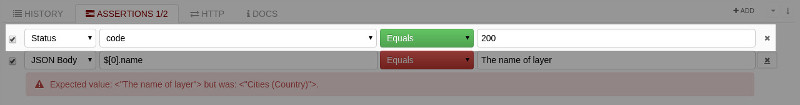
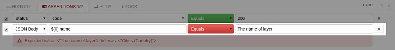

For each request an **Assertions** tab is provided to define the rules that the response of a call, to a RESTful service, needs to check to be successful.

# Assertions structure

An assertion consists of several parts:

## Part of the call to be tested
The first part is the part of the call the assertion applies to.  
The following parts are supported by Restlet Client: status, header, JSON body, body and response. You can see that there are two “body” parts. As a matter of fact, the tool provides native support of JSON within body. This means that you can leverage JSON Patch to get data from JSON content.

## Optional parameter
The second part is an optional parameter related to the first part.  
For example for headers, it corresponds to the name of the header.

## The comparison operator
The matching mode can differ depending on the part of the call. Of course, standard comparisons (equality, superiority, inferiority) are always present. In addition, where header and body is concerned you can also check existence and containment.

## The value to check
This can be raw values but also expressions.

# Assertions display

In the same spirit as xUnit tools in different languages, Restlet Client uses the green color for successful assertions and the red one for failures.

The following screenshots provide a sample use of assertions within the **Assertions** tab.

The **Assertions** tab displays in red if at least one test fails:

If a test succeeds, the comparison operator displays in green:

If a test fails, the comparison operator displays in red:

Note that you can disable assertions when necessary using the checkbox right before the line of the assertion, as shown below:

As you can see, the assertion that failed is not taken into account anymore.
