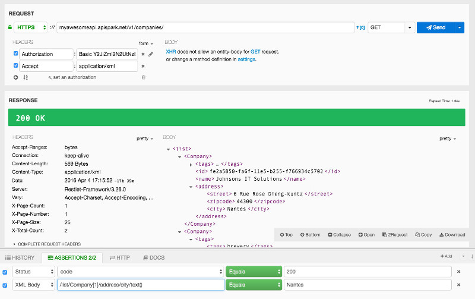

When selecting **JSON Body** or **XML Body**, assertions can leverage JSON path or XPath expressions to use and check specific parts of the content. This expression language is natural and enables you to browse data graph easily.

# Use JSON path for JSON payloads

The reference documentation is located [here](http://goessner.net/articles/JsonPath/ "reference documentation of JSON Path").
You can also find an online JSON Path evaluator [here](http://jsonpath.com/ "JSON Path online evaluator").

Here are a few hints to help you use JSON payloads:

- The dollar sign ```$``` identifies the root object of the JSON content.

- The dot sign ```.``` allows you to get attributes of an object or to go deeper in the tree.

- The square brackets ```[]``` target arrays and allow the selection of a particular element in them, or a slice of them.

As we will see below the current implementation in Restlet Client mostly follows the reference, but differs on few points.

## Sample expressions

This paragragh lists expressions and their result agains the following sample json file:

<pre class="language-json"><code class="language-json">{
  "store": {
        "book": [
            {
                "category": "reference",
                "author": "Nigel Rees",
                "title": "Sayings of the Century",
                "price": 8.95
            },
            {
                "category": "fiction",
                "author": "Evelyn Waugh",
                "title": "Sword of Honour",
                "price": 12.99
            },
            {
                "category": "fiction",
                "author": "Herman Melville",
                "title": "Moby Dick",
                "isbn": "0-553-21311-3",
                "price": 8.99
            },
            {
                "category": "fiction",
                "author": "J. R. R. Tolkien",
                "title": "The Lord of the Rings",
                "isbn": "0-395-19395-8",
                "price": 22.99
            }
        ],
        "bicycle": {
            "color": "red",
            "price": 19.95
        }
    }
}</code>
</pre>


Here are the sample expressions and their result.

| Expression | Value
| ---------- | -----
| $.store | The whole node "store" located under the root node
| $.store.bicycle.color | The value of the color attribute of bicycle (i.e. `"red"`)
| $.store.book[0] | The first "book" node in "store"
| $.store.book[:2] | An array of the first and second "book" nodes in "store"
| $.store.book[1:3] $.store.book[1,2] | An array of the second and third "book" nodes in "store"
| $.store.book[1:4:1] | An array of the second, third and fourth "book" nodes in "store"
| $.store.book[1:4:2] | An array of the second and fourth "book" nodes in "store"
| $.store.book.[1:4:2].author | An array of the authors of the second and fourth "book" nodes in "store" (i.e.: `["Nigel Rees","Herman Melville"]`)
| $.store.book[-1:] | An array containing the last "book" node in "store"
| $.store.book[1].* | An array of the values of all attributes of the second book (i.e. `["reference","Nigel Rees","Sayings of the Century",8.95]`)
| $.store.* | An array of the values of all attributes of the store (i.e. the list of books and the bicycle node)
| $.store..price | An array of the values of all attributes "price" of the "store" node (i.e. the prices of books and bicycle `[8.95,12.99,8.99,22.99,19.95]`)
| $.store.book.author | An array of the values of all attributes "author" of the "book" node (i.e. `["Nigel Rees","Evelyn Waugh","Herman Melville","J. R. R. Tolkien"]`)
| $.store.book[?(@.isbn)] | An array of the books that has an attribute "isbn" (i.e. the two last books)
| $.store.book[?(@.price<10)] | An array of the books which price is less than "10"
| $.. | An array of all child nodes of the root node, recursively
| $..category | An array of all values of the "category" nodes (i.e. `["reference","fiction","fiction","fiction"]`)
| $..category[(@.length-1)] | The value of the last "category" node


## When Restlet Client differs from the reference

### the "*" operator

| Expression | Reference | Restlet Client
| ---------- | --------- | --------------
| $.store.book[*].author | An array containing the authors of all books in the store | Return empty array, use `$.store.book.author` instead


### the ".." operator

The expression `$..book` is interpreted as an array of all "book" nodes so it returns an an array containing an array, since "book" node is an array:

<pre class="language-json"><code class="language-json">[
  [
    { "category": "reference", "author": "Nigel Rees", "title": "Sayings of the Century", "price": 8.95 },
    { "category": "fiction", "author": "Evelyn Waugh", "title": "Sword of Honour", "price": 12.99 },
    { "category": "fiction", "author": "Herman Melville", "title": "Moby Dick", "isbn": "0-553-21311-3", "price": 8.99 },
    { "category": "fiction", "author": "J. R. R. Tolkien", "title": "The Lord of the Rings", "isbn": "0-395-19395-8", "price": 22.99 }
  ]
]
</code></pre>


Then the following expressions are computed differently :

| Expression | Reference | Restlet Client
| ---------- | --------- | --------------
| $..book[0] | An array containing the first "book" node | The first element of the array, that is to say the array containing all books.
| $..book[-1:] | An array containing the last book | Not supported as is, it works using (`$..book[0][-1:]`)
| $..book[(@.length-1)] | An array containing the last book | Not supported as is, it works using (`$..book[0][(@.length-1)]`)
| $..book[0,1] | An array containing the first and second book | Not supported as is, it works using (`$..book[0][0,1]`)
| $..book[:2] | An array containing the third book | Not supported as is, it works using (`$..book[0][:2]`)


# <a class="anchor" name="xpath"></a>Use XPath for XML payloads

Note that XPath expressions have a directory-path-like syntax.

Here are a few tips to help you work with XML payloads:

- A single ```/``` selects from the root node.

- ```/list``` identifies the "list object" at the top level of the XML document. Then you can iterate over attributes and sub attributes. The language natively supports arrays.

- The slash sign ```/``` allows you to get attributes of an object or to go deeper in the tree.

- The square brackets ```[]``` enable to select a specific item in an array by its position. Please note that the index starts from 1.

- ```/text()``` allows you to get a node inner text.

- ```//``` selects nodes in the document from the current node that match the selection no matter where they are.

In the following example, the expression **/list/Company[1]/address/city/text()** corresponds to the name of the city contained in the address of the first Company.



For more information on the <a href="http://www.w3schools.com/xsl/xpath_syntax.asp" target="_blank">XPath syntax</a>, head over to the <a href="https://www.w3.org/TR/xpath/" target="_blank">official W3C specification</a>.
