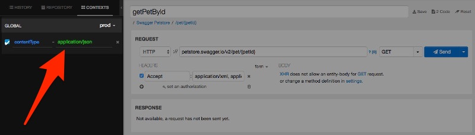
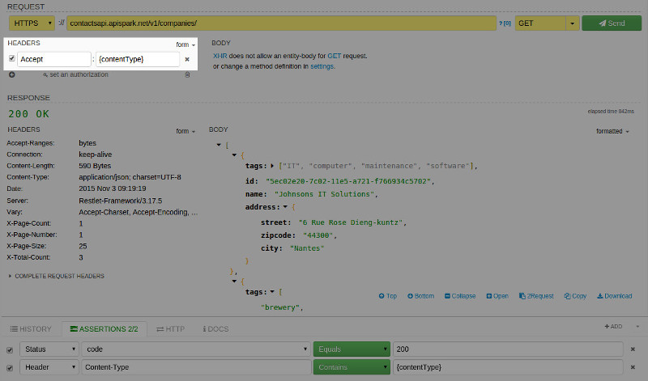
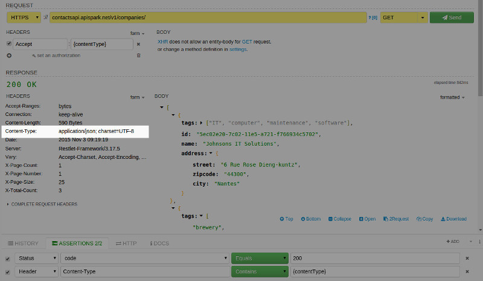
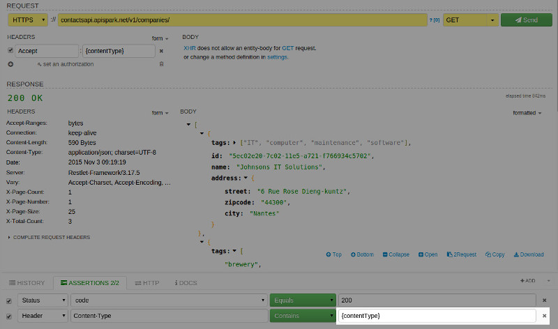
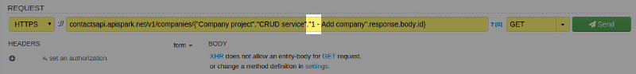

Now we know how easy it is to define assertions and check different parts of calls. However Restlet Client goes a step further as you can take advantage of expressions in assertions.

Imagine that you have settings in your context e.g.  the **contentType** you want to use for exchanging data (both request and response).

You can then use this variable when defining your request in the **Accept** header, to tell the RESTful service that you expect JSON content. To test this behavior, you can add an assertion to check the content of the **contentType** response header and to be sure that JSON content is actually received.

This screenshot shows how you can use the **contentType** context variable:

Here you can see the returned **contentType** to check:

Here we use the **contentType** context variable in assertion:

Another possibility is to rely on the result of previous calls. Restlet Client lets you reference the executed calls through expressions. For this to be possible, these calls need to have been saved at least once. The tool will automatically look for the corresponding last call in the history. To do this, it is important to follow this pattern: **{“PROJECT-NAME”.”SERVICE-NAME”.”CALL-NAME”}**.

You can then reference any part such as response body or headers. For example, to get the value of the id attribute in the response body, simply use the **response.body.id** expression, as described below:

