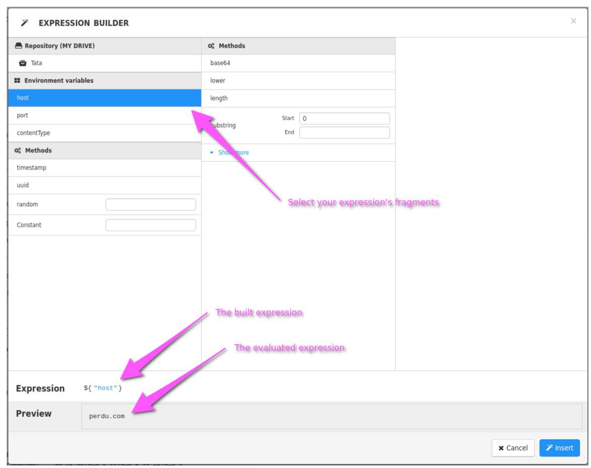

Expressions are structured strings that are parsed and evaluated by Restlet Client.
You can use them in all those places:

* Request URL
* Headers (name and value)
* Query parameters (name and value)
* Form parameters (name and value)
* Request body (of type text)
* Assertions values

Expressions allow you to:
* [Reference environment variables by name](./environments)
* [Reference other request elements by name](./reuse-request-or-response-parts)
* [Transform your data](./methods)

## Usage example

A request with URL `https://${"host"}` and an environment containing a variable `host: perdu.com` will be sent to
`https://perdu.com`.

## How do I know what the sent request will look like ?

* In the `Requests` perspective: the evaluated request is displayed in the bottom-pane-tab named `HTTP`
* In the `Scenario` perspective: click on `Request preview` between the request and assertions in the main pane

## How should I craft expressions ?

We have got you covered of course. In every field where assertions are supported, you will find a button with the icon
 <i class="fa fa-magic" aria-hidden="true"></i>. Click on it to open the __Expression builder__. You can create your
 expressions from there in a few clicks and see the evaluated expression in real-time.

> Note: The expression will be added where you placed your cursor before clicking the magic wand icon
<i class="fa fa-magic" aria-hidden="true"></i>. If the cursor was _inside_ and expression, the expression builder
will open in edition mode and you can modify the said expression.

## Going further

If UIs never excited you and you want to learn how to craft expressions by hand, you can go get a look at the
[full documentation](./going-further-with-expressions).
