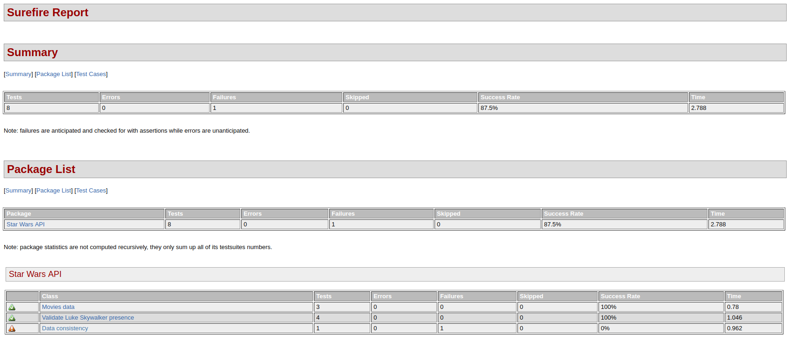
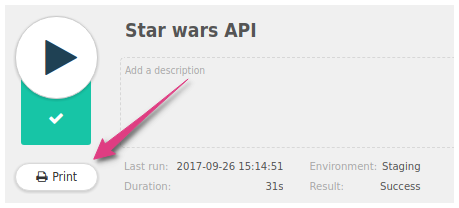
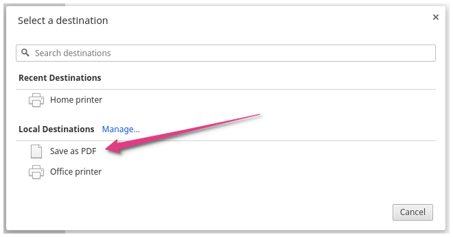

When you run your tests, you sometimes want to preserve a trace of their results. That's why Restlet provides a few
ways to export printable test reports - in HTML of PDF.

## From CLI

Our CLI tool generates JUnit-like XML files for each test. This means every reporting tool that integrates with this
type of files can generate reports for your API tests too.

Here are a few examples but you can probably use any of your favorite tools.

### Jenkins

Let's rencarde with Antoine on that point

### Surefire

You can generate HTML reports using surefire with the following commands:

<pre class="language-shell">
  <code class="language-shell">
# Runs the API tests
mvn clean test

# Creates a nicely formatted Surefire Test Report in HTML format (without running the tests, they have been run already)
mvn surefire-report:report-only

# The Site Plugin is used to generate a site for the project.
# The generated site also includes the project&apos;s reports that were configured in the POM
mvn site -DgenerateReports=false
  </code>
</pre>

The generated output shows a summary at the top followed by a detailed view.

## From the Chrome extension

When you have run a project/service/scenario in Restlet Client, you just need to open it and click on the button
`Print`.

If you don't want to print it, you can just export it in PDF format by changing the printer.

