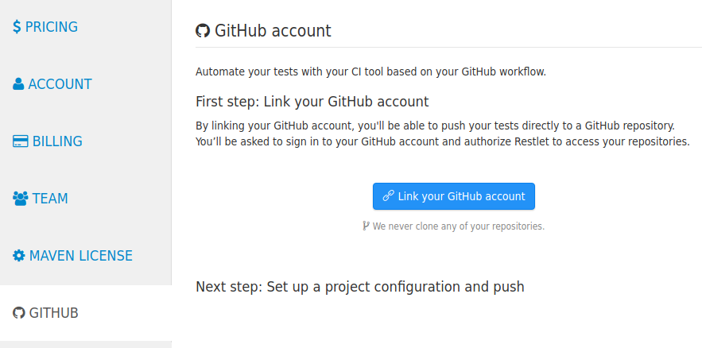
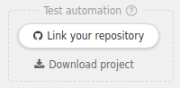
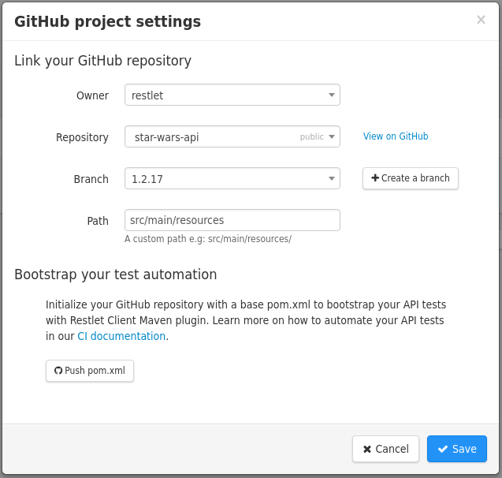
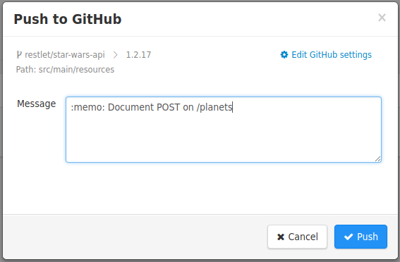

As you have seen in the previous chapter, testing your API on CI with Restlet Client is pretty easy but you have
probably noticed that we haven't covered yet an essential part of the CI build: the __source control__.

Nobody wants to update the test files by hand in the source control. That's why we decided to integrate with the most
widespread source control solution there is - __GitHub__ - so that you can get a fully integrated API testing workflow.

Pushing your test files to GitHub is effortless with Restlet Client, you'll have to configure your account and project
then pushing is only a click away.

## Link your GitHub account to Restlet

You will first need to link your GitHub account with Restlet. Once this is done, you will be able to use the GitHub
integration on Restlet Client and Restlet Studio. Everything you push to GitHub will be done with the linked GitHub
account.

Open Restlet Client and open your Account (to the right of the header bar). There, you’ll find a GitHub section in
which you can link your account.

We will never clone any of your repositories, and only ask GitHub for rights to write in your repositories, which is
the minimal possible scope required for the feature to work.

## Link your project to a repository

Once your GitHub account is linked, you need to link your project to a GitHub repository. To do so, open the project
you want to link and click on the button "link your repository" at the right of the screen.

You can choose the GitHub repository where you want to push your project test file and select the branch and path where
it should be pushed.

In the example above, my test file will be pushed to _git@github.com:restlet/star-wars-api.git_ on branch _1.2.17_ in
the folder _src/main/resources_.

> Note: We will warn you if the repository your are pushing to is public. Make sure there is no sensitive information
in your project and environment before pushing anything in this case!

## Push your project to GitHub

You are all set now, you just need to open your project and click on the GitHub button (that now says 'Push') to push
your project to GitHub.

A bubble will appear in the GitHub push button to notify you that you have changes on your project that have not been
pushed to GitHub.
