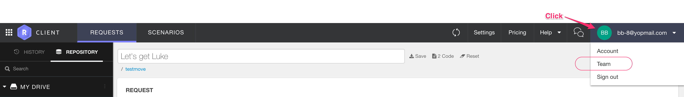

# Managing your team

As a Restlet user, you'll have one team assigned to your account. You are a team owner. This team will be used across Restlet Client, Restlet Studio, and Restlet Cloud.

To add people to your team, open the Team menu from the profile drop-down menu in the header bar.

# Contributing to other teams

# Editing a shared project

